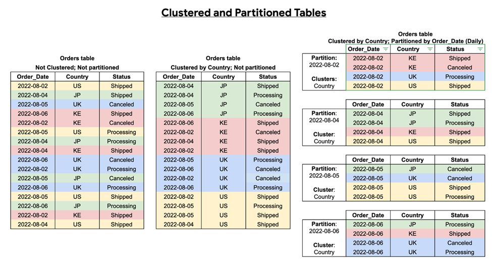

# Query optimisation

BigQuery:
- Stores data as a columnar data structure;

Optimising query cost:
- As it is a columnar database, `SELECT *` is the most expensive way to query data; so, **specify the exact columns you need** instead of using the wildcard `*` operator
- In partitioned and clustered tables, use `WHERE` on such columns

Partitioning and clustering:
-	Partitioning: 
    -	Dividing a table into smaller tables based by a single column, 
    -	The column can be date or integer
    -	Reduces query cost and faster retrieval (as you need to sift through less data)
    -	Allows you to know the cost before running a query
-	Clustering: 
    -	Basically just sorting by values in up to 4 columns
    -	Improves performance of some queries with filter and aggregate clauses
    -	Better done when cardinality of values in a column or group of columns is large

