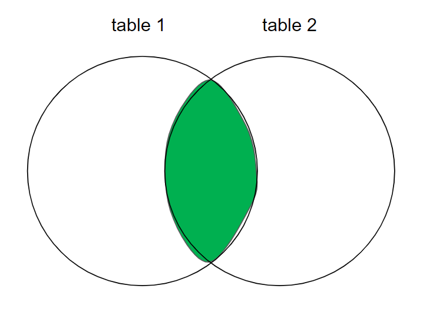

# SQL-handbook

*Ver 3.0.0*

> This is a practical handbook outlining the most important concepts and commands in SQL. When writing this material, I intended it to be a hands-on manual on how to achieve a specific objective in SQL, rather than to be an exhaustive piece of writing about every aspect of the language.   
> .   
> Evgenii Zorin

[](https://creativecommons.org/licenses/by/4.0/)

# Contents
- [Essentials](#Essentials)
- [Database](#Database)
- [Table](#Table)
- [Edit columns](#Edit-columns)
- [Edit rows](#Edit-rows)
- [Constraints](#Constraints)
- [Primary key](#Primary-key)
- [Filter](#Filter)
- [Comparison operators](#Comparison-operators)
- [REGEX](#REGEX)
- [Arithmetic operations](#Arithmetic-operations)
- [Dates](#Dates)
- [Join tables](#Join-tables)
- [Export query to CSV](#Export-query-to-CSV)

# Essentials

**Types of databases**:
- SQL (relational databases): MySQL, PostreSQL, SQLite, Microsoft SQL Server, MariaDB, Oracle; 
  - *In a relational database, there are relationships between tables.* 
- NoSQL (not only SQL; can also structure in non-structured data): MongoDB, Redis, Firebase, DynamoDB, Cassandra; 

Basic commands: 
| Command | Function |
| --- | --- |
| `\! cd` | list current dir|
| `\! dir` | list files in the current dir |
| `\i file.sql` | import file |
| `\?` | print methods |
| `\l` | list databases |
| `\c database_name` | connect to a database |
| `\d` | check which tables are present |
| `\dt` | show tables ONLY, without `id_seq` |
| `\d second_table` | check columns and details of a table in a database |

---

# Database

```sql
# Create a new database
CREATE DATABASE database1;
# Rename a database
ALTER DATABASE first_database RENAME TO second_database;
# Delete a database
DROP DATABASE second_database;
```

# Table

General form
```sql
CREATE TABLE table1(
column1 DATATYPE CONSTRAINTS, 
column2 DATATYPE CONSTRAINTS);
```
More commands
```sql
# Create a new table
CREATE TABLE IF NOT EXISTS tablename;
# Create an empty table
CREATE TABLE table1();
# Some examples
CREATE TABLE table1(id SERIAL PRIMARY KEY, first_name VARCHAR(50) NOT NULL, gender VARCHAR(7) NOT NULL, date_birth DATE NOT NULL);
CREATE TABLE table1(id BIGSERIAL NOT NULL PRIMARY KEY);

# Rename a table
ALTER TABLE table1 RENAME TO table2;

# Delete all the data inside the tables, but not the tables themselves
TRUNCATE table1, table2; 
DROP TABLE second_table; 
DROP TABLE IF EXISTS tablename;
```

**Datatypes**: 
| Datatype | Description |
| --- | --- |
| `DATE` | YYYY-MM-DD |
| `INT` | |
| `SERIAL` | Auto-increments? |
| `BIGSERIAL` | Auto-increments a number |
| `VARCHAR(30)` | String (max length) |
| `NUMERIC(4, 1)` | Float with number of decimals (1) |

**Constraints**: 
| Constraint | Meaning |
| --- | --- |
| `NOT NULL` | Values in this column have to be present; cannot be NULL |
| `PRIMARY KEY` | Makes a specified column a PRIMARY KEY column |
| `REFERENCES table(column)` | Make a foreign key referencing another table |
| `BIGSERIAL` | Integer that auto-increments |
| `BOOLEAN ` | True / False, 'Yes' / 'No' |
| `UNIQUE` | Values in this column must be unique |


---

# Edit columns

General form:
```sql
ALTER TABLE table1 
ADD COLUMN column1 DATATYPE CONSTRAINTS DEFAULT 'default', 
ADD COLUMN column2 DATATYPE CONSTRAINTS REFERENCES table2(column1);
```
More commands:
```sql
# Add a column
ALTER TABLE table1 ADD COLUMN name VARCHAR(30) NOT NULL;

# Rename a column
ALTER TABLE table1 RENAME COLUMN column1 TO column2
# Change datatype of a column
ALTER TABLE characters ALTER COLUMN date_of_birth SET DATA TYPE VARCHAR(10); # Change datatype of a column
# Restart the auto-incrementing values
ALTER SEQUENCE person_id_seq RESTART WITH 10; # or 1
# Add foreign key
ALTER TABLE <table_name> ADD FOREIGN KEY(<column_name>) REFERENCES <referenced_table_name>(<referenced_column_name>);

# Delete a column
ALTER TABLE table1 DROP COLUMN column1;
# Drop a constraint for a column
ALTER TABLE table1 DROP CONSTRAINT constraint_name; # Drop a named constraint
ALTER TABLE table1 ALTER COLUMN column1 DROP NOT NULL; # Drop not null constraint


# Add a column by concatenating two other columns (NOTE: this is not the most optimal solution, but it's the one that works for me):
ALTER TABLE table1 ADD COLUMN full_name VARCHAR(30); 
UPDATE table1 SET full_name = first_name || ' ' || last_name;
```

# Edit rows
```sql
# Insert a row
INSERT INTO table1 (column1, column2, column3) VALUES ('Value1', 52, DATE '1995-05-04');
# Insert two rows
INSERT INTO table1 (column1, column2, column3) VALUES (...), (...);

# Update an entry based on IF-condition
UPDATE table1 SET column1=5, column2=10 WHERE row="Rowname";

# Delete all records
DELETE FROM table1; 
# Delete a row in which column has the specified value
DELETE FROM table1 WHERE column1='Value'; 
```

## Update rows

```sql
# Update values in a column - swap 'f' and 'm' values
UPDATE Salary SET sex = CASE WHEN sex = 'm' THEN 'f' ELSE 'm' END;

```

---

# Constraints

```sql
ALTER TABLE table_name ALTER COLUMN column_name SET NOT NULL; # Add NOT NULL constraint to foreign key column, so that there will be no rows for nobody 
```

UNIQUE - makes sure that only unique values can be added in a column
```sql
ALTER TABLE table1 ADD CONSTRAINT constraint_name_here UNIQUE (column1) # Custom constraint name
# or
ALTER TABLE table1 ADD UNIQUE (column1) # Constraint name defined by psql
```

CHECK - a column can only accept specific values
```sql
ALTER TABLE table1 ADD CONSTRAINT constraint_name CHECK (column1='Male' OR column1='Female');
```

CONFLICT (CONSTRAINT) MANAGEMENT
```sql
ON CONFLICT (column1) DO NOTHING;
INSERT INTO ... VALUES ... ON CONFLICT (column1) DO UPDATE SET column1 = EXCLUDED.column1; # If an entry exists, it will update with the value you give it
```

FOREIGN KEYS - can connect tables based on foreign keys
```sql
CREATE TABLE table1(column1 DATATYPE REFERENCES table2(column_of_table2);

ALTER TABLE table_name ADD COLUMN column_name DATATYPE REFERENCES referenced_table_name(referenced_column_name); # to set a foreign key that references a column from another table
ALTER TABLE table_name ADD FOREIGN KEY(column_name) REFERENCES referenced_table(referenced_column); # set an existing column as a foreign key
ALTER TABLE character_actions ADD FOREIGN KEY(character_id) REFERENCES characters(character_id);
```

# Primary key

If there are entries with the same details, can uniquely identify them by primary key, e.g. their id. 

```sql
ALTER TABLE table1 ADD PRIMARY KEY (column1); # Add primary key constraint to a column
ALTER TABLE table_name ADD PRIMARY KEY(column1, column2); # create composite primary key (primary key from two columns)

ALTER TABLE table1 DROP CONSTRAINT person_pkey # Drop primary key constraint
```

## Composite primary key 

Uses more than one column as a unique pair. 

```sql
ALTER TABLE <table_name> ADD PRIMARY KEY(<column_name>, <column_name>);
```
---

# Filter

```sql
SELECT column1, column2 FROM table1 WHERE column2='Value' AND (column3='Value2' OR column3='value3')
ORDER BY column_name LIMIT 10 OFFSET 3;

# COALESCE - print a value for NULL values
SELECT COALESCE(column1, 'Entry not found') FROM table1;   
```

**SELECT**:
- `SELECT DISTINCT(column1)`: only print unique values from the column
- `SELECT COUNT(*)` count the total number of rows
- `SELECT MAX(column1)` print the max value of column1
- `SELECT AVG(column1)` 
- `SELECT ROUND(AVG(column1))`
- `SELECT SUM(column1)` sum all values in a column
- `SELECT column1 AS "Column title"`

**WHERE**:
- `WHERE column1 != 2 OR column2 IS null;`
- `WHERE column1 IN ('Value1', 'Value2', 'Value3');`
- Values between two dates: `WHERE date BETWEEN DATE '1999-01-01' AND '2015-01-01';`
- Values alphabetically between two strings: `WHERE column BETWEEN 'Alpha' AND 'Beta'`
- Value starts with "a": `WHERE email LIKE 'a%'`
- Value ends with ".com": `WHERE email LIKE '%.com'; `
- `WHERE course NOT LIKE '_lgorithms';
- `ILIKE`, `NOT ILIKE` - case-insensitive


**ORDER BY**:
-  `ORDER BY column1 ASC`
-  `ORDER BY column1 DESC`

**GROUP BY**:
- `GROUP BY column1`
- `GROUP BY column1 HAVING COUNT(*) > 5` only group those values whose count is > 5
- `select major_id, count(*) from students group by major_id;` count unique values in column 'major_id'
- `select major_id, min(gpa) from students group by major_id;` view min value in each group within column major_id


**OFFSET**: skip n rows
**LIMIT**: show n first rows

Examples: 
- `SELECT * FROM table1;` view table1
- `SELECT * FROM characters ORDER BY character_id DESC;` view the whole table ordered by 'character_id'; DESC or ASC
- `SELECT * FROM person WHERE gender='Female' AND (country_of_birth='Poland' OR country_of_birth='China') ORDER BY first_name;`
- `SELECT column1, COUNT(*) FROM table GROUP BY column1;` print count of each value in column1
- `SELECT make, SUM(price) FROM car GROUP BY make;`
- `WHERE column1 < 'M'` selects rows with column1 values before 'M' alphabetically

## Sub-query

Use IDs from one table to use in querying another table
```sql
SELECT column1 as 'Column 1' FROM table1 WHERE table1.id NOT IN (SELECT customer_id FROM table2);
```


# Comparison operators

| Operator | Meaning |
| --- | -- |
| `=`, `<`, `<=`, `>`, `>=` | |
| `=` | equals |
| `<>` | not equal |

## IF conditions

```sql
# From table 'Employee', calculate bonus for each employee_id. 
# Bonus = 100% salary (if ID is odd and employee name doesn't start with 'M'), else bonus = 0. 
## Solution 1
SELECT employee_id, CASE WHEN employee_id % 2 = 1 AND name NOT LIKE 'M%' THEN salary ELSE 0 END AS bonus FROM Employees;
## Solution 2
SELECT employee_id, if(employee_id % 2 = 1 AND name NOT LIKE 'M%', salary, 0) AS bonus FROM Employees;
```

# REGEX

```sql
select * from courses where course like '_lgorithms';
```

| Sign | Meaning |
| --- | --- |
| `%` | any character, any number of times |
| `_` | exactly 1 character |

- `LIKE 'W%'` names starting with 'W'
- `LIKE '_e%'` second letter is 'e'
- `LIKE '% %'` values with a space in them

---

# Arithmetic operations

```sql
SELECT 10 + 2;
ROUND(column1, decimalplaces); 
```
| Operator | Meaning |
| --- | --- |
| `-`, `+`, `*`, `/` | |
| `^` | power |
| `%` | modulo |
| `MIN(column1)` | minimum value of a column |
| `SUM(column1)` | sum of all values in a column |
| `AVG(column1)` | average of a column's values |
| `CEIL(5.9)`, `FLOOR(5.1)` | round up a value |
| `ROUND(<number_to_round>, <decimals_places>)` | round a value to the nearest whole number |
| `COUNT(*)` | count number of rows |


Examples: 
- `SELECT column1 * 10`
- `SELECT MAX(column1)`


# Dates

```sql
SELECT NOW(); # Gives YYYY-MM-DD HH:MM:SS.MSMS
SELECT AGE(NOW(), date_of_birth); # Get years of a person from his birthday
```

INTERVAL: `YEARS`, `MONTHS`, `DAYS`

```sql
NOW() - INTERVAL '1 YEAR'; # Time a year ago
```

Typecasting: `::DATE`, `::TIME`
```sql
SELECT NOW()::DATE # YYYY-MM-DD
SELECT NOW()::TIME # HH:MM:SS.MSMS
(NOW()::DATE + INTERVAL '10 MONTHS')::DATE
```

Extracting fields: `DAY`, `DOW`, `YEAR`, `CENTURY`
```sql
SELECT EXTRACT (YEAR FROM NOW());

```

# Join tables

There are two main categories of joins:
- **INNER JOIN**: will only retain the data from the two tables that is related to each other (that is present in both tables, like an overlap of the Venn diagram);
- **OUTER JOIN**: will additionally retain the data that is not related from one table to the other; iow, combines values from the two tables, even those with NULL values.

## Inner joins

Combine two tables by a column with the same values. Join only gives rows that have foreign key in both tables. 



General form:
```sql
SELECT * FROM table1
JOIN table2 ON relation;
```
More examples:

`\x` - toggle expanded display. 

```sql
SELECT * FROM students INNER JOIN majors ON students.major_id = majors.major_id;
SELECT * FROM table1 JOIN table2 ON table1.table1_id = table2.id; 
SELECT table1.column1, table2.column FROM table1 JOIN table2 ON table1.table1_id = table2.id; # Or if you want to join selected columns only
```

## Left (outer) join

Will keep the unrelated data from the left (the first) table.

Left join gets all rows from the left table, but from the right table - only rows that are linked to those of the table on the left. 

The same notation, just write `LEFT JOIN` instead of `JOIN`

General form:
```sql
SELECT columns FROM table1
LEFT JOIN table2
ON relation;
```
More examples:
```sql
# Only show entries that don't have a car
SELECT * FROM person LEFT JOIN car ON car.id = person.car_id WHERE car.* IS NULL;
```
## Right (outer) join

Will keep the data in the second table that is not related to the first table.

General form:
```sql
SELECT columns FROM table1
RIGHT JOIN table2
ON relation;
```

## Full (outer) join

Combine values from two tables, including those with NULL values. 

General form:
```sql
SELECT columns FROM table1
FULL JOIN table2
ON relation;
```

More examples:
```sql
SELECT * FROM table1 FULL JOIN table2 ON table1.id = table2.char_id; 
```
Or, if the column has the same name:
```sql
SELECT * FROM table1 JOIN table2 USING (id_name)
```

# Export query to CSV

```sql
\copy (SELECT ...) TO '/Users/Desktop/file.csv' DELIMITER ',' CSV HEADER;
# Example
\copy (SELECT * FROM table1 WHERE first_name='Evgenii') TO '/Users/evgen/Desktop/query2.csv' DELIMITER ',' CSV HEADER;
```
