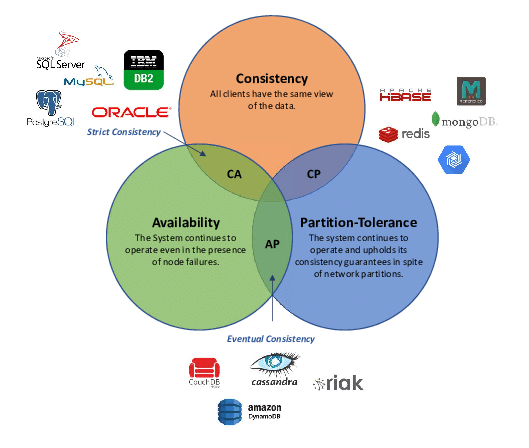

# Handbook_Databases

*Ver 3.0.0*

> This is a practical handbook outlining the most important concepts and commands in SQL and noSQL databases. When writing this material, I intended it to be a hands-on manual on how to achieve a specific objective in querying databases, rather than to be an exhaustive piece of writing about every aspect of the language.
>
> Evgenii Zorin

[](https://creativecommons.org/licenses/by/4.0/)

# Introduction

**Database** is an organised structure made for storing, editing, and processing of information, typically stored electronically in a computer system.

Two types of databases - **relational** and **non-relational** database.

A **DBMS** (Database Management System):
- is a software applications that helps users create and maintain a database. 
- It does:
- Security
- Backups
- Importing / exporting data
- Concurrency
- Interacts with software applications, e.g. programing languages
- DBMS allow you to perform CRUD operations and other administrative tasks

**RDBMS** (Relational DBMS): 
- <u>Manages a relational database</u>
- a type of DBMS that deals with relations and various key constraints. 
- Helps users create and maintain a relational database. 
- Examples include PostgreSQL, MySQL, etc.

**NRDBMS** (Non-relational DBMS):
- <u>Manager a non-relational database</u>
- Helps users create and maintain a non-relational database, e.g. mongoDB, dynamoDB, etc.
- Any non-relational database falls under this category, so there's no set language standard
- Most NRDBMS will implement their own NoSQL language for performing CRUD and administrative operations on the database

Four basic operations of persistent storage - CRUD:
- Create
- Read
- Update
- Delete

A **Query** is a request made to the DBMS for specific information. We write queries for a specific DBMS (RDBMS or NRDBMS) using a query language (either SQL or NoSQL).

```sql
-- Example query in SQL
SELECT employee.name, employee.age 
FROM employee
WHERE employee.salary > 30000;
```

# Classifications

Two types of databases - relational databases using [SQL](SQL.md) and non-relational databases using [noSQL](noSQL.md):

## SQL

Relational Database: 
- <u>Stores data as a series of tables</u>, where each column contains data of the same type and there are relationships between tables that are specified with keys (primary, foreign keys);
- Another feature is that the data schema for a table is specified upon its creation; 

SQL (Structured Query Language):
- is used to interact with RDBMS, 
- perform CRUD operations, 
- and perform other administrative tasks (user management, security, backup, etc.)
- used to define tables and structures
- SQL is standardised; however, different RDBMS make slight modifications to the SQL language. Therefore, code used on one RDBMS is not always portable to another without modification

Advantages / uses:
- Suitable for structured data with **rigid, predefined data schema**
- More suitable if your application requires complex data queries and transactional support
- Supports **complex queries** with keys, join statements, etc.

Disadvantages:
- SQL can be **too restrictive with its data schema**: you have to use predefined schemas to determine your data structure before you can work with it. All of your data must follow the same structure, and this process requires significant upfront preparation. If you ever need to change your data structure, it would be difficult and disruptive to your whole system

Examples of RDBMS:
- MySQL, 
- PostgreSQL, 
- SQLite, 
- Microsoft SQL Server, 
- MariaDB, 
- Oracle


## noSQL

Non-Relational Database:
- Have **non-relational, flexible data structures** (such as documents, graph databases, and key-value stores) that often do not require upfront design and specification of data schema. 
- <u>Organise data in anything but a traditional table</u>
- Different non-relational databases use different NoSQL language
- NoSQL systems are designed to be more flexible than traditional relational databases and can scale up or down easily to accommodate changes in usage or load.

Advantages:
- Offers more flexibility and scalability. Allows fast prototyping, without worrying about the underlying data storage implementation. |
- Suitable for unstructured and semi-structured data

Disadvantages:
- Does not support complex queries;
- Does not support JOIN operations;


Examples of different types of NRDBMS:
- **Key/Value Hash**: data is queried upon requesting its key
  - Redis (open-source), KeyDB, memcached, etcd
- **Document-oriented**: uses structured formats (JSON, BSON, XML) for storing documents; specifying data schemas is optional; as a result, each document / data point can have its own internal structure; they are great for prototyping and fast development due to ease of use and ability to change data types; 
  - MondoDB, RethinkDB, Elasticsearch, Aerospike
- **Column**: databases optimised for column search; as opposed to the RDBMS, which scans scans the entire table, this one allows searching only in specific columns;
  - ClickHouse, Cassandra
- **Graph**: make links between tables using edges, nodes, and properties.
  - ArangoDB: free, open-source multi-model (can be used as document DB, key-value store, or graph DB). Uses AQL (ArangoDB query language)
  - Neo4j, Dgraph, RedisGraph
- **Time series**: optimised for time series
  - Prometheus, InfluxDB

# State vs Schema

Database state: the collection of information stored in a database at a particular moment;

Database schema: the overall design of the database;

# CAP Theorem

(from Wikipedia)
In database theory, the CAP theorem, also named Brewer's theorem after computer scientist Eric Brewer, states that any distributed data store can provide only two of the following three guarantees:

- **Consistency**: <u>Every read receives the most recent write or an error</u>. So after we have written some new data into our database, any client upon request can get that data;
- **Availability**: <u>Every request received by a non-failing node in the system must result in a response</u>. This is definition of availability in CAP theorem as defined by Gilbert and Lynch. But note that there are different notions of availability: in distributed systems, availability means the percentage of requests that clients see as successful, or something close to that.
- **Partition tolerance**: <u>The system continues to operate despite an arbitrary number of messages being dropped (or delayed) by the network between nodes</u>.

From the viewpoint of the CAP theorem, databases can be of three types: CA, CP, or AP.

Read more: https://blog.iddqd.uk/interview-section-databases/



# ACID

ACID is a series of characteristics / features that which ensures that a set of database operations (grouped together in a transaction) leave the database in a valid state even in the event of unexpected errors.
- **Atomicity**: Atomicity guarantees that all of the commands that make up a transaction are treated as a single unit and either succeed or fail together.
- **Consistency**: Consistency guarantees that changes made within a transaction are consistent with database constraints. This includes all rules, constraints, and triggers. If the data gets into an illegal state, the whole transaction fails.
- **Isolation**: Isolation ensures that all transactions run in an isolated environment. That enables running transactions concurrently because transactions don’t interfere with each other.
- **Durability**: Durability guarantees that once the transaction completes and changes are written to the database, they are persisted. This ensures that data within the system will persist even in the case of system failures like crashes or power outages.


