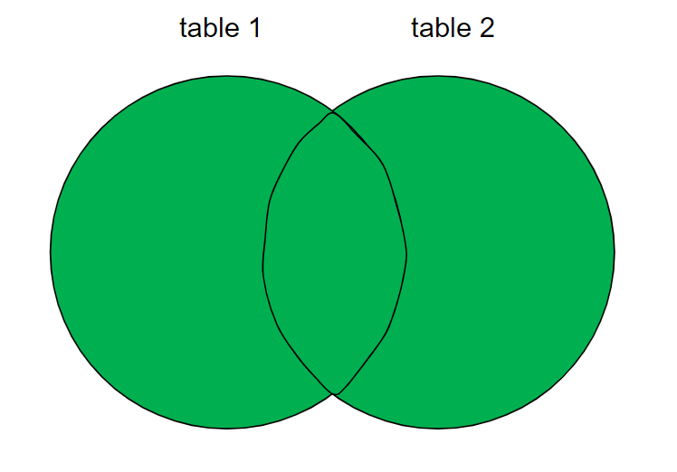

# SQL-handbook

*Ver 3.0.0*

> This is a practical handbook outlining the most important concepts and commands in SQL. When writing this material, I intended it to be a hands-on manual on how to achieve a specific objective in SQL, rather than to be an exhaustive piece of writing about every aspect of the language. *Please note that, unless explicity stated, the commands are given for PostgreSQL*.
> .   
> Evgenii Zorin

[](https://creativecommons.org/licenses/by/4.0/)

# Contents
- [SQL-handbook](#sql-handbook)
- [Contents](#contents)
- [Essentials](#essentials)
- [Database](#database)
- [Table](#table)
- [Edit columns](#edit-columns)
- [Edit rows](#edit-rows)
  * [Update rows](#update-rows)
- [Constraints](#constraints)
- [Primary key](#primary-key)
  * [Composite primary key](#composite-primary-key)
- [Filter](#filter)
  * [Sub-query](#sub-query)
- [Operators](#operators)
  * [Logical operators](#logical-operators)
  * [Comparison operators](#comparison-operators)
  * [Arithmetic operations](#arithmetic-operations)
- [IF conditions](#if-conditions)
- [REGEX](#regex)
- [Dates](#dates)
- [Join tables](#join-tables)
  * [Inner joins](#inner-joins)
  * [Left (outer) join](#left--outer--join)
  * [Right (outer) join](#right--outer--join)
  * [Full (outer) join](#full--outer--join)
- [Export query to CSV](#export-query-to-csv)
- [Procedures](#procedures)
- [Views](#views)

<small><i><a href='http://ecotrust-canada.github.io/markdown-toc/'>Table of contents generated with markdown-toc</a></i></small>


# Essentials

SQL - structured query language. 

**SQL / relational databases**:
- Relational database management systems (RDBMSs) (there are relationships between tables): use SQL to store and retrieve data and store data in rows and columns.
- In RDBMSs, information from various tables is connected with keys (primary, foreign keys) 
- Examples: MySQL, PostgreSQL, SQLite, Microsoft SQL Server, MariaDB, Oracle
- Allows users to query, insert, delete, and update records in relational databases
- Uses:
 - Suitable for structured data with predefined schema
- Advantages:
 - More advantageous if if your application requires complex data queries and transactional support.
 - Perfect for complex queries - supports complex queries
- Disadvantages:
 - SQL can be too restrictive with data schema: You have to use predefined schemas to determine your data structure before you can work with it. All of your data must follow the same structure, and this process requires significant upfront preparation. If you ever need to change your data structure, it would be difficult and disruptive to your whole system. 

**NoSQL**:
- NoSQL (not only SQL; can also structure in non-structured data): MongoDB, Redis, Firebase, DynamoDB, Cassandra;
- It is a type of database that uses non-relational data structures, such as documents, graph databases, and key-value stores to store and retrieve data. NoSQL systems are designed to be more flexible than traditional relational databases and can scale up or down easily to accommodate changes in usage or load.
- Uses:
 - Suitable for unstructured and semi-structured data
- Advantages:
 - Offers more flexibility and scalability. Allows fast prototyping, without worrying about the underlying data storage implementation. |
- Disadvantages:
 - Does not support complex queries;

Basic commands: 
| Command | Function |
| --- | --- |
| `\! cd` | list current dir|
| `\! dir` | list files in the current dir |
| `\i file.sql` | import file |
| `\?` | print methods |
| `\l` | list databases |
| `\c database_name` | connect to a database |
| `\d` or MySQL `SHOW TABLES` | check which tables are present |
| `\dt` | show tables ONLY, without `id_seq` |
| `\d second_table` | check columns and details of a table in a database |

**Database Normalization**

Denormalized dataset - all the data is combined in one dataset, without adhering to the database rules. To enter to a database, data has to have data integrity and adhere to some rules of good database design. Normalization of a database table - structuring it in such a way that it doesn't and cannot express *redundant information*. 

The main purpose of database normalization is to avoid complexities, eliminate duplicates, and organize data in a consistent way.

There are some normal forms (NF) which start with the most important (dangerous) at 1NF and continue to the less dangerous ones with increasing number. These are basically like safety assessment levels, starting from broader one to the more detailed ones. 

**1NF** - eliminates repeating groups:
- Row order should NOT be used to convey information in a table;
- Atomicity: a single cell can only contain a single value of the same data type (within the column);
- Every table has to have primary key (one or several);
- Every row should be unique and not be repeated;
- A repeating group of data items should NOT be stored on a single row; instead, should be stored in a separate table referencing the main table via key;

**2NF** - eliminates redundancy:
- The table has to be in 1NF;
- All non-key attribute in a table must depend on the entire primary key (one or several) within that table; if it only depends on one of the primary keys, then it doesn't belong in this table;
- Relationship between tables has to be formed with foreign keys;

**3NF** - eliminates transitive partial dependency:
- The table has to be in 2NF;
- every non-attribute in a table should depend on the key, the whole key, and nothing but the key; that is to say, there should not be dependencies between attributes that are not part of primary key;

An excellent example is given here: https://www.freecodecamp.org/news/database-normalization-1nf-2nf-3nf-table-examples/#:~:text=The%20First%20Normal%20Form%20%E2%80%93%201NF,-For%20a%20table&text=there%20must%20be%20a%20primary,each%20row%20in%20the%20table

---

# Database

```sql
# Create a new database
CREATE DATABASE database1;
# Rename a database
ALTER DATABASE first_database RENAME TO second_database;
# Delete a database
DROP DATABASE second_database;
```

# Table

General form
```sql
CREATE TABLE table1(
column1 DATATYPE CONSTRAINTS, 
column2 DATATYPE CONSTRAINTS);
```
More commands
```sql
# Create a new table
CREATE TABLE IF NOT EXISTS tablename;
# Create an empty table
CREATE TABLE table1();
# Some examples
CREATE TABLE table1(id SERIAL PRIMARY KEY, first_name VARCHAR(50) NOT NULL, gender VARCHAR(7) NOT NULL, date_birth DATE NOT NULL);
CREATE TABLE table1(id BIGSERIAL NOT NULL PRIMARY KEY);

# Rename a table
ALTER TABLE table1 RENAME TO table2;

# Delete records from a table, but leave the table
# DELETE - has a possible IF clause
DELETE FROM table1;
DELETE FROM table1 WHERE column1 = value; 
# Delete records from a table, but leave the table
# TRUNCATE - like DELETE, but doesn't have a possible IF clause
TRUNCATE table1;
TRUNCATE table1, table2;
# Delete the table and all the rows inside it
DROP TABLE table1;
DROP TABLE IF EXISTS table1;
```

**Datatypes**: 
| Datatype | Description |
| --- | --- |
| `DATE` | YYYY-MM-DD |
| `INT` | |
| `SERIAL` | Auto-increments? |
| `BIGSERIAL` | Auto-increments a number |
| `VARCHAR(30)` | String (max length) |
| `NUMERIC(4, 1)` | Float with number of decimals (1) |

**Constraints**: 
| Constraint | Meaning |
| --- | --- |
| `NOT NULL` | Values in this column have to be present; cannot be NULL |
| `PRIMARY KEY` | Makes a specified column a PRIMARY KEY column |
| `REFERENCES table(column)` | Make a foreign key referencing another table |
| `BIGSERIAL` | Integer that auto-increments |
| `BOOLEAN ` | True / False, 'Yes' / 'No' |
| `UNIQUE` | Values in this column must be unique |


---

# Edit columns

General form:
```sql
ALTER TABLE table1 
ADD COLUMN column1 DATATYPE CONSTRAINTS DEFAULT 'default', 
ADD COLUMN column2 DATATYPE CONSTRAINTS REFERENCES table2(column1);
```
More commands:
```sql
# Add a column
ALTER TABLE table1 ADD COLUMN name VARCHAR(30) NOT NULL;

# Rename a column
ALTER TABLE table1 RENAME COLUMN column1 TO column2
# Change datatype of a column
ALTER TABLE characters ALTER COLUMN date_of_birth SET DATA TYPE VARCHAR(10); # Change datatype of a column
# Restart the auto-incrementing values
ALTER SEQUENCE person_id_seq RESTART WITH 10; # or 1
# Add foreign key
ALTER TABLE <table_name> ADD FOREIGN KEY(<column_name>) REFERENCES <referenced_table_name>(<referenced_column_name>);

# Delete a column
ALTER TABLE table1 DROP COLUMN column1;
# Drop a constraint for a column
ALTER TABLE table1 DROP CONSTRAINT constraint_name; # Drop a named constraint
ALTER TABLE table1 ALTER COLUMN column1 DROP NOT NULL; # Drop not null constraint


# Add a column by concatenating two other columns (NOTE: this is not the most optimal solution, but it's the one that works for me):
ALTER TABLE table1 ADD COLUMN full_name VARCHAR(30); 
UPDATE table1 SET full_name = first_name || ' ' || last_name;
```

# Edit rows
```sql
# Insert a row
INSERT INTO table1 (column1, column2, column3) VALUES ('Value1', 52, DATE '1995-05-04');
# Insert two rows
INSERT INTO table1 (column1, column2, column3) VALUES (...), (...);

# Update an entry based on IF-condition
UPDATE table1 SET column1=5, column2=10 WHERE row="Rowname";

# Delete all records
DELETE FROM table1; 
# Delete a row in which column has the specified value
DELETE FROM table1 WHERE column1='Value'; 
```

## Update rows

```sql
# Update values in a column - swap 'f' and 'm' values
UPDATE Salary SET sex = CASE WHEN sex = 'm' THEN 'f' ELSE 'm' END;

```

---

# Constraints

```sql
ALTER TABLE table_name ALTER COLUMN column_name SET NOT NULL; # Add NOT NULL constraint to foreign key column, so that there will be no rows for nobody 
```

UNIQUE - makes sure that only unique values can be added in a column
```sql
ALTER TABLE table1 ADD CONSTRAINT constraint_name_here UNIQUE (column1) # Custom constraint name
# or
ALTER TABLE table1 ADD UNIQUE (column1) # Constraint name defined by psql
```

CHECK - a column can only accept specific values
```sql
ALTER TABLE table1 ADD CONSTRAINT constraint_name CHECK (column1='Male' OR column1='Female');
```

CONFLICT (CONSTRAINT) MANAGEMENT
```sql
ON CONFLICT (column1) DO NOTHING;
INSERT INTO ... VALUES ... ON CONFLICT (column1) DO UPDATE SET column1 = EXCLUDED.column1; # If an entry exists, it will update with the value you give it
```

FOREIGN KEYS - can connect tables based on foreign keys
```sql
CREATE TABLE table1(column1 DATATYPE REFERENCES table2(column_of_table2);

ALTER TABLE table_name ADD COLUMN column_name DATATYPE REFERENCES referenced_table_name(referenced_column_name); # to set a foreign key that references a column from another table
ALTER TABLE table_name ADD FOREIGN KEY(column_name) REFERENCES referenced_table(referenced_column); # set an existing column as a foreign key
ALTER TABLE character_actions ADD FOREIGN KEY(character_id) REFERENCES characters(character_id);
```

# Primary key

If there are entries with the same details, can uniquely identify them by primary key, e.g. their id. 

```sql
ALTER TABLE table1 ADD PRIMARY KEY (column1); # Add primary key constraint to a column
ALTER TABLE table_name ADD PRIMARY KEY(column1, column2); # create composite primary key (primary key from two columns)

ALTER TABLE table1 DROP CONSTRAINT person_pkey # Drop primary key constraint
```

## Composite primary key 

Uses more than one column as a unique pair. 

```sql
ALTER TABLE <table_name> ADD PRIMARY KEY(<column_name>, <column_name>);
```
---

# Filter

```sql
ORDER BY column_name LIMIT 10 OFFSET 3;

# COALESCE - print a value for NULL values
SELECT COALESCE(column1, 'Entry not found') FROM table1;   
```

**SELECT**:

General form:
```sql
SELECT column1, column2 
FROM table1 
WHERE column2='Value'
AND (column3='Value2' OR column3='value3');
```

Examples:
```sql
# Select all rows for all columns from a table
SELECT * FROM table1;

# Only print unique values from the column
SELECT DISTINCT(column1)
# Count the total number of rows
SELECT COUNT(*)
# Print the max value of column2
SELECT MAX(column1)
SELECT AVG(column1) 
SELECT ROUND(AVG(column1))
# Sum all values in a column
SELECT SUM(column1)
SELECT column1 AS "Column title"

# Select example
SELECT column1 FROM table1 WHERE column2 = 'value' and column3 > 100;
```

**WHERE**:
```sql
WHERE column1 != 2 OR column2 IS null;
WHERE column1 IN ('Value1', 'Value2', 'Value3')
# Values between two dates
WHERE date BETWEEN DATE '1999-01-01' AND '2015-01-01'
# Values alphabetically between two strings
WHERE column1 BETWEEN 'Alpha' AND 'Beta'

# REGEXP
### Value starts with 'a'
WHERE email LIKE 'a%'
### Value ends with '.com'
WHERE email LIKE '%.com';
#
WHERE course NOT LIKE '_lgorithms';
# case-insensitive
ILIKE, NOT ILIKE
# Entries start with a vowel
SELECT DISTINCT(CITY) FROM STATION WHERE CITY ~ '^[AEIOUaeiou].*';
SELECT DISTINCT(CITY) FROM STATION WHERE CITY REGEXP '^[aeiou]';
```


**ORDER BY**:
-  `ORDER BY column1 ASC`
-  `ORDER BY column1 DESC`

**GROUP BY**:
- `GROUP BY column1`
- `GROUP BY column1 HAVING COUNT(*) > 5` only group those values whose count is > 5
- `select major_id, count(*) from students group by major_id;` count unique values in column 'major_id'
- `select major_id, min(gpa) from students group by major_id;` view min value in each group within column major_id


**OFFSET**: skip n rows
**LIMIT**: show n first rows

Examples: 
- `SELECT * FROM table1;` view table1
- `SELECT * FROM characters ORDER BY character_id DESC;` view the whole table ordered by 'character_id'; DESC or ASC
- `SELECT * FROM person WHERE gender='Female' AND (country_of_birth='Poland' OR country_of_birth='China') ORDER BY first_name;`
- `SELECT column1, COUNT(*) FROM table GROUP BY column1;` print count of each value in column1
- `SELECT make, SUM(price) FROM car GROUP BY make;`
- `WHERE column1 < 'M'` selects rows with column1 values before 'M' alphabetically

## Sub-query

Use IDs from one table to use in querying another table
```sql
SELECT column1 as 'Column 1' FROM table1 WHERE table1.id NOT IN (SELECT customer_id FROM table2);
```


# Operators

## Logical operators

| Operator | Meaning |
| - | - |
| `AND` | Shows data if all the conditions separated by `AND` are TRUE. |
| `OR` | Shows data if any of the conditions separated by `OR` is TRUE. |
| `NOT` | Shows data if the condition after `NOT` is not true. |

Some examples:
```sql
SELECT column1, column2 FROM table1 WHERE condition1 AND condition2 AND condition3;

WHERE NOT condition;
```

## Comparison operators

| Operator | Meaning |
| --- | -- |
| `=`, `<`, `<=`, `>`, `>=` | |
| `=` | equals |
| `<>` | not equal |

## Arithmetic operations

```sql
SELECT 10 + 2;
ROUND(column1, decimalplaces); 
```
| Operator | Meaning |
| --- | --- |
| `-`, `+`, `*`, `/` | |
| `^` | power |
| `%` | modulo |
| `MIN(column1)` | minimum value of a column |
| `SUM(column1)` | sum of all values in a column |
| `AVG(column1)` | average of a column's values |
| `CEIL(5.9)`, `FLOOR(5.1)` | round up a value |
| `ROUND(<number_to_round>, <decimals_places>)` | round a value to the nearest whole number |
| `COUNT(*)` | count number of rows |
| `mod(column1,2)` | Check the remainder of the division. In this case, remainder is zero if the number is even. |


Examples: 
- `SELECT column1 * 10`
- `SELECT MAX(column1)`

# IF conditions

```sql
# From table 'Employee', calculate bonus for each employee_id. 
# Bonus = 100% salary (if ID is odd and employee name doesn't start with 'M'), else bonus = 0. 
## Solution 1
SELECT employee_id, CASE WHEN employee_id % 2 = 1 AND name NOT LIKE 'M%' THEN salary ELSE 0 END AS bonus FROM Employees;
## Solution 2
SELECT employee_id, if(employee_id % 2 = 1 AND name NOT LIKE 'M%', salary, 0) AS bonus FROM Employees;
```

# REGEX

```sql
select * from courses where course like '_lgorithms';
```

| Sign | Meaning |
| --- | --- |
| `%` | any character, any number of times |
| `_` | exactly 1 character |

- `LIKE 'W%'` names starting with 'W'
- `LIKE '_e%'` second letter is 'e'
- `LIKE '% %'` values with a space in them

---


# Dates

```sql
SELECT NOW(); # Gives YYYY-MM-DD HH:MM:SS.MSMS
SELECT AGE(NOW(), date_of_birth); # Get years of a person from his birthday
```

INTERVAL: `YEARS`, `MONTHS`, `DAYS`

```sql
NOW() - INTERVAL '1 YEAR'; # Time a year ago
```

Typecasting: `::DATE`, `::TIME`
```sql
SELECT NOW()::DATE # YYYY-MM-DD
SELECT NOW()::TIME # HH:MM:SS.MSMS
(NOW()::DATE + INTERVAL '10 MONTHS')::DATE
```

Extracting fields: `DAY`, `DOW`, `MONTH`, `YEAR`, `CENTURY`
```sql
SELECT EXTRACT (YEAR FROM NOW());

```

Select a part of a date:
- 'year', 'month', 'day', 'hour', 'minute', 'second'
```sql
SELECT date_part('year', (SELECT date_column_name))
```

# Join tables

There are two main categories of joins:
- **INNER JOIN**: will only retain the data from the two tables that is related to each other (that is present in both tables, like an overlap of the Venn diagram);
- **OUTER JOIN**: will additionally retain the data that is not related from one table to the other; iow, combines values from the two tables, even those with NULL values.

General form:
```sql
SELECT * FROM table1
JOIN table2 ON relation;
```

## Inner joins

Combine two tables by a column with the same values. Join only gives rows that have foreign key in both tables. 


More examples:

`\x` - toggle expanded display. 

```sql
SELECT * FROM students INNER JOIN majors ON students.major_id = majors.major_id;
```

## Left (outer) join

Will keep the unrelated data from the left (the first) table. Left join gets all rows from the left table, but from the right table - only rows that are linked to those of the table on the left. 

The same notation, just write `LEFT JOIN` instead of `JOIN`


General form:
```sql
SELECT columns FROM table1
LEFT JOIN table2
ON relation;
```
More examples:
```sql
# Only show entries that don't have a car
SELECT * FROM person LEFT JOIN car ON car.id = person.car_id WHERE car.* IS NULL;
```
## Right (outer) join

Will keep the data in the second table that is not related to the first table.


General form:
```sql
SELECT columns FROM table1
RIGHT JOIN table2
ON relation;
```

## Full (outer) join

Combine values from two tables, including those with NULL values. 



General form:
```sql
SELECT columns FROM table1
FULL JOIN table2
ON relation;
```

More examples:
```sql
SELECT * FROM table1 FULL JOIN table2 ON table1.id = table2.char_id; 
```
Or, if the column has the same name:
```sql
SELECT * FROM table1 JOIN table2 USING (id_name)
```

# Export query to CSV

```sql
\copy (SELECT ...) TO '/Users/Desktop/file.csv' DELIMITER ',' CSV HEADER;
# Example
\copy (SELECT * FROM table1 WHERE first_name='Evgenii') TO '/Users/evgen/Desktop/query2.csv' DELIMITER ',' CSV HEADER;
```

# Procedures

In SQL, stored procedure is a set of statement(s) that perform some defined actions. We make stored procedures so that we can reuse statements that are used frequently. Below are the procedures for PostgreSQL.

Not sure if I can get a procedure to return information in a SELECT statement.

Check all procedures for postgreSQL
```sql
\df
```

Create a new procedure for PostgreSQL
```sql
CREATE PROCEDURE proc_1 ()
LANGUAGE SQL
AS $$
SELECT * FROM table1;
$$;
```

Run a procedure
```sql
CALL proc_1();
```

E.g. a procedure for inserting a new entry
```sql
# Create procedure
CREATE PROCEDURE proc_insertrecord 
(var1 VARCHAR(30), var2 VARCHAR(30), var3 INT) 
LANGUAGE SQL
AS $$ 
INSERT INTO table1 (first_name, gender, age) 
VALUES (var1, var2, var3); 
$$;

# Run procedure
CALL proc_insertRecord ('Isabel2', 'weird', 10);
```

Delete a procedure
```sql
DROP PROCEDURE proc_1;
```

# Views

A View is a kind of a table that is based on results of a previous SQL query. For example, you can save a table view upon running the inner join command, and then perform actions on that view table to not type in the join command over and over again. 

After you create a view, it shows in the list of tables using the command `\d`. Nevertheless, this view is not a table; it simply is a result of a saved query. 

```sql
# Create a view of a table
CREATE VIEW table1_view_males AS 
SELECT * FROM table1 WHERE gender = 'Male';

# Show a table view
SELECT * FROM table1_view_males;

# Update a view
CREATE OR REPLACE VIEW view1 AS ...;

# Delete a view
DROP VIEW view1;
```

A more practical example
```sql
# Let's say you have a join query
SELECT table1.first_name, table1.gender, table1.age, table2.item 
FROM table1 
INNER JOIN table2 ON table1.first_name = table2.first_name;

# If you want to make an operation on it, instead of writing it out every time, you can save it as a view and then perform that action on the view of the table
CREATE VIEW table1_table2_innerjoin AS 
SELECT table1.first_name, table1.gender, table1.age, table2.item 
FROM table1 
INNER JOIN table2 ON table1.first_name = table2.first_name;

# So now, you can perform operations on that view object you created, 
# for example, you can count rows
SELECT COUNT(*) FROM table1_table2_innerjoin;
```


