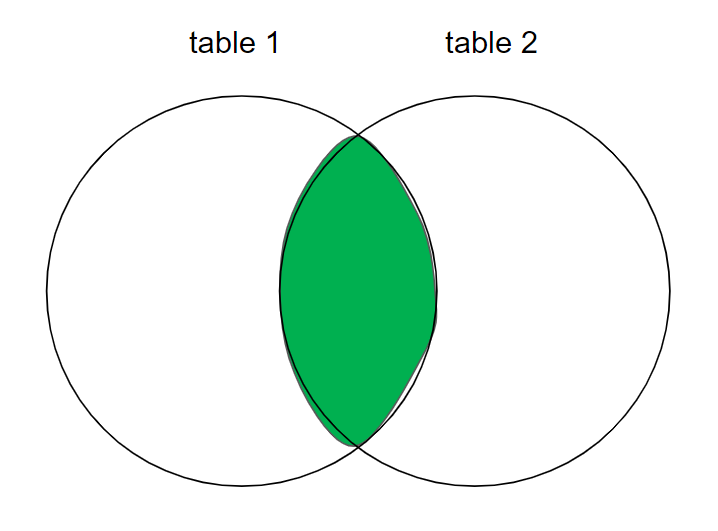

# SQL

- [SQL](#sql)
- [General](#general)
  - [Comments](#comments)
  - [Query formatting](#query-formatting)
  - [Database Normalization](#database-normalization)
- [Subsets of SQL commands](#subsets-of-sql-commands)
  - [DDL](#ddl)
  - [DML](#dml)
  - [DCL](#dcl)
  - [TCL](#tcl)
- [Datatypes](#datatypes)
  - [Character](#character)
  - [Numeric](#numeric)
  - [Temporal](#temporal)
  - [NULL](#null)
  - [Type casting](#type-casting)
  - [Array \> column etc.](#array--column-etc)
- [Operators](#operators)
- [Query clauses](#query-clauses)
  - [Aliases](#aliases)
  - [SELECT](#select)
    - [Built-in functions](#built-in-functions)
    - [String manipulation](#string-manipulation)
      - [CHAR](#char)
      - [LENGTH](#length)
      - [TRIM](#trim)
      - [UPPER](#upper)
    - [Workings with numbers](#workings-with-numbers)
      - [Rounding](#rounding)
    - [DISTINCT](#distinct)
    - [COALESCE](#coalesce)
    - [ROUND](#round)
    - [EXCEPT](#except)
    - [CONCAT](#concat)
    - [Random sampling](#random-sampling)
    - [CASE WHEN](#case-when)
    - [QUOTE](#quote)
    - [LIKE, REGEXP](#like-regexp)
    - [Aggregate statements](#aggregate-statements)
      - [COUNT](#count)
      - [SUM](#sum)
      - [MIN/MAX](#minmax)
      - [AVG](#avg)
      - [GROUP BY](#group-by)
      - [STRING\_AGG](#string_agg)
  - [FROM](#from)
    - [Types of tables](#types-of-tables)
      - [Subquery](#subquery)
      - [CTE](#cte)
      - [Temporary tables](#temporary-tables)
      - [Views](#views)
  - [WHERE](#where)
    - [LIKE, REGEX](#like-regex)
  - [HAVING](#having)
  - [ORDER BY](#order-by)
  - [OFFSET](#offset)
  - [LIMIT](#limit)
- [Constraints](#constraints)
  - [Primary key](#primary-key)
  - [Composite primary key](#composite-primary-key)
  - [Foreign key](#foreign-key)
- [Trigger](#trigger)
- [IF conditions](#if-conditions)
- [Joins](#joins)
  - [ON...AND vs ON...WHERE](#onand-vs-onwhere)
  - [ON vs USING](#on-vs-using)
  - [Inner joins](#inner-joins)
  - [Left (outer) join](#left-outer-join)
  - [Right (outer) join](#right-outer-join)
  - [Full (outer) join](#full-outer-join)
  - [Multi-table joins](#multi-table-joins)
  - [Self join](#self-join)
  - [Cartesian product](#cartesian-product)
- [Set operations](#set-operations)
- [Pivot](#pivot)
  - [Wide -\> long](#wide---long)
  - [Long -\> wide](#long---wide)
- [Export query to CSV](#export-query-to-csv)
- [Procedures](#procedures)
- [Views](#views-1)
- [Transaction](#transaction)
- [Isolation levels](#isolation-levels)
- [Denormalisation](#denormalisation)
- [Relationships](#relationships)
  - [One-to-one](#one-to-one)
  - [One-to-many](#one-to-many)
  - [Many-to-many](#many-to-many)
  - [Many-to-one](#many-to-one)
  - [Self-referencing](#self-referencing)
- [PostgreSQL](#postgresql)
- [Tasks](#tasks)
  - [JOINS](#joins-1)

<small><i><a href='http://ecotrust-canada.github.io/markdown-toc/'>Table of contents generated with markdown-toc</a></i></small>

# General

**Table** - organised set of data in the form of rows and columns.

A few types of schema in a relational database:
- Star schema: 
- Snowflake schema

Basic commands: 
| Command | PostgreSQL psql ; general | MySQL |
| - | - | - |
| List current dir | `\! cd` | |
| List files in the current dir | `\! dir` | |
| Import file | `\i file.sql` | |
| Print methods | `\?` | |
| List databases | `\l` | `SHOW DATABASES;` |
| Connect to a database | `\c database_name` | `use database_name;` |
| Show tables | `\d` | `SHOW TABLES;` |
| Show tables ONLY, without `id_seq` | `\dt` | |
| Describe table / Check columns and details of a table in a database | `\d second_table`, `\d+ second_table` ; `SELECT column_name, data_type, character_maximum_length, column_default, is_nullable FROM INFORMATION_SCHEMA.COLUMNS WHERE table_name = 'sample1';` | `DESCRIBE tablename`, `DESC table1` |
| Show the supported character sets in your server | | `SHOW CHARACTER SET;` |
| Connect to a database `database1` and format every output in XML | | | `sudo mysql -u root -p --xml database1` |
| Check constraints of different tables and databases | | | `SELECT * FROM information_schema.TABLE_CONSTRAINTS;` |

Specific to BigQuery:
```sql
-- Get names of columns in a table
SELECT column_name
FROM <project_name>.<dataset_name>.INFORMATION_SCHEMA.COLUMNS
WHERE table_name = '<table_name>' 
```

**Row / record**: a set of columns that together completely describe an entity or some action on an entity. 

## Comments

```sql
SELECT /* comment here */
FROM /* another comment here */
-- this is another way to write comments

/*
you can write multi-line comments
like this
*/
SELECT *
FROM table1
WHERE employee='Laura'

```

## Query formatting

```sql
SELECT a
     , d
     , c
FROM table
WHERE d = 'SOMETHING'
```

## Database Normalization

**Database normalization**:
- The process of **structuring a relational database** in accordance with a series of so-called **normal forms** in order to reduce data redundancy and improve data integrity; usually it is done by splitting a table into smaller tables and coding relationships between them via keys. 
- It was first proposed by British computer scientist Edgar F. Codd as part of his relational model.
- Normalisation is the process of refining a database design to ensure that each independent piece of information is in only one place except for foreign key
- Doesn't really apply in noSQL databases;

Denormalized dataset - all the data is combined in one dataset, without adhering to the database rules. To enter to a database, data has to have data integrity and adhere to some rules of good database design. Normalization of a database table - structuring it in such a way that it doesn't and cannot express *redundant information*. 

The main purpose of database normalization is to avoid complexities, eliminate duplicates, and organize data in a consistent way.

There are some normal forms (NF) which start with the most important (dangerous) at 1NF and continue to the less dangerous ones with increasing number. These are basically like safety assessment levels, starting from broader one to the more detailed ones. 

**1NF** - eliminates repeating groups:
- Row order should NOT be used to convey information in a table;
- Atomicity: a single cell can only contain a single value of the same data type (within the column);
- Every table has to have primary key (one or several);
- Every row should be unique and not be repeated;
- A repeating group of data items should NOT be stored on a single row; instead, should be stored in a separate table referencing the main table via key;

**2NF** - eliminates redundancy:
- The table has to be in 1NF;
- All non-key attribute in a table must depend on the entire primary key (one or several) within that table; if it only depends on one of the primary keys, then it doesn't belong in this table;
- Relationship between tables has to be formed with foreign keys;

**3NF** - eliminates transitive partial dependency:
- The table has to be in 2NF;
- every non-attribute in a table should depend on the key, the whole key, and nothing but the key; that is to say, there should not be dependencies between attributes that are not part of primary key;

An excellent example is given here: https://www.freecodecamp.org/news/database-normalization-1nf-2nf-3nf-table-examples/#:~:text=The%20First%20Normal%20Form%20%E2%80%93%201NF,-For%20a%20table&text=there%20must%20be%20a%20primary,each%20row%20in%20the%20table

---

# Subsets of SQL commands

SQL is a hybrid language that contains 4 languages at once - DDL, DML, DCL, DQL

Read more: https://www.scaler.com/topics/ddl-dml-dcl/

## DDL

Data Definition Language, shortly termed DDL, is a subset of SQL commands that define the structure or schema of the database; commands used to modify or alter the structure of the database. 

Commands:
| Command | Explanation |
| - | - |
| **CREATE** | Create a new database |
| **ALTER** | ALTER command alters the database structure by adding, deleting, and modifying columns of the already existing tables, like renaming and changing the data type and size of the columns. |
| **DROP** | The DROP command deletes the defined table with all the table data, associated indexes, constraints, triggers, and permission specifications. |
| **TRUNCATE** | **Deletes all the data / rows** and records from an existing table, including the allocated spaces for the records. Unlike the DROP command, it does not delete the table from the database. It works similarly to the DELETE statement without a WHERE clause; also TRUNCATE is faster than DELETE. |
| **RENAME** | ... |

**Database commands**:
```sql
CREATE DATABASE database1;

-- Rename a database: 
ALTER DATABASE first_database RENAME TO second_database;

-- Delete a database:
DROP DATABASE second_database;
```

**Table commands**:

These are SQL schema statements for creating tables with specified schemas.
```sql
-- General form
CREATE TABLE table1(
  column1 DATATYPE CONSTRAINTS, 
  column2 DATATYPE CONSTRAINTS
);
-- Create a new table
CREATE TABLE IF NOT EXISTS tablename;
-- Create an empty table
CREATE TABLE table1();
-- Some examples
CREATE TABLE table1(
  -- primary key column to automatically increment
  id SERIAL PRIMARY KEY, -- BIGSERIAL NOT NULL PRIMARY KEY; 
  first_name VARCHAR(50) NOT NULL, 
  gender VARCHAR(7) NOT NULL, 
  date_birth DATE NOT NULL,
  street VARCHAR(20),
  city VARCHAR(20),
  country VARCHAR(20),
  eye_color ENUM('BR', 'BL', 'GR') -- can only take on values from the list
);

-- Rename a table
ALTER TABLE table1 
RENAME TO table2;

-- Delete records from a table, but leave the table
-- TRUNCATE - like DELETE, but doesn't have a possible IF clause
TRUNCATE table1;
TRUNCATE table1, table2;

-- Delete the table and all the rows inside it
DROP TABLE table1;
DROP TABLE table1, table2;
DROP TABLE IF EXISTS table1;

-- General form
ALTER TABLE table1 
ADD COLUMN column1 DATATYPE CONSTRAINTS DEFAULT 'default', 
ADD COLUMN column2 DATATYPE CONSTRAINTS REFERENCES table2(column1);
-- Add a column example
ALTER TABLE table1 
ADD COLUMN name VARCHAR(30) NOT NULL UNIQUE;

-- Rename a column
ALTER TABLE table1 
RENAME COLUMN column1 TO column2;

-- Change datatype of a column
ALTER TABLE characters ALTER COLUMN date_of_birth SET DATA TYPE VARCHAR(10); # Change datatype of a column
-- Restart the auto-incrementing values
ALTER SEQUENCE person_id_seq RESTART WITH 10; # or 1
-- Add foreign key
ALTER TABLE <table_name> ADD FOREIGN KEY(<column_name>) REFERENCES <referenced_table_name>(<referenced_column_name>);

-- Delete a column
ALTER TABLE table1 
DROP COLUMN column1;

-- Drop a constraint for a column
ALTER TABLE table1 DROP CONSTRAINT constraint_name; # Drop a named constraint
ALTER TABLE table1 ALTER COLUMN column1 DROP NOT NULL; # Drop not null constraint

-- Add a column by concatenating two other columns (NOTE: this is not the most optimal solution, but it's the one that works for me):
ALTER TABLE table1 ADD COLUMN full_name VARCHAR(30); 
UPDATE table1 SET full_name = first_name || ' ' || last_name;
```


## DML

Data Manipulation Language, shortly termed DML, is an element in SQL language that deals with managing and manipulating data in the database. DML commands are SQL commands that perform operations like storing data in database tables, modifying and deleting existing rows, retrieving data, or updating data.

Commands:
| Command | Explanation |
| - | - |
| **SELECT** | Fetches data or records from one or more tables in the SQL database. The retrieved data gets displayed in a result table known as the result set.
| **INSERT** | Inserts one or more new records into the table in the SQL database. |
| **UPDATE** | Updates or changes the existing data or records in a table in the SQL database. |
| **DELETE** | Deletes the existing records (that can be specified with a WHERE clause and logical operators to delete selected rows from the database). Is redo-able. |
| **MERGE** | Deals with insertion, updation, and deletion in the same SQL statement. |
| **CALL** | Calls or invokes a stored procedure. |
| **EXPLAIN PLAN** | Describes the access path to the data. It returns the execution plans for the statements like INSERT, UPDATE, and DELETE in the readable format for users to check the SQL Queries. |
| **LOCK TABLE** | Ensures the consistency, atomicity, and durability of database transactions like reading and writing operations. |

Table:
```sql
-- Delete records from a table, but leave the table
-- DELETE - has a possible IF clause
DELETE FROM table1;
DELETE FROM table1 WHERE column1 = value; 
```

```sql
-- Insert a row in the default order of columns
INSERT INTO table1 VALUES ('Value1', 52, DATE '1995-05-04');
-- Insert a row with data for specified columns only
INSERT INTO table1 (column1, column2, column3) VALUES ('Value1', 52, DATE '1995-05-04');
-- Insert two rows
INSERT INTO table1 (column1, column2, column3) VALUES (...), (...);

-- Alter all rows
UPDATE table1
SET column1 = 10

-- Update an entry based on IF-condition
UPDATE table1 
SET column1=5, column2=10 
WHERE row='Rowname' AND row2='Rowname2';

-- Delete all rows
DELETE FROM table1; 
-- Delete a row in which column has the specified value
DELETE FROM table1 WHERE column1='Value'; 

-- Update rows

-- Update values in a column - swap 'f' and 'm' values
UPDATE Salary SET sex = CASE WHEN sex = 'm' THEN 'f' ELSE 'm' END;

```

## DCL

Data Control Language, shortly termed DCL, is comprised of those commands in SQL that deal with controls, rights, and permission in the database system. DCL commands are SQL commands that perform operations like giving and withdrawing database access from the user.

| Command | Explanation | 
| - | - |
| **GRANT** | Gives access privileges or permissions like ALL, SELECT, and EXECUTE to the database objects like views, tables, etc, in SQL. |
| **REVOKE** | Withdraws access privileges or permissions given with the GRANT command. |

## TCL

Transaction Control Language:
- COMMIT
- ROLLBACK
- SAVEPOINT

# Datatypes

## Character

| Datatype | Description | Example |
| - | - | - |
| `CHAR(30)` | Fixed-length, blank-padded strings. <br> The string has to be EXACTLY the specified length, in this case, 30 characters - no more, no less. These are right-padded with spaces (to fill up the remaining characters not used by definition of a variable) and always consume the same number of bytes.| State abbreviations - all strings stored in the column are of the same length. |
| `VARCHAR(30)` | Variable-length string. The string can have a length up to the specified limit, such as 10, 20, 25 characters, but no more than e.g. 30 characters. | Varchar is appropriate for free-form data entry, e.g. notes column to hold data about customer interactions with your company's customer service department.  |
| PostgreSQL `text` ; MySQL `tinytext`, `text`, `mediumtext`, `longtext` | To store longer strings such as emails, XML documents. | Note: in MySQL, `tinytext` and `text` aren't normally used. Instead, you can see more often the use of mediumtext and longtext that can be used for storing documents. |

> Note 1: 
> for character data types, use single quotes, not doublequotes. 
> If you need to use a single apostrophe as part of the string, use it two times to escape, e.g. to write a string `O'Brien` you can escape like this: `'O''Brien'`

> Note 2:
> CHAR and VARCHAR are for storing relatively short text strings. For longer, use text data types

Define character set:
```sql
-- for a variable
VARCHAR(20) CHARACTER SET latin1
-- for the entire database
CREATE DATABASE database1 CHARACTER SET latin1;
```

## Numeric

| Datatype | Description | Example |
| - | - | - |
| `SERIAL` | Auto-increments a number upon inserting a new row. The SERIAL type will make your column an INT with a NOT NULL constraint, and automatically increment the integer when a new row is added. `BIGSERIAL` is the same but has a higher range of possible values.  |
| `BOOLEAN` | `TRUE`, `FALSE` | A column indicating whether a customer order has been shipped |
| `INT` | Whole number. MySQL also has `tinyint`, `smallint`, `mediumint`, `int`, `bigint` | |
| `FLOAT` | Can be `FLOAT(p,s)`, where p is the total number of digits and s is number of allowable digits to the right of the decimal point. For MySQL, can be `FLOAT`, `FLOAT(p,s)`, and for even larger numbers `DOUBLE(p,s)`. | E.g. `FLOAT(4,2)` - handles 17.87, 8.19, but rounds 17.8675 to 17.87 and errors at attempt of storing 178.375 |

> Note 1: 
> The numeric data types can be defined as `unsigned`, meaning that they are greater than or equal to zero.

## Temporal

| Datatype | Description | Example |
| - | - | - |
| `TIMESTAMP` 

| `DATETIME` | `YYYY-MM-DD HH:MM:SS` | Column to hold information about when a customer order was actually shipped. |
| `TIMESTAMP` | Same information as DATETIME, but 1) is automatically populated with the current date/time by the MySQL server when a row is added or when a row is modified and 2) has a much smaller range of acceptable values. | A column that tracks when a user last modified a particular row in a table. |
| `DATE` | `YYYY-MM-DD` | Column to hold the expected future shipping date of a customer order. An employee's birth date. |
| `YEAR` | `YYYY` | |
| `TIME` | `HHH:MM:SS` | |

> Date is inserted as string in the format `YYYY-MM-DD`, e.g. `2020-03-23`. MySQL or other servers will automatically convert the string into a date, given that the format of the string matches that of the column in the temporal datatype

Different ways of writing time:
| Date | Example |
| - | - |
| `YYYY` | 2014 |
| `MM` | 01 to 12 |
| `DD` | 01 to 31 |
| `HH` | Hour: 00 to 23 |
| `HHH` | Hours (elapsed): -838 to 838 |
| `MI` | Minute: 00 to 59 |
| `SS` | Seconds: 00 to 59 |

**Time zones**

```sql
-- Give current UTC time
-- MySQL
SELECT utc_timestamp();

-- Check time zone settings - global time zone and session time zone
-- SYSTEM = server is using the time zone setting from the server on which the database resides
-- MySQL
SELECT @@global.time_zone, @@session.time_zone
-- Set time zone
SET time_zone = 'Europe/Zurich';
-- PostgreSQL
SHOW timezone;
SELECT current_setting('TIMEZONE');
```

**General**

```sql
-- Update a date for a row
UPDATE rental
SET return_date = '2019-09-17' -- or '2019-09-17 15:30:00'
WHERE rental_id = 99999;

-- Gives YYYY-MM-DD HH:MM:SS.MSMS
SELECT NOW();
-- Get years of a person from his birthday
SELECT AGE(NOW(), date_of_birth);
-- Get current date; returns 2022-03-16
SELECT CURDATE()
select CURRENT_DATE() -- or CURRENT_DATE -- returns '2024-11-21'
-- Get current time
SELECT CURTIME()
-- returns current date formatted as UNIX
select UNIX_TIMESTAMP()

-- INTERVAL: 'YEARS', 'MONTHS', 'DAYS'
-- This is used to add time period to dates
-- Time a year ago
NOW() - INTERVAL '1 YEAR';
-- Select birthdays between 1977-05-04 and 30 days before that
SELECT * FROM personal_data 
WHERE birthday < '1977-05-04'::date 
AND birthday > '1977-05-04'::date - INTERVAL '30 DAYS';


-- Typecasting
-- YYYY-MM-DD
SELECT NOW()::DATE
-- HH:MM:SS.MSMS
SELECT NOW()::TIME
-- An example
(NOW()::DATE + INTERVAL '10 MONTHS')::DATE


-- EXTRACT: Extracting fields: DAY, DOW, MONTH, YEAR, CENTURY
-- EXTRACT can be used in SELECT and WHERE
-- PostgreSQL
EXTRACT (YEAR FROM NOW())
SELECT YEAR(NOW()), MONTH(NOW()), DAY(NOW()), HOUR(NOW()), MINUTE(NOW()), SECOND(NOW())
-- Select month of February
SELECT * FROM notable_dates WHERE EXTRACT (MONTH FROM date1) = 02
-- Compare two years
WHERE EXTRACT(YEAR FROM date1) < EXTRACT(YEAR FROM CURRENT_DATE())
WHERE EXTRACT(YEAR FROM e.birth_date) IN (1967, 1961)
-- MySQL
WHERE YEAR(date1) = 2004 -- or '2004'

-- Select a part of a date
-- year, month, day, hour, minute, second
SELECT date_part('year', (SELECT date_column_name))

-- Select year and month
SELECT TO_CHAR(order_date, 'YYYY-MM')

-- DATEDIFF
-- returns the number of days between two dates
SELECT DATEDIFF('2024-12-31', '2024-01-01')

-- MySQL
-- if you have date containing minutes, hours, etc. apart from the date itself, you can filter only based on year,month,day like this:
WHERE return_date = date('2005-07-05') 
```

MySQL string formats to date type, e.g. `str_to_date('DEC-21-1980', '%b-%d-%Y')`:
| Formatter | Definition | Example |
| - | - | - |
| `%a` | The short weekday name | Sun, Mon, ... |
| `%b` | The short month name | Jan, Feb, ... |
| `%c` | The numeric month | (0..12) |
| `%d` | The numeric day of the month | (00..31) |
| `%f` | The number of microseconds | (000000..999999) |
| `%H` | The hour of the day, in 24-hour format | (00..23) |
| `%h` | The hour of the day, in 12-hour format | (01..12) |
| `%i` | The minutes within the hour | (00..59) |
| `%j` | The day of year | (001..366) |
| `%M` | The full month name | (January..December) |
| `%m` | The numeric month | |
| `%p` | AM or PM | |
| `%s` | The number of seconds | (00.59) |
| `%W` | The full weekday name | (Sunday..Saturday) |
| `%w` | The numeric day of the week | (0=Sunday..6=Saturday) |
| `%Y` | The four-digit year | |

Examples:
```sql
-- return records where date equals to specified date
select * from personal_data where birthday = '1977-05-04'
select * from personal_data where birthday = '1977-05-04'::date;

-- Thus, we can order birthdays based only on month and date
-- For example, table like this:
--  id | name         |    date    |
-- ----+--------------+------------+
--  21 | Person 1     | 1971-11-21 |
--  23 | Person 2     | 1989-12-29 |

SELECT * FROM notable_dates 
ORDER BY 
  EXTRACT(MONTH FROM date), 
  EXTRACT(DAY FROM date) DESC;
```

## NULL

Different meanings / contexts of NULL:
- Not applicable: employee ID column for a transaction that took place at an ATM machine
- Value not yet known: federal ID is not known at the time a customer row is created
- Value undefined: when an account is created for a product that has not yet been added to the database

Rules:
- An expression can *be* null, but it can never *equal* null: 
  - ❌ `WHERE return_date = NULL` does not return any rows
  - ✅ `WHERE return_date IS NULL` or `IS NOT NULL`
- Two nulls are never equal to each other

## Type casting

You can cast datatypes in the ways below:
```sql
-- data types: date, numeric, int, float
SELECT 
  whatever::date, 
  whatever2::numeric
-- or
round( SUM(rating::dec / position::dec)::dec / COUNT(rating)::dec, 2) AS quality

-- another way
SELECT 
  CAST(sss2.sku_id AS STRING),
  CAST(age AS varchar)
```

Complex data types:
```sql
-- List - usually used within a WHERE _ IN <list> clause
('Value1', 'Value2', 'Value3')
```

## Array > column etc.

Convert sql array into rows of a column
```sql
SELECT *
FROM UNNEST(ARRAY[1, 2, 3,
                  4, 5, 6
]) AS id1
-- id1   |
-- ------+
--      1|
--      2|
--      3|
--      4|
--      5|
--      6|
```

Separate string into list items
```sql
-- Separate string into list items
SELECT string_to_array('1 2 3 4', ' ') -- gives you output of one cell like this: {1,2,3,4}
-- Separate and put as values of a column
SELECT unnest(string_to_array('1 2 3 4', ' '))
-- example usage: you have a string containing items you want to look for
select *
from employee
where emp_id in (
	select unnest(string_to_array('100 101 102', ' '))::numeric
)
-- make a database selection as a name
```

# Operators

Operators can be used in SELECT and WHERE statements. 

**Logical operators**

| Operator | Meaning |
| - | - |
| `AND` | Shows data if all the conditions separated by `AND` are TRUE. |
| `OR` | Shows data if any of the conditions separated by `OR` is TRUE. |
| `NOT` | Shows data if the condition after `NOT` is not true. |
| `BETWEEN ... AND ...` | Return values that are between the two values. `WHERE salary BETWEEN 5000 AND 10000` |
| `IN` | TRUE if the operand is equal to one of a list of expressions |
| `LIKE` | TRUE if the operand matches a pattern |

Some examples:
```sql
SELECT 
  column1, 
  column2 
FROM table1 
WHERE 
  condition1 AND condition2 AND NOT condition3
;
```

**Comparison operators**

Can be used for comparing numbers or strings. 

| Operator | Meaning |
| --- | -- |
| `<`, `<=`, `>`, `>=` | |
| `=` | equals |
| `<>` | not equal. `WHERE name <> 'STEVEN'` |
| `LIKE`, `~`, `REGEXP` | used for regex |
| `IN` | if a value is contained within a list. |
| `BETWEEN` | value is contained between two other values. |

> Note: NULL value indicates an unavailable or unassigned value. The value NULL does not equal zero (0), nor does it equal a space (‘ ‘). Because the NULL value cannot be equal or unequal to any value, you cannot perform any comparison on this value by using operators such as ‘=’ or ‘<>’.
>
> Therefore, use `Column IS NULL` or NOT NULL

**Arithmetic operators**

| Operator | Meaning |
| --- | --- |
| `-`, `+`, `*`, `/` | |
| `^` | power. Works in PostgreSQL. |
| `%` | modulo |

Examples:
```sql
SELECT 10 + 2;
SELECT (100 * 20) / 10;
SELECT column1 * 10;
```

**Set operators**

> To read more on set operations, see the section **Set operations**

| Operator | Explanation |
| - | - |
| `UNION` | Combine all the rows from two or more sets. Sort the combined set and remove duplicates. |
| `UNION ALL` | Like UNION, but does not sort the combined set and does not remove duplicates. Thus, the number of rows in the final data set always equals to the sum of the number of rows in the sets being combined. |
| `INTERSECT` | Performs intersection. If the two queries in a compound query return non-overlapping data sets, the intersection will be an empty set. Removes duplicate rows in the overlapping region. |
| `INTERSECT ALL` | Same as INTERSECT but doesn't remove the duplicates in the overlapping region. |
| `EXCEPT` | Performs the EXCEPT set operation - returns the first result set minus any overlap with the second result set. Removes all occurrences of duplicate data from set A. |
| `EXCEPT ALL` | Same as EXCEPT but removes only one occurrence of duplicate data from set A for every occurrence in set B. | 

Examples:
```sql
-- Set A: {10, 10, 10, 11, 12}
-- Set B: {10, 10}

-- A except B: {11, 12}
-- A except all B: {10, 11, 12}
```

# Query clauses

Query clauses:
- select
- from
- where
- group by
- having
- order by

Each clause has keywords / statements, e.g. clause SELECT has statements such as DISTINCT etc.

## Aliases

```sql
-- General syntax
SELECT 
  column1 AS "column title", 
  column2 AS aliasHere, ..., columnN
-- or `*` to select the rows from all the columns in a table
-- or `table1.column1, table1.column2` to specify which table, especially useful in joins
FROM table1
WHERE column2 = 'Value' -- allows us to specify a condition by using an operator
AND (column3 = 'Value2' OR column3 > 100);

-- we can also give aliases to the tables
SELECT o.OrderId, o.OrderDate, c.CustomerId, c.FirstName, c.LastName, c.Country
FROM Orders o
RIGHT JOIN Customers c 
ON o.CustomerId = c.CustomerId

-- When aliasing, we can either use the keyword AS or omit it
-- (albeit it is preferable to use the AS keyword)
SELECT column1 AS alias1 
-- or
SELECT column1 alias1
```

## SELECT

### Built-in functions

For the sample built-in functions below you don't even need a WHERE clause:

```sql
SELECT 
  version(),
  user(),
  database()
;
```

### String manipulation

#### CHAR

> Works for MySQL and PostgreSQL

Returns the ASCII code / number for a character

```sql
SELECT ASCII('ñ') -- for instance, in character set UTF-8 it's a character 195
```


#### LENGTH

> Works for MySQL and PostgreSQL
>
> Works only with string / character data types

For a specified column, returns the string length of each row

```sql
SELECT LENGTH(name)
FROM person;
-- returns:
-- length| -- int data type
-- ------+
--      9|
--      2|
--      5|
--      5|
```

#### TRIM

Removes spaces or specified characters from both ends of a string.

```sql
SELECT TRIM(name) FROM employees;
```

#### UPPER

```sql
SELECT UPPER(name)
-- Capitalise the first letter only
SELECT CONCAT(
  UPPER(SUBSTRING(name,1,1)),
  LOWER(SUBSTRING(name, 2, LENGTH(name) - 1))
) AS name
```

### Workings with numbers

```sql
-- | `POW(2, 3)` | Power; in this example, 2^3. Works in PostgreSQL, MySQL. |
-- | `MOD(<number_to_round/column>, <number-by-which-to-divide>)` | Modulo: check the remainder of the division. In this case, remainder is zero if the number is even. E.g. `MOD(3, 2)`, `MOD(column1, 2)`. Works in MySQL and PostgreSQL. |
-- | `exp(x)` | Calculate the e^x |
-- | `ln(x)` | Calculate the natural log of x |
-- | `sqrt(x)` | Calculate the square root of x |

-- In a column 'comparison' with binary values (0 and 1), calculate percentage that all ones make from the total amount
SELECT ROUND( (SUM(comparison)::numeric / COUNT(comparison)::numeric) * 100 , 2 ) AS immediate_percentage

-- SIGN
-- Show the sign of the signed number
-- `1` if positive, `-1` if negative, and `0` if the number is a zero.
SELECT
  balance,
  SIGN(balance) AS sign
FROM account
-- | balance | sign |
-- | - | - |
-- | 102.21 | 1 |
-- | 0 | 0 |
-- | -122 | -1 |

-- ABS
-- Shows the absolute value of a signed number
SELECT ABS(balance) FROM account
```


#### Rounding

Controlling number precision:
| Operator | Description |
| - | - |
| `ROUND(<number/column-to-round>)` | Round a value to the nearest whole number. |
| `ROUND(<number_to_round/column>, <decimals_places>)`. | Round a value / column to the nearest number with the specified precision after decimal point. Example: `ROUND(15.51235312, 2)` rounds to 15.51. |
| `FLOOR(5.1)` | Round DOWN a value. E.g. `FLOOR(7.1)`, `FLOOR(7.9)` produces 7. |
| `CEIL(5.9)` | Round UP a value. E.g. `CEIL(7.1)`, `CEIL(7.9)` produces 8. |


### DISTINCT

```sql
-- Only print unique values from the column
SELECT DISTINCT (column1)
SELECT DISTINCT column1

-- Show unique combinations of two columns - returns column where each row is a list of unique combs
SELECT DISTINCT (column1, column2)
-- row                   |
-- ----------------------+
-- (2,"Custom Forms")    |
-- (2,Paper)             |
-- (2,"Writing Utensils")|
-- (3,"Custom Forms")    |
-- (3,Paper)             |
-- (3,"Writing Utensils")|

-- Same but as separate columns
SELECT DISTINCT column1, column2 
-- branch_id|supply_type     |
-- ---------+----------------+
--         2|Custom Forms    |
--         2|Paper           |
--         2|Writing Utensils|
--         3|Custom Forms    |
--         3|Paper           |
--         3|Writing Utensils|
```

### COALESCE

Return the first non-null value in a list of columns. If all the values in the list of columns are NULL, then the function returns NULL

```sql
SELECT 
	name 
	, alias 
	, COALESCE(name, alias)
FROM student s 
-- returns:
-- name        |alias       |coalesce    |
-- ------------+------------+------------+
-- John Wick   |Baba Yaga   |John Wick   |
-- Jack Bauer  |Dude from 24|Jack Bauer  |
-- Poseidon    |Tlalok      |Poseidon    |
-- John Stramer|            |John Stramer|
--             |Ghostface   |Ghostface   |


-- in this case get a value for NULL values
SELECT COALESCE(column1, 'Entry not found') FROM table1;
```

### ROUND

```sql
SELECT ROUND(AVG(column1))
```

### EXCEPT

This function doesn't work in PostgreSQL. Works in BigQuery.

```sql
-- Select every column except for the column `alias`
SELECT
	* EXCEPT (alias)
FROM student s

```

### CONCAT

Features:
- Can handle any expression that returns a string
- In MySQL, will convert numbers, dates to string format

Concatenate two columns:
```sql
SELECT first_name || '-' || last_name AS column_name
FROM employee;
-- or
SELECT CONCAT( first_name, '-', last_name )
FROM employee;

-- Update a table's column by concatenating a string at the end
UPDATE table1
SET col1 = CONCAT(col1, ' additional string')
```


### Random sampling

https://render.com/blog/postgresql-random-samples-big-tables

**random()**


First type of sort is this. 

Intuitive but very inefficient.

```sql
SELECT * FROM my_events -- first, examines every row in the table
ORDER BY random() -- performs a lot of comparisons to sort
LIMIT 10000;
```

Next type - Bernoulli sampling. Much faster (as you just go through the data once) but the output is non-deterministic in the count of rows you get.

```sql
-- Random returns a value in the range [0, 1)
-- Therefore we compare against (0.001% / 100) to get ~10k rows
SELECT * FROM sample_values WHERE random() < 0.00001;
```


**TABLESAMPLE SYSTEM**

Sample N % of all data points. 

> More info: https://cloud.google.com/bigquery/docs/table-sampling

```sql
-- IMPORTANT! sampling is always done before the filtering. Here, you will first sample the table and then to that sample apply the WHERE clause, so the actual amount of sampled data will vary 
SELECT *
FROM table1 TABLESAMPLE SYSTEM (1)
WHERE last_name = 'Wayne'

-- or
SELECT *
FROM table1 AS t1
TABLESAMPLE SYSTEM (0.1) -- sample 0.1% of rows
WHERE last_name = 'Wayne'

-- To first filter and then do sampling you can do this, you can create a temporary table but I don't know how to do it: https://dba.stackexchange.com/questions/258271/perform-tablesample-with-where-clause-in-postgresql#:~:text=However%20you%20can%20work%20around%20this%20if%20you%20really%20want%20to%20use%20the%20tablesample%20attribute%20by%20creating%20a%20temporary%20table%20(or%20similar)%20based%20on%20your%20conditional%20query.

```

### CASE WHEN

Creating a new column / field based on a condition for the other columns. 

```sql
-- General view
CASE WHEN
condition1 THEN result1
WHEN condition2 THEN result2
WHEN conditionN THEN resultN
ELSE else_result
END AS alias;
```

Here is an example where we create a new field that will detail if a student passed or failed, based on their scores:
```sql
SELECT 
  student_id, 
  student_name, 
  exam_score,
  CASE WHEN exam_score >= 60 THEN 'Pass' ELSE 'Fail' END AS result
FROM students;
```

```sql
-- CASE WHEN can be used within a aggregate function
-- For example, take values where rating < 3 as 1 (otherwise, take as 0), and sum them - that counts how many ratings there are with a value of less than 3
SUM(case when rating < 3 then 1 else 0 end)

-- An example: multiply by -1 if another column says "Buy", else take the original value
SELECT stock_name, 
    CASE
        WHEN operation = 'Buy' THEN price * -1 
        ELSE price
        END AS capital_proc
    FROM Stocks
```

Another example of multiple filters:
```sql
SELECT 
	sex,
	count(*) AS count1,
	sum(is_married) AS count_married,
	sum(CASE WHEN e.birth_date > '1980-01-01' THEN 1 ELSE 0 END) AS count_older_1980,
	sum(CASE WHEN e.birth_date < '1970-01-01' THEN 1 ELSE 0 END) AS count_younger_1970
FROM employee e
INNER JOIN newtable nt
ON e.emp_id = nt.emp_id 
GROUP BY sex
```

### QUOTE

> This function is MySQL only.

Place quotes around results of the query AND adds escape characters (to single quotes / apostrophes). Can be used with any data type.

```sql
SELECT QUOTE(person_id) FROM person
-- output:
-- QUOTE(person_id)|
-- ---------------+
-- '58'           |
-- '92'           |
-- '182'          |
-- '118'          |
```

### LIKE, REGEXP

> `LIKE` Works for MySQL, PostgreSQL

The regex statement `LIKE` in the `SELECT` clause will return a boolean mask for whether a column matches that regexp.

```sql
SELECT 
  first_name,
  first_name LIKE 'A%' AS starts_with_a
  -- MySQL:      alternatively you can use: `first_name REGEXP '^A.*' AS starts_with_a`
  -- PostgreSQL: alternatively you can use: `first_name ~ '^A.*' AS starts_with_a`
FROM employee;
-- returns for MySQL
-- first_name|starts_with_a| -- bigint
-- ----------+-------------+
-- David     |0            |
-- Angela    |1            |
-- Kelly     |0            |
-- Stanley   |0            |
-- Andy      |1            |

-- returns for PostgreSQL
-- first_name|starts_with_a| -- bool
-- ----------+-------------+
-- David     |false        |
-- Angela    |true         |
-- Kelly     |false        |
-- Stanley   |false        |
-- Andy      |true         |
```

### Aggregate statements

> Note: aggregate functions such as AVG, MIN, and MAX cannot be used in a WHERE clause directly - they have to be wrapped in a subquery.

```sql
-- General form
SELECT column1, column2, columnN aggregate_function(columnX)
FROM table
GROUP BY columns(s);

SELECT column1, aggregate_function(column2) AS alias

--- we can use order of the tables in the filter statement - you basically substitute the names of columns in the filter statement with their ordinal number (index in the order of mention)
SELECT column1, column2, column3
FROM table1
GROUP BY 1 2 ORDER BY 2 DESC
```

#### COUNT

```sql
-- COUNT
-- Count the total number of rows
SELECT COUNT(*)
-- Count non-null values in a column
SELECT COUNT(column_name)
-- Count all female employees
SELECT COUNT(emp_id) FROM employee WHERE sex = 'F';
-- Count how many entries for each unique group in column 'sex' there are
SELECT COUNT(sex), sex FROM employee GROUP BY sex;
-- Count unique categories in a column
SELECT COUNT(DISTINCT sex) FROM employee;
SELECT COUNT(DISTINCT(sex)) FROM employee;
-- Equivalent of COUNTIF in excel
SUM(CASE WHEN state='approved' THEN 1 ELSE 0 END)
```

#### SUM

```sql
-- SUM
-- Sum all values in a column
SELECT SUM(column1)
-- Find the total sales of each salesman
SELECT SUM(total_sales), emp_id FROM works_with GROUP BY emp_id;
```

#### MIN/MAX

```sql
-- MIN, MAX
-- Print the max value of column2
SELECT MAX(column1)
-- Select the earliest date for each 'player_id' category
SELECT 
  player_id, 
  MIN(event_date) AS first_login
FROM Activity
GROUP BY player_id
-- Select the second highest salary in a table
SELECT MAX(salary) AS second_highest_salary
FROM employees
WHERE salary < (SELECT MAX(salary) FROM employees);
```

#### AVG

```sql
-- AVG
SELECT AVG(column1) 
```

#### GROUP BY 

```sql
-- GROUP BY
-- Find out the total salary paid out by each department
SELECT department_id, SUM(salary) as total_salary
FROM employees
GROUP BY department_id;
-- Group by can be used with joins:
SELECT u.name as NAME, SUM(t.amount) as BALANCE
FROM Users u
INNER JOIN Transactions t
ON u.account = t.account
GROUP BY u.name
HAVING SUM(t.amount) > 10000

-- Note: order of GROUP BY doesn't matter - the final numbers will remain the sum, just the order will change
-- https://www.kaggle.com/discussions/getting-started/100307
-- https://stackoverflow.com/questions/3064677/does-the-order-of-columns-matter-in-a-group-by-clause
-- consider this table:
-- | country | person | sale |
-- | - | - | - |
-- | UK | John | 100 |
-- | UK | John | 200 |
-- | UK | Lisa | 500 |
-- | Mex | John | 100 |
-- | Mex | Marvin | 150 |
-- | Mex | Marvin | 150 |
-- | Mex | Jake | 50 |
-- Now consider two queries: 
SELECT 1, 2, SUM(sale)
FROM table1
GROUP BY 1, 2
-- or
SELECT 2, 1, SUM(sale)
FROM table1
GROUP BY 2, 1
-- they will produce the same calculations, just in different order

-- HAVING clause
-- The HAVING clause was added to SQL to filter the results of the GROUP BY clause since WHERE does not work with aggregated results. The syntax for the HAVING clause is as follows:
-- The HAVING clause is used in combination with the GROUP BY clause in a SELECT statement to filter rows based on specified conditions after the data is grouped and aggregated. It operates on the result of the grouping operation and filters the aggregated data.
SELECT column1, aggregate_function(column2)
FROM table
GROUP BY column1
HAVING aggregated_condition;
-- Find out which departments have a total salary payout greater than 50,000
SELECT department_id, SUM(salary) as total_salary
FROM employees
GROUP BY department_id
HAVING SUM(salary) > 50000;
```

```sql
-- Count number of repetitions of unique categories in column `column1`
SELECT branch_id, COUNT(*) FROM branch_supplier GROUP BY branch_id 
-- Count number of repetitions of unique categories in column `column1` where count is greater than 3
SELECT branch_id, COUNT(*) FROM branch_supplier GROUP BY branch_id HAVING COUNT(*) > 3;

-- Count how many unique categories each super_id has
SELECT super_id, COUNT(DISTINCT(emp_id)) FROM employee GROUP BY super_id;
```

- `GROUP BY column1`
- `GROUP BY column1 HAVING COUNT(*) > 5` only group those values whose count is > 5
- `select major_id, count(*) from students group by major_id;` count unique values in column 'major_id'
- `select major_id, min(gpa) from students group by major_id;` view min value in each group within column major_id

#### STRING_AGG
```sql
-- STRING_AGG to concatenate strings
-- Below, the ORDER BY within the agg function is optional - it's just to sort the concatenated names lexicographically within each concatenation group
SELECT id, STRING_AGG(name, ', ' ORDER BY name) AS names
FROM some_table
GROUP BY id
```

Concatenate all rows in column "countryname" into one cell, delimited by `, `
```sql
SELECT 
  STRING_AGG(countryname, ', ')
FROM table1
```

```sql
-- for each group in "supply_type", concatenate rows in the column "supplier_name" 
SELECT 
	supply_type,
	STRING_AGG(supplier_name, ' | ') AS suppliers_agg
FROM table1 
GROUP BY supply_type

-- supply_type     |suppliers_agg                            |
-- ----------------+-----------------------------------------+
-- Writing Utensils|Uni-ball | Uni-ball                      |
-- Paper           |Hammer Mill | Patriot Paper | Hammer Mill|
-- Custom Forms    |J.T. Forms & Labels | Stamford Lables    |

-- Same but with a non-textual column
STRING_AGG(CAST(supplier_id AS STRING), ' | ')
```

You can also concatenate rows from a non-textual column:
```sql
-- Method 1
-- works in PostgreSQL
WITH a1 AS (
	SELECT CAST(emp_id AS VARCHAR)
	FROM test.employee
)
SELECT STRING_AGG(emp_id, ' ') FROM a1
-- Method 2
SELECT STRING_AGG(CAST(emp_id AS VARCHAR), ' | ') -- VARCHAR for PostgreSQL and STRING for BigQuery
FROM test.employee
```

## FROM

> The **FROM** clause defines the tables used by a query, along with the means of linking the tables together

### Types of tables

Different types of tables:
- Permanent tables: created by the `CREATE TABLE` statement
- Derived (subquery-generated) tables: rows returned by a subquery and held in memory
- Temporary (volatile) tables: volatile data held in memory
- Virtual table (view): created using the `CREATE VIEW` statement

#### Subquery

> a.k.a. subquery, nested query, inner query

- Subqueries are embedded within another SQL query and are used when the result of one query depends on that of the other; 
- Are powerful tools for performing complex data manipulations that require one or more intermediary steps
- Types (depending on where / in which clause the subquery is located):
  - SELECT subqueries
  - FROM subqueries
  - WHERE subqueries
  - HAVING subqueries

**SELECT subqueries**

```sql
-- General Form
SELECT column1, column2, columnN,
(SELECT agg_function(column) FROM table WHERE condition)
FROM table
```

**FROM subqueries**

Subqueries in the FROM clause create a temporary table that can be used for the main query. This allows
the programmer to simplify the process by breaking the problem into smaller, more manageable parts.

This subquery's data is held in memory for the duration of the entire query and then discarded.

```sql
-- General form
-- This is the containing query
SELECT employee, total_sales
FROM (
  -- This is the subquery
  SELECT 
    first_name || ' ' || last_name AS employee, 
    SUM(sales) AS total_sales
  FROM sales
  GROUP BY employee
) AS sales_summary -- alias of the subquery
WHERE total_sales > 100000;
```

In this example, the subquery creates a temporary table aliased as `sales_summary`, which does the following:
- Concatenates each employee’s first and last name (separated by a space). This concatenation is aliased as employee.
- Calculates the total sales for each employee.
- Groups the total_sales by employee.

**WHERE subqueries**

Subqueries in the WHERE clause are used to filter rows based on conditions detailed in a subquery.

This method is useful when you don’t already have access to the condition on which you want to filter your query.

Scalar example: 
```sql
-- Suppose that we have a table called employees with employee_id, first_name, last_name, salary, and department_id columns. If we want to find all employees who earn more than the average salary, we can use a subquery:
SELECT first_name, last_name, salary
FROM employees
WHERE salary > (SELECT AVG(salary) FROM employees);
```

Non-scalar example:
```sql
-- Suppose that we are using the same dataset as before with the first_name, last_name, and salary fields. We want to return the first name, last name, and salary of employees whose first name begins with the letter 'J':
SELECT first_name, last_name, salary
FROM employees
WHERE salary > ANY (SELECT salary FROM employees WHERE first_name LIKE 'J%');
```

**HAVING subqueries**

The HAVING clause is used to filter the results of a GROUP BY query based on conditions involving
aggregate functions. The subquery is executed for each group and filters the groups based on the
specified condition.

```sql
SELECT CustomerID, AVG(TotalAmount) AS AverageTotalAmount
FROM Orders
GROUP BY CustomerID
HAVING AVG(TotalAmount) > (SELECT AVG(TotalAmount)
FROM Orders);
```

---

Using multiple SELECT statements, where the output of one query gets passed on to another query. 

```sql
-- Find names of all employees who have sold over 30,000 to a single client
SELECT employee.first_name, employee.last_name
FROM employee
WHERE employee.emp_id IN (
    SELECT works_with.emp_id
    FROM works_with
    WHERE works_with.total_sales > 30000
);

-- Find all clients who are handled by the branch that Michael Scott manages
SELECT client.client_name
FROM client
WHERE branch_id = (
    SELECT employee.branch_id
    FROM employee
    WHERE employee.first_name = 'Michael' AND employee.last_name = 'Scott'
);
```


Use IDs from one table to use in querying another table
```sql
SELECT column1 as 'Column 1' FROM table1 WHERE table1.id NOT IN (SELECT customer_id FROM table2);
```

#### CTE

CTE, common table expressions

CTEs are similar to subqueries. 

CTEs are also temporary tables typically that are formulated at the beginning of a
query and only exist during the execution of the query. This means that CTEs cannot be used in other
queries beyond the one in which you are using the CTE.
While CTEs and subqueries are both used in similar circumstances (such as when you need to produce
an intermediary result), there are a couple of factors that tip off CTEs:
• They are typically created at the beginning of a query using the WITH operator
• They are followed by a query that queries the CTE
Alternatively, subqueries are a query within a query, nested within one of a query’s clauses.

```sql
WITH 
alias AS (
  -- <Put query here>
), 
alias2 AS (
  -- <put query here>
)
-- ... <Query that queries the alias>

-- A more concrete example
WITH customer_totals AS (
  SELECT CustomerID, SUM(TotalAmount) AS total_sales
  FROM Orders
  GROUP BY CustomerID
)
SELECT c.CustomerID, c.total_sales, o.avg_order_amount
FROM customer_totals c
JOIN (
  SELECT CustomerID, AVG(TotalAmount) AS avg_order_amount
  FROM Orders GROUP BY CustomerID )
ON c.CustomerID = o.CustomerID;
```

```sql
-- Example
WITH a1 AS (
	SELECT
		bs.branch_id,
		bs.branch_name,
		COUNT(bs.mgr_id)
	FROM employees_db.public.branch bs
	INNER JOIN employees_db.public.branch_supplier bs2 
	ON bs.branch_id = bs2.branch_id 
	
	GROUP BY 
		bs.branch_id, 
		bs.branch_name
)
SELECT * FROM a1
```

#### Temporary tables

The tables appear like permanent tables, but any data inserted into this table will disappear at some point, e.g. at the end of a transaction or when the database connection session is closed.

```sql
-- MySQL
CREATE TEMPORARY TABLE temp1
(
  person_id SMALLINT(5),
  first_name VARCHAR(45),
  last_name VARCHAR(45)
);
INSERT INTO temp1
SELECT actor_id, first_name, last_name
FROM table1
WHERE last_name LIKE '%J';
```

#### Views

It is a query that is stored in the data dictionary. 
- It looks and acts like a table, but there is no data associated with a view; when you issue a query against a view, your query is merged with the view definition to create a final query to be executed.
- It is like a saved query for later use;

```sql
-- First you create a view
CREATE VIEW cust_vw AS
SELECT 
  person_id, 
  name, 
  surname,
  height
FROM person;
-- Then later, you can issue queries against a view
SELECT 
  name,
  surname
FROM cust_vw
WHERE surname = 'Jones';
```

## WHERE

The WHERE clause is used in a SELECT statement to filter rows based on the specified *filter conditions / statements* before the data is grouped or aggregated. It operates on individual rows and filters them based on the given conditions.

- WHERE clause can have multiple filter conditions separated by the operators `AND` or `OR`

`WHERE salary IS NOT NULL`

```sql
-- OR condition
WHERE 
  column1 != 2 
  OR column2 IS NULL
--
WHERE 
  (surname = 'Jones' AND age > 17)
  OR (surname = 'Wilkinson' AND age > 50)

-- IS
age IS NOT NULL

-- IN
-- values are in a list
column1 IN ('Value1', 'Value2', 'Value3') -- or NOT IN


-- BETWEEN (PostgreSQL, MySQL)
-- Inclusive between <lower limit> and <upper limit>; >= lower_limit AND <= upper_limit
age BETWEEN 25 AND 30
-- Values between two dates
date BETWEEN '1999-01-01' AND '2015-01-01' -- between 1991-01-01 00:00:00 (midnight) and 2015-01-01 00:00:00 (midnight)
-- Values alphabetically between two strings
column1 BETWEEN 'Alpha' AND 'Beta'
-- Include names like 'FARNELL', 'FENNEL', 'FRANKLIN', 'FRAZIER'
column1 BETWEEN 'FA' and 'FRB' -- if you put 'FR' instead of 'FRB', it won't include 'FRANKLIN' and 'FRAZIER'

-- Odd number
MOD(columnName, 2) <> 0
-- Even number
MOD(columnName, 2) = 0
```

### LIKE, REGEX

There are two ways of writing regular expressions in SQL:
- `LIKE`: simplified REGEXP; is not as powerful, but typically faster than regular expressions.
- `~` or `REGEXP`: True REGEXP

First, very basic regex functions `LEFT`:

**LEFT**

> Works for PostgreSQL, MySQL

```sql
-- Match last names that begin with 'Q'
WHERE LEFT(last_name, 1) = 'Q' 
-- Match last names that begin with 'Qu'
WHERE LEFT(last_name, 2) = 'Qu'
```

**LIKE**

> Works for MySQL, PostgreSQL

General form:
```sql
SELECT * 
FROM courses 
WHERE course LIKE '_lgorithms';
```

| Wildcard character | Meaning |
| --- | --- |
| `%` | any character, any number of times (including 0) |
| `_` | exactly 1 character |

These are used with the SQL keyword `LIKE`

```sql
-- Find any clients who are an LLC
client_name LIKE '%LLC';
-- Case insensitive
LOWER(client_name) LIKE 'david'
-- Find employees born in october
birth_date LIKE '____-10-%';

-- names starting with 'W'
LIKE 'W%'
-- the second letter is 'e'
LIKE '_e%'
-- values with a space in them
LIKE '% %'
-- Value ends with '.com'
LIKE '%.com';
-- last_name like MATTHEWS, WALTERS, WATTS
LIKE '_A_T%S'
-- negative LIKE
NOT LIKE '_lgorithms';
-- case-insensitive
ILIKE, NOT ILIKE

```

**REGEXP**

> MySQL: `REGEXP` ; PostgreSQL: `~`

```sql
SELECT * FROM table1 WHERE name ~ '^Grandfather.+|.+parents.+'
-- Entries start with a vowel
SELECT DISTINCT(CITY) FROM STATION WHERE CITY ~ '^[AEIOUaeiou].*';
SELECT DISTINCT(CITY) FROM STATION WHERE CITY REGEXP '^[aeiou]';
```


## HAVING

WHERE is used for filtering rows BEFORE any grouping or aggregation.

HAVING is used for filtering rows AFTER any grouping or aggregation.

If you have both a WHERE clause and a HAVING clause in your query, WHERE will execute first.

In order to use HAVING, you also need:
- A GROUP BY clause
- An aggregation in your SELECT section (SUM, MIN, MAX, etc.)

```sql
SELECT 
  p.name,
  p.surname,
  COUNT(*)
FROM person p
INNER JOIN transactions t
ON p.id = t.person_id
GROUP BY 
  name, 
  surname
HAVING COUNT(*) >= 40
```

## ORDER BY

> If you have multiple columns in your ORDER BY clause, the order in which columns appear there matter, as one row might appear before the other if you order by multiple columns in different order.

```sql
-- General form
SELECT column1, column2, ..., columnN
FROM table_name
ORDER BY 
  column1 [ASC|DESC], 
  column2 [ASC|DESC], 
  ... 
  columnN [ASC|DESC];

-- Examples
SELECT *
FROM employees
ORDER BY salary DESC, age DESC;

-- ORDER BY always comes after GROUP BY
SELECT 
  country, 
  COUNT(*) AS n_companies
FROM companies
GROUP BY country
ORDER BY n_companies DESC
LIMIT 10
```

You can also sort the columns using the **numeric placeholders**:
```sql
SELECT 
  name,
  surname,
  age,
  birthday
FROM person
ORDER BY 3 DESC; -- order the table using the third element in the SELECT clause
```


## OFFSET 

Skip $n$ rows.

## LIMIT

show n first rows.

# Constraints

Constraints are used to limit the data types for specific columns.

**Check all constraints for database `database1`, table `favorite_food`**
```sql
-- MySQL
SELECT * FROM information_schema.TABLE_CONSTRAINTS 
WHERE 
	CONSTRAINT_SCHEMA = 'database1'
	AND TABLE_NAME = 'favorite_food';
```

| Constraint | Meaning |
| --- | --- |
| **NOT NULL** | Values in this column have to be present, i.e. cannot be `NULL` |
| **CHECK** | Check for a specified condition. E.g. `constraint login_min_length check (char_length(login) >= 3)` - check the minimum length of a login field. `eye_color CHAR(2) CHECK (eye_color IN ('BR', 'BL', 'GR'))` - check constraints that only three values are possible for this column. |
| **DEFAULT** | Sets a default value for each row in a column |
| **PRIMARY KEY** | Makes a specified column a `PRIMARY KEY` type. |
| **FOREIGN KEY** | Makes a specified column an external key. E.g. `constraint user_uuid_foreign_key foreign key (user_uuid) references users (uuid) on update cascade on delete cascade` - обязывает содержать значение в user_uuid только для существующей записи в таблице users и автоматически обновится если оно будет изменено в таблице users, а так же заставит запись удалиться при удалении записи о пользователе |
| **REFERENCES table(column)** | Make a foreign key referencing another table |
| **BIGSERIAL** | Integer that auto-increments |
| **BOOLEAN** | True / False, 'Yes' / 'No' |
| **UNIQUE** | Values in this column must be unique for each data point |

Examples:
```sql
-- Add a NOT NULL constraint to the foreign key column, so that there will be no Null rows
ALTER TABLE table_name ALTER COLUMN column_name SET NOT NULL;
```

UNIQUE - makes sure that only unique values can be added in a column
```sql
ALTER TABLE table1 ADD CONSTRAINT constraint_name_here UNIQUE (column1) # Custom constraint name
# or
ALTER TABLE table1 ADD UNIQUE (column1) # Constraint name defined by psql
```

DEFAULT - specify a default value for a column
```sql
CREATE TABLE table1 (column1 INT DEFAULT 'undecided')
```

CHECK - a column can only accept specific values
```sql
ALTER TABLE table1 ADD CONSTRAINT constraint_name CHECK (column1='Male' OR column1='Female');
```

CONFLICT (CONSTRAINT) MANAGEMENT
```sql
ON CONFLICT (column1) DO NOTHING;
INSERT INTO ... VALUES ... ON CONFLICT (column1) DO UPDATE SET column1 = EXCLUDED.column1; # If an entry exists, it will update with the value you give it
```

FOREIGN KEYS - can connect tables based on foreign keys
```sql
CREATE TABLE table1(column1 DATATYPE REFERENCES table2(column_of_table2);

ALTER TABLE table_name ADD COLUMN column_name DATATYPE REFERENCES referenced_table_name(referenced_column_name); # to set a foreign key that references a column from another table
ALTER TABLE table_name ADD FOREIGN KEY(column_name) REFERENCES referenced_table(referenced_column); # set an existing column as a foreign key
ALTER TABLE character_actions ADD FOREIGN KEY(character_id) REFERENCES characters(character_id);
```

```sql
-- AUTO_INCREMENT
-- Makes a column automatically populate with incrementing values (starting with 1) upon inserting new rows
```sql
-- MySQL
CREATE TABLE person (
  person_id SMALLINT UNSIGNED,
  PRIMARY KEY (person_id)
);
SET foreign_key_checks=0;
ALTER TABLE person MODIFY person_id SMALLINT UNSIGNED AUTO_INCREMENT;
SET foreign_key_checks=1;
```


## Primary key

Primary key:
- Serves as a **unique identifier** for each record in a table;
- IOW, it is an entry into the `Primary key` column that **inequivocally (uniquely)** identify each one row in a table, i.e. an ID for each data point / row.
- Features:
  - `Null` values are not accepted. 
  - Are indexed automatically.
  - If you manually tried inserting a row with a primary key that already exists in the table, it would lead to an error, as no duplicate primary keys are allowed;
  - By definition, primary key has two constraints - NOT NULL and UNIQUE;

An example of a column `person_id` that is a primary key:
```txt
<!-- MySQL -->
Field      |Type                |Null|Key|Default|Extra         |
-----------+--------------------+----+---+-------+--------------+
person_id  |smallint unsigned   |NO  |PRI|       |auto_increment|

<!-- PostgreSQL -->
   Column    |         Type          | Collation | Nullable |                  Default
-------------+-----------------------+-----------+----------+-------------------------------------------
 person_id   | integer               |           | not null | nextval('person_person_id_seq'::regclass)
```

**Create a column with primary key that you manually have to enter**:
```sql
-- NOTE: NOT A GOOD PRACTICE, but an example
-- PostgreSQL
CREATE TABLE sounds (sound_id INT PRIMARY KEY);
```

**Create a table with PRIMARY KEY constraint**
```sql
-- You can create a table with a column with PRIMARY KEY constraint. 
-- As it is also a  SERIAL, you don't need to specify it when inserting new rows - it will be created automatically as per the internal rules:

-- PostgreSQL
CREATE TABLE sounds (
  sound_id SERIAL PRIMARY KEY
);

-- MySQL
-- can be SMALLINT or INT
CREATE TABLE person (
  person_id SMALLINT UNSIGNED AUTO_INCREMENT,
  PRIMARY KEY (person_id)
);
-- or if you want to name the constraint
CREATE TABLE person (
  person_id SMALLINT UNSIGNED AUTO_INCREMENT,
  CONSTRAINT pk_person PRIMARY KEY (person_id)
);
```

**Set a column as a primary key**
```sql
-- PostgreSQL
-- Add a column and set it as primary key
ALTER TABLE moon ADD COLUMN moon_id SERIAL PRIMARY KEY;
-- or in two steps
ALTER TABLE table_name ADD COLUMN column1 SERIAL;
ALTER TABLE table1 ADD PRIMARY KEY (column1);
```


If you want to alter the primary key, you can do it like this. Check first the details of a table:
```txt
mario_database=> \d characters
                                             Table "public.characters"
+----------------+-----------------------+-----------+----------+--------------------------------------------------+
|     Column     |         Type          | Collation | Nullable |                     Default                      |
+----------------+-----------------------+-----------+----------+--------------------------------------------------+
| character_id   | integer               |           | not null | nextval('characters_character_id_seq'::regclass) |
| name           | character varying(30) |           | not null |                                                  |
| homeland       | character varying(60) |           |          |                                                  |
| favorite_color | character varying(30) |           |          |                                                  |
+----------------+-----------------------+-----------+----------+--------------------------------------------------+
Indexes:
    "characters_pkey" PRIMARY KEY, btree (name)
```

Then drop contraint:
```sql
ALTER TABLE characters DROP CONSTRAINT characters_pkey;
```

## Composite primary key 

**Upon creation of the table**
```sql
-- MySQL
CREATE TABLE table1(
  person_id SMALLINT UNSIGNED,
  food VARCHAR(20),
  CONSTRAINT pk_favorite_food PRIMARY KEY (person_id, food)
);
```

**Set few columns**
```sql
-- PostgreSQL
-- Uses more than one column as a unique pair. 
ALTER TABLE table_name ADD PRIMARY KEY(column1, column2); 
```

## Foreign key

A foreign key:
- Field in a table that references the primary key of another table
- Makes a connection between two tables via their joint column. 
- Enforce data integrity, making sure the data confirms to some rules when it is added to the DB. More specifically, it *verifies that the values in one table exist in another table.*
- It is NOT necessary to have a foreign key constraint in place in order to join two tables
- A table might include a *self-referencing foreign key*, which means that it includes a column that points to the primary key within the same table; for example, a table about movies, where each movie has a `film_id`, can contain column `prequel_film_id` which points to the film's parent `film_id`

ON DELETE SET NULL: if in the table 1 a row is deleted, then in the table 2 that references that first table via foreign key the corresponding value is set to NULL;

ON DELETE CASCADE: if the row in the original table containing an id is deleted, then in a table referencing that table via a foreign key the entire row is deleted. 

**Create foreign key upon creation of the table**
```sql
-- PostgreSQL
CREATE TABLE user_profiles (
  profile_id INT PRIMARY KEY,
  user_id INT UNIQUE,
  profile_data VARCHAR(255),
  FOREIGN KEY (user_id) REFERENCES users(user_id) -- ON DELETE SET NULL --or-- ON DELETE CASCADE
);

-- MySQL
-- Foreign key person_id in table favorite_food that references another table's person.person_id
CREATE TABLE favorite_food (
  person_id SMALLINT UNSIGNED,
  CONSTRAINT fk_fav_food_person_id FOREIGN KEY (person_id) REFERENCES person (person_id) 
);

```

```sql

-- Create a new column with  the constraint of foreign key
ALTER TABLE more_info 
ADD COLUMN character_id INT 
REFERENCES characters(character_id);

-- You can set an existing column as a foreign key like this:
-- PostgreSQL
ALTER TABLE table_name 
ADD FOREIGN KEY(column_name) 
REFERENCES referenced_table(referenced_column)
ON DELETE SET NULL -- optional option
;
```

# Trigger

Defines a certain action when a certain operation is performed on a database. 

```sql
-- Run this in the MySQL terminal
DELIMITER $$
CREATE
    TRIGGER my_trigger BEFORE INSERT
    ON employee
    FOR EACH ROW BEGIN
        INSERT INTO trigger_test VALUES('added new employee'); -- `VALUES(NEW.attribute_name)` if you want to add attribute of the newly-inserted row  
    END$$
DELIMITER ;
-- Now, every time a row is added to the table `employee`, a row is added into the table `trigger_test` saying `added new employee`
```

# IF conditions

```sql
# From table 'Employee', calculate bonus for each employee_id. 
# Bonus = 100% salary (if ID is odd and employee name doesn't start with 'M'), else bonus = 0. 
## Solution 1
SELECT employee_id, CASE WHEN employee_id % 2 = 1 AND name NOT LIKE 'M%' THEN salary ELSE 0 END AS bonus FROM Employees;
## Solution 2
SELECT employee_id, if(employee_id % 2 = 1 AND name NOT LIKE 'M%', salary, 0) AS bonus FROM Employees;
```


# Joins

JOIN is a command for linking rows from two or more tables based on a column common for all of them, using the subclause `ON`.

| Type | Explanation |
| - | - |
| Inner Join | Returns records with matching values in both tables. |
| Left (outer) join | Returns all records from the left table and the matched records (or NULL for non-matched records) from the right table. |
| Right (outer) join | The opposite of left outer join. |
| Full (outer) joint | Returns all records, with non-matching records having NULL. |

There are two main categories of joins:
- **INNER JOIN**: will only retain the data from the two tables that is related to each other (that is present in both tables, like an overlap of the Venn diagram);
- **OUTER JOIN**: will additionally retain the data that is not related from one table to the other; iow, combines values from the two tables, even those with NULL values.

General form:
```sql
SELECT * FROM table1 -- or SELECT table1.id, table2.id2
JOIN table2 ON table1.id = table2.id;
```

You can also combine JOIN and WHERE operations:
```sql
SELECT column_list
FROM table1
JOIN table2 ON table1.column_name = table2.column_name
WHERE condition;
```


---


Now let's consider two tables and how they can be joined on the `student_id` column:

Table `student`:
| student_id |     name     | age|
|:----|:----|:----|
|          1 | John Stramer |  50|
|          2 | John Wick    |  35|
|          3 | Jack Bauer   |  45|

Table `course`:
| course_id | student_id|
|:----|:----|
|         1 |          1|
|         1 |          2|
|         2 |          1|
|         3 |         10|


## ON...AND vs ON...WHERE

Let's say we have two tables:

```sql
SELECT * FROM A
```

| id | val |
| - | - |
| 1 | A |
| 2 | B |
| 3 | C |

```sql
SELECT * FROM B
```

| id | val |
| - | - |
| 1 | A | 
| 2 | B |
| 3 | B |
| 4 | A |

You can join them with two different ways:

**We do additional filter in the ON statement with AND - filter is happening BEFORE the join, in the individual table**

```sql
SELECT *
FROM A
LEFT JOIN B
ON
  A.id = B.id
  AND B.val = 'A'
```

We get:

| A.id | A.val | B.id | B.val |
| - | - | - | - |
| 1 | A | 1 | A | 
| 2 | B | NULL | NULL |
| 3 | C | NULL | NULL |

**We do additional filter in the WHERE statement - filter is happening AFTER the join, in the resulting joined table**

```sql
SELECT *
FROM A
LEFT JOIN B
ON
  A.id = B.id
WHERE B.val = 'A'
```

We get:

| A.id | A.val | B.id | B.val |
| - | - | - | - |
| 1 | A | 1 | A |

---

You can also use joins for an advanced case like this:


```sql
SELECT 
  p.PROD_CAT,
  COALESCE(SUM(s.PRICE * s.CNT), 0) AS TOTAL_AMT
FROM public.product1 AS p
LEFT JOIN public.sale1 AS s 
ON 
  p.PROD_NM = s.PROD_NM
  AND s.SALE_DT BETWEEN p.EFF_DT AND p.EXP_DT
GROUP BY p.PROD_CAT
```

## ON vs USING

There are two clauses for joining - ON and USING:

**ON**

the ON clause is the most general: `ON t1.a = t2.a`, `ON t1.a = t2.b AND t1.b = t2.b`

```sql
SELECT 
  post.post_id,
  title,
  review
FROM post
INNER JOIN post_comment ON post.post_id = post_comment.post_id
ORDER BY post.post_id, post_comment_id
```

**USING**

if a column used for join has the same name, USING can be used where you don't specify the table it is coming from;

the USING clause: shorthand form: `USING a`, `USING (a, b)` - where if you are joining on multiple columns you just write them in a tuple where each element is separated by a coma

USING -any columns mentioned in the USING list will appear in the joined list only once with an unqualified name

```sql
SELECT
  post_id,
  title,
  review
FROM post
INNER JOIN post_comment 
  USING(post_id)
ORDER BY post_id, post_comment_id
```

## Inner joins

> `INNER JOIN` can also be written as `JOIN`

Intersection of two tables, meaning all rows that exist for both. 



Command:
```sql
SELECT * 
FROM student 
INNER JOIN course 
ON student.student_id = course.student_id;
```
Output:
| student_id |     name     | age | course_id | student_id|
|:----|:----|:----|:----|:----|
|          1 | John Stramer |  50 |         1 |          1|
|          2 | John Wick    |  35 |         1 |          2|
|          1 | John Stramer |  50 |         2 |          1|

> `\x` - toggle expanded display. 

Another example of joining two tables:
```txt
table1
| id | val |
| -  | -   |
| 1  | A |
| null | B |
| 1 | C | 
| 2 | D |

table2
| id | val |
| - | - |
| 1 | A |
| null | B |
| 1 | C |

inner join of these tables:
| id | table1.val | table2.val |
| - | - | - |
| 1 | A | A |
| 1 | A | C |
| 1 | C | A |
| 1 | C | C |
```

## Left (outer) join

Will keep the unrelated data from the left (the first) table. Left join gets all rows from the left table, but from the right table - only rows that are linked to those of the table on the left. Missing data from the right table will have NULL values. 


Command:
```sql
SELECT * FROM student LEFT JOIN course ON student.student_id = course.student_id;
```
Output:
| student_id |     name     | age | course_id | student_id|
|:----|:----|:----|:----|:----|
|          1 | John Stramer |  50 |         1 |          1|
|          2 | John Wick    |  35 |         1 |          2|
|          1 | John Stramer |  50 |         2 |          1|
|          3 | Jack Bauer   |  45 |         NULL | NULL |


More examples:
```sql
select * from a LEFT OUTER JOIN b on a.a = b.b;
-- Only show entries that don't have a car
SELECT * FROM person LEFT JOIN car ON car.id = person.car_id WHERE car.* IS NULL;
```

> Note: we can change the join type from LEFT JOIN to RIGHT JOIN and vise versa as long as we also change the order of the tables
>
> For example, these two statements should return the same result:
>
> SELECT o.OrderId, o.OrderDate, c.CustomerId, c.FirstName, c.LastName, c.Country
> FROM Customers c
> LEFT JOIN Orders o ON c.CustomerId = o.CustomerId;
>
> and
>
> SELECT o.OrderId, o.OrderDate, c.CustomerId, c.FirstName, c.LastName, c.Country
> FROM Orders o
> RIGHT JOIN Customers c ON o.CustomerId = c.CustomerId

## Right (outer) join

All rows from the second / right table + the rows that match the rows from the second table .


Command:
```sql
SELECT * FROM student RIGHT JOIN course ON student.stu
dent_id = course.student_id;
```
Output:
| student_id |     name     | age | course_id | student_id|
|:----|:----|:----|:----|:----|
|          1 | John Stramer |  50 |         1 |          1|
|          2 | John Wick    |  35 |         1 |          2|
|          1 | John Stramer |  50 |         2 |          1|
|       NULL |       NULL   | NULL|         3 |         10|


## Full (outer) join

> `FULL OUTER JOIN` can also be written as `FULL JOIN`

Combine all values from the two tables, including those with NULL values. 


Command:
```sql
SELECT * FROM student FULL JOIN course ON student.student_id = course.student_id;
```
Output:
| student_id |     name     | age | course_id | student_id|
|:----|:----|:----|:----|:----|
|          1 | John Stramer |  50 |         1 |          1|
|          2 | John Wick    |  35 |         1 |          2|
|          1 | John Stramer |  50 |         2 |          1|
|       NULL | NULL         | NULL|         3 |         10|
|          3 | Jack Bauer   |  45 |      NULL | NULL      |


More examples:
```sql
select * from a FULL OUTER JOIN b on a.a = b.b;

SELECT * FROM table1 FULL JOIN table2 ON table1.id = table2.char_id; 
```
Or, if the column has the same name:
```sql
SELECT * FROM table1 JOIN table2 USING (id_name)
```

```sql
-- We have two tables with primary and foreign key "employee_id", and we want to show ids that are not used for inner join (because they are not in both tables)
SELECT absent_in_one AS employee_id 
FROM (
    SELECT
    CASE 
    WHEN e_emp_id IS NULL THEN s_emp_id
    WHEN s_emp_id IS NULL THEN e_emp_id
    ELSE NULL
    END AS absent_in_one
    FROM (
        SELECT e.employee_id AS e_emp_id, e.name AS e_name, s.employee_id AS s_emp_id, s.salary AS s_salary
        FROM Employees e
        FULL JOIN Salaries s
        ON e.employee_id = s.employee_id
    )
)
WHERE absent_in_one IS NOT NULL
```

Or if we want to joint three tables:
```sql
SELECT columns FROM junction_table
FULL JOIN table_1 ON junction_table.foreign_key_column = table_1.primary_key_column
FULL JOIN table_2 ON junction_table.foreign_key_column = table_2.primary_key_column;
```

## Multi-table joins

Example:
```sql
-- example 1
SELECT c.CustomerName, o.OrderDate, p.ProductName
FROM Customers c
INNER JOIN Orders o ON c.CustomerID = o.CustomerID
INNER JOIN Products p ON o.ProductID = p.ProductID;

-- example 2
SELECT c.CustomerName, o.OrderDate, p.ProductName
FROM Customers c
INNER JOIN Orders o ON c.CustomerID = o.CustomerID
LEFT JOIN Products p ON o.ProductID = p.ProductID;
```

The join order does not matter! All the variations below will return the same result, but thw rows might be in different order:
```sql
SELECT 
  c.first_name,
  c.last_name,
  ct.city

-- variation 1
FROM customer c
INNER JOIN address a
  ON c.address_id = a.address_id
INNER JOIN city ct
  ON a.city_id = ct.city_id

-- variation 2
FROM city ct
INNER JOIN address a
  ON a.city_id = ct.city_id
INNER JOIN customer c
  ON c.address_id = a.address_id

-- variation 3
FROM address a
INNER JOIN city ct
  ON a.city_id = ct.city_id
INNER JOIN customer c
  ON c.address_id = a.address_id
```

## Self join

Joining a table with itself. Can utilise inner, left, right, or full outer joins. 

Why?
- Some tables might include a self-referencing foreign key, which means that it includes a column that points to the primary key within the same table

For example, let's consider the following table. 
| id | name  | salary | managerId |
| -- | ----- | ------ | --------- |
| 1  | Joe   | 70000  | 3         |
| 2  | Henry | 80000  | 4         |
| 3  | Sam   | 60000  | null      |
| 4  | Max   | 90000  | null      |

We can join each employee with their manager:
| employee_name | employee_salary | manager_name | manager_salary |
| ------------- | --------------- | ------------ | -------------- |
| Joe           | 70000           | Sam          | 60000          |
| Henry         | 80000           | Max          | 90000          |

This can be done by using the following command:
```sql
SELECT 
  e1.name AS employee_name, 
  e1.salary AS employee_salary, 
  e2.name AS manager_name, 
  e2.salary AS manager_salary
FROM Employee e1
INNER JOIN Employee e2 
-- using self-referencing foreign key managerId
ON e1.managerId = e2.id
```

Another example - return all addresses that are in the same city:
```sql
SELECT 
	a1.address AS address1,
	a2.address AS address2,
	a1.city_id 
FROM address AS a1
INNER JOIN address AS a2
	ON a1.city_id = a2.city_id
-- here you use `<` to prevent duplication. If you use `<>` instead, you will get duplication like addressA, addressB, same city and addressB, addressA, same city
WHERE a1.address < a2.address;
```

## Cartesian product 

Cartesian product (a.k.a. cross join) is when you join two tables without specifying how to join them, which generates every permutation of the two tables. 

> This join type is used rarely

For example, in this case you join two tables without specifying a condition:
- `SELECT COUNT(*) FROM customer` - $599$ rows
- `SELECT COUNT(*) FROM payment` - $16044$ rows
- `SELECT COUNT(*) FROM customer INNER JOIN payment` - $599 * 16044 = 9610356$ rows
```sql
SELECT 
  *
FROM customer 
INNER JOIN payment;
```

# Set operations

> Also see the `set operator` in the `operators` section

You perform a set operation by placing a set operator between two `select` statements

Example:
```sql
SELECT ...
FROM table1
WHERE ...
UNION -- UNION ALL, INTERSECT, INTERSECT ALL, EXCEPT
SELECT ...
FROM table2
WHERE ...
```

UNION combines the results from several SELECT statements.

Rule:
- The two statements / tables / data sets that are joined by the `UNION` statement MUST have the same number of columns
- The columns being concatenated MUST have the same data type

```sql
-- Return a list of employee names and then branch names located below the first list
SELECT first_name -- can also specify the name of the common column, e.g. `AS name_of_the_union_column`
FROM employee 
UNION -- can also be UNION ALL
SELECT branch_name 
FROM branch

-- You can also include ORDER BY, but it has to come after the last query AND you have to sort it by the names of the first query
SELECT 
  a.first_name AS fname,
  a.last_name AS lname
FROM actor a
UNION ALL
SELECT 
  c.first_name,
  c.last_name
FROM customer c
ORDER BY lname, fname
;

-- Find a list of all clients and branch suppliers ids
SELECT client_name, branch_id -- to increase clarity, can specify the table: `client.branch_id`
FROM client 
UNION
SELECT supplier_name, branch_id -- same: `branch_supplier.branch_id`
FROM branch_supplier;

-- Get distinct values from two columns - emp_id and is_married
SELECT DISTINCT (a1.emp_marr_vals)
FROM (
	SELECT emp_id AS emp_marr_vals
	FROM newtable
	UNION 
	SELECT is_married
	FROM newtable
) AS a1
```

# Pivot

## Wide -> long

From table: 
| name | sport | color | bonus |
| - | - | - | - |
| name1 | basketball | green | 10 |
| name2 | voleyball | red | 5 |

To table:
| name | category | value |
| - | - | - |
| name1 | sport | basketball | 
| name1 | color | green |
| name1 | bonus | 10 |
| name2 | sport | voleyball |
| name2 | color | red |
| name2 | bonus | 5 |

```sql
select 
 name, 
 'sport' as category, 
 sport as value
from wideClient
union all 
select 
 name, 
 'color' as category, 
 color as value
from wideClient
union all
select 
 name, 
 'bonus' as category, 
 bonus as value 
from wideClient
```

## Long -> wide

```txt
Input: 
Department table:
+------+---------+-------+
| id   | revenue | month |
+------+---------+-------+
| 1    | 8000    | Jan   |
| 2    | 9000    | Jan   |
| 3    | 10000   | Feb   |
| 1    | 7000    | Feb   |
| 1    | 6000    | Mar   |
+------+---------+-------+
Output: 
+------+-------------+-------------+-------------+-----+-------------+
| id   | Jan_Revenue | Feb_Revenue | Mar_Revenue | ... | Dec_Revenue |
+------+-------------+-------------+-------------+-----+-------------+
| 1    | 8000        | 7000        | 6000        | ... | null        |
| 2    | 9000        | null        | null        | ... | null        |
| 3    | null        | 10000       | null        | ... | null        |
+------+-------------+-------------+-------------+-----+-------------+
```

Query:
```sql
SELECT
    id,
    MAX(CASE WHEN month='Jan' THEN revenue ELSE null END) AS Jan_Revenue,
    MAX(CASE WHEN month='Feb' THEN revenue ELSE null END) AS Feb_Revenue,
    MAX(CASE WHEN month='Mar' THEN revenue ELSE null END) AS Mar_Revenue,
    MAX(CASE WHEN month='Apr' THEN revenue ELSE null END) AS Apr_Revenue,
    MAX(CASE WHEN month='May' THEN revenue ELSE null END) AS May_Revenue,
    MAX(CASE WHEN month='Jun' THEN revenue ELSE null END) AS Jun_Revenue,
    MAX(CASE WHEN month='Jul' THEN revenue ELSE null END) AS Jul_Revenue,
    MAX(CASE WHEN month='Aug' THEN revenue ELSE null END) AS Aug_Revenue,
    MAX(CASE WHEN month='Sep' THEN revenue ELSE null END) AS Sep_Revenue,
    MAX(CASE WHEN month='Oct' THEN revenue ELSE null END) AS Oct_Revenue,
    MAX(CASE WHEN month='Nov' THEN revenue ELSE null END) AS Nov_Revenue,
    MAX(CASE WHEN month='Dec' THEN revenue ELSE null END) AS Dec_Revenue
FROM Department
GROUP BY id
ORDER BY id ASC
```

# Export query to CSV

```sql
\copy (SELECT ...) TO '/Users/Desktop/file.csv' DELIMITER ',' CSV HEADER;
# Example
\copy (SELECT * FROM table1 WHERE first_name='Evgenii') TO '/Users/evgen/Desktop/query2.csv' DELIMITER ',' CSV HEADER;
```

# Procedures

In SQL, stored procedure is a set of statement(s) that perform some defined actions. We make stored procedures so that we can reuse statements that are used frequently. Below are the procedures for PostgreSQL.

Not sure if I can get a procedure to return information in a SELECT statement.

Check all procedures for postgreSQL
```sql
\df
```

Create a new procedure for PostgreSQL
```sql
CREATE PROCEDURE proc_1 ()
LANGUAGE SQL
AS $$
SELECT * FROM table1;
$$;
```

Run a procedure
```sql
CALL proc_1();
```

E.g. a procedure for inserting a new entry
```sql
# Create procedure
CREATE PROCEDURE proc_insertrecord 
(var1 VARCHAR(30), var2 VARCHAR(30), var3 INT) 
LANGUAGE SQL
AS $$ 
INSERT INTO table1 (first_name, gender, age) 
VALUES (var1, var2, var3); 
$$;

# Run procedure
CALL proc_insertRecord ('Isabel2', 'weird', 10);
```

Delete a procedure
```sql
DROP PROCEDURE proc_1;
```

# Views

A View is a kind of a table that is based on results of a previous SQL query. For example, you can save a table view upon running the inner join command, and then perform actions on that view table to not type in the join command over and over again. 

Uses and advantages:
- Views can join and simplify multiple tables into a single virtual table;
- Views can act as aggregated tables
- Views can hide the complexity of data
- Views can provide extra security to a DBMS

After you create a view, it shows in the list of tables using the command `\d`. Nevertheless, this view is not a table; it simply is a result of a saved query. 

```sql
# Create a view of a table
CREATE VIEW table1_view_males AS 
SELECT * FROM table1 WHERE gender = 'Male';

# Show a table view
SELECT * FROM table1_view_males;

# Update a view
CREATE OR REPLACE VIEW view1 AS ...;

# Delete a view
DROP VIEW view1;
```

A more practical example
```sql
# Let's say you have a join query
SELECT table1.first_name, table1.gender, table1.age, table2.item 
FROM table1 
INNER JOIN table2 ON table1.first_name = table2.first_name;

# If you want to make an operation on it, instead of writing it out every time, you can save it as a view and then perform that action on the view of the table
CREATE VIEW table1_table2_innerjoin AS 
SELECT table1.first_name, table1.gender, table1.age, table2.item 
FROM table1 
INNER JOIN table2 ON table1.first_name = table2.first_name;

# So now, you can perform operations on that view object you created, 
# for example, you can count rows
SELECT COUNT(*) FROM table1_table2_innerjoin;
```

# Transaction

A transaction is $N \ge 1$ queries to DB that either compelete successfully all together or are not completed at all.

A SQL transaction is a sequence of database operations that behave as a single unit of work. It ensures that multiple operations are executed in an atomic and consistent manner, which is crucial for maintaining database integrity. SQL transactions adhere to a set of principles known as ACID.

Primary statements used for managing SQL transactions:
- BEGIN TRANSACTION / START TRANSACTION
- COMMIT
- ROLLBACK


Example of a transaction: consider a bank database with two tables: Customers (customer_id, name, account_balance) and Transactions (transaction_id, transaction_amount, customer_id). To transfer a specific amount from one customer to another securely, you would use a SQL transaction as follows:
```sql
BEGIN TRANSACTION;

-- Reduce the balance of the sender
UPDATE Customers
SET account_balance = account_balance - 100
WHERE customer_id = 1;

-- Increase the balance of the receiver
UPDATE Customers
SET account_balance = account_balance + 100
WHERE customer_id = 2;

-- Insert a new entry into the Transactions table
INSERT INTO Transactions (transaction_amount, customer_id)
VALUES (-100, 1),
       (100, 2);

-- Check if the sender's balance is sufficient
IF (SELECT account_balance FROM Customers WHERE customer_id = 1) >= 0
    COMMIT;
ELSE
    ROLLBACK;
```

SQL transactions are crucial in various real-world scenarios that require multiple database operations to occur atomically and consistently. Below are some common examples:
- E-commerce: When processing an order that includes billing, shipping, and updating the inventory, it is essential to execute these actions as a single transaction to ensure data consistency and avoid potential double bookings, incorrect inventory updates, or incomplete order processing.
- Banking and financial systems: Managing accounts, deposits, withdrawals, and transfers require transactions for ensuring data integrity and consistency while updating account balances and maintaining audit trails of all transactions.
- Reservation systems: For booking tickets or accommodations, the availability of the seats or rooms must be checked, confirmed, and updated in the system. Transactions are necessary for this process to prevent overbooking or incorrect reservations.
- User registration and authentication: While creating user accounts, it is vital to ensure that the account information is saved securely to the correct tables and without duplicates. Transactions can ensure atomicity and isolation of account data operations.

Potential issues with SQL transactions:
- Isolation problems:
  - Dirty reads - where a transaction may see uncommitted changes made by some other transaction. 
  - Non-repeatable reads: Before transaction A is over, another transaction B also accesses the same data. Then, due to the modification caused by transaction B, the data read twice from transaction A may be different. The key to non-repeatable reading is to modify: In the same conditions, the data you have read, read it again, and find that the value is different.
  - Phantom reads: When the user reads records, another transaction inserts or deletes rows to the records being read. When the user reads the same rows again, a new “phantom” row will be found. The key point of the phantom reading is to add or delete: Under the same conditions, the number of records read out for the first time and the second time is different.
- Deadlocks
- Lost updates
- Long-running transactions

# Isolation levels

> Read more: https://blog.iddqd.uk/interview-section-databases/

Transaction isolation levels are how SQL databases solve data reading problems in concurrent transactions. 

The four isolation levels in increasing order of isolation attained for a given transaction, are READ UNCOMMITTED , READ COMMITTED , REPEATABLE READ , and SERIALIZABLE.
- **Read uncommitted**: one transaction can read the data of another uncommitted transaction.  
  - Weakest isolation, but also the fastest;
  - Allows dirty reads, non-repeatable reads, phantoms
  - Is acceptable when 1) you are reading data that you know will never be modified in any way or 2) for non-critical summary reports
- **Read committed**: a transaction cannot read data until another transaction is committed. 
  - Default for PostgreSQL
  - Prevents dirty reads
  - Allows non-repeatable reads, phantom reads
- **Repeatable read**: when starting to read data (transaction is opened), modification operations are no longer allowed. Solved non-repeatable read.
  - Default for MySQL
  - Prevents dirty reads, non-repeatable reads
  - Allows phantoms
- **Serializable**: erializable is the highest transaction isolation level. Under this level, transactions are serialized and executed sequentially, which can avoid dirty read, non-repeatable read, and phantom read. However, this transaction isolation level is inefficient and consumes database performance, so it is rarely used.
  - Strongest isolation, but also the slowest
  - Prevents dirty reads, non-repeatable reads, and phantom reads


# Denormalisation

Denormalization is a database optimization technique in which we add redundant data to one or more tables. This can help us avoid costly joins in a relational database. Note that denormalization does not mean ‘reversing normalization’ or ‘not to normalize’. It is an optimization technique that is applied after normalization.

Basically, The process of taking a normalized schema and making it non-normalized is called denormalization, and designers use it to tune the performance of systems to support time-critical operations.

In a traditional normalized database, we store data in separate logical tables and attempt to minimize redundant data. We may strive to have only one copy of each piece of data in a database. For example, in a normalized database, we might have a Courses table and a Teachers table. Each entry in Courses would store the teacherID for a Course but not the teacherName. When we need to retrieve a list of all Courses with the Teacher’s name, we would do a join between these two tables. In some ways, this is great; if a teacher changes his or her name, we only have to update the name in one place. The drawback is that if tables are large, we may spend an unnecessarily long time doing joins on tables. Denormalization, then, strikes a different compromise. Under denormalization, we decide that we’re okay with some redundancy and some extra effort to update the database in order to get the efficiency advantages of fewer joins. 

Pros of Denormalization:
- Improved query performance: retrieving data is faster since we do fewer joins;
- Reduced complexity: By combining related data into fewer tables, denormalization can simplify the database schema and make it easier to manage. 
- Simplification of queries: Queries to retrieve can be simpler(and therefore less likely to have bugs), since we need to look at fewer tables.
- Easier Maintenance and Updates: Denormalization can make it easier to update and maintain the database by reducing the number of tables.
- Improved Read Performance: Denormalization can improve read performance by making it easier to access data.
- Better Scalability: Denormalization can improve the scalability of a database system by reducing the number of tables and improving the overall performance.


Cons of Denormalization:
- Reduced data integrity: By adding redundant data, denormalization can reduce data integrity and increase the risk of inconsistencies.
- Increased Complexity: While denormalization can simplify the database schema in some cases, it can also increase complexity by introducing redundant data.
- Increased Storage Requirements: By adding redundant data, denormalization can increase storage requirements and increase the cost of maintaining the database.
- Increased Update and Maintenance Complexity: Denormalization can increase the complexity of updating and maintaining the database by introducing redundant data.
- Limited Flexibility: Denormalization can reduce the flexibility of a database system by introducing redundant data and making it harder to modify the schema.

# Relationships

Relationships in SQL are a way to establish connections between multiple tables. There are five different types of relationships between tables:
- One-to-one
- One-to-many
- Many-to-many
- Many-to-one
- Self-referencing

Read more: https://www.geeksforgeeks.org/relationships-in-sql-one-to-one-one-to-many-many-to-many/

## One-to-one

- Definition: Each record in Table A is associated with one and only one record in Table B, and vice versa.
- Setup: Include a foreign key in one of the tables that references the primary key of the other table.

```sql
-- For example: Tables users and user_profiles, where each user has a single corresponding profile.
CREATE TABLE users (
    user_id INT PRIMARY KEY,
    username VARCHAR(50));
CREATE TABLE user_profiles (
    profile_id INT PRIMARY KEY,
    user_id INT UNIQUE,
    profile_data VARCHAR(255),
    FOREIGN KEY (user_id) REFERENCES users(user_id));
```

## One-to-many

- Definition: Each record in Table A can be associated with multiple records in Table B, but each record in Table B is associated with only one record in Table A.
- Setup: Include a foreign key in the "many" side table (Table B) that references the primary key of the "one" side table (Table A).

```sql
-- For example: Tables departments and employees, where each department can have multiple employees, but each employee belongs to one department.
CREATE TABLE departments (
    department_id INT PRIMARY KEY,
    department_name VARCHAR(50));
CREATE TABLE employees (
    employee_id INT PRIMARY KEY,
    employee_name VARCHAR(50),
    department_id INT,
    FOREIGN KEY (department_id) REFERENCES departments(department_id));
```

```txt
Example: each character from the Mario franchise is associated with multiple filenames that represent sounds, but each sound is only connected to one character.

In this example, the foreign key from table B (`sounds`) references the primary key from table A (`characters`): 

mario_database=> SELECT * FROM characters FULL JOIN sounds ON characters.character_id = sounds.character_id;
mario_database=>                                                    
+--------------+--------+------------------+----------------+----------+--------------+--------------+
| character_id |  name  |     homeland     | favorite_color | sound_id |   filename   | character_id |
+--------------+--------+------------------+----------------+----------+--------------+--------------+
|            1 | Mario  | Mushroom Kingdom | Red            |        1 | its-a-me.wav |            1 |
|            1 | Mario  | Mushroom Kingdom | Red            |        2 | yippee.wav   |            1 |
|            2 | Luigi  | Mushroom Kingdom | Green          |        3 | ha-ha.wav    |            2 |
|            2 | Luigi  | Mushroom Kingdom | Green          |        4 | oh-yeah.wav  |            2 |
|            3 | Peach  | Mushroom Kingdom | Pink           |        5 | yay.wav      |            3 |
|            3 | Peach  | Mushroom Kingdom | Pink           |        6 | woo-hoo.wav  |            3 |
|            3 | Peach  | Mushroom Kingdom | Pink           |        7 | mm-hmm.wav   |            3 |
|            1 | Mario  | Mushroom Kingdom | Red            |        8 | yahoo.wav    |            1 |
```

## Many-to-many

- Definition: Each record in Table A can be associated with multiple records in Table B, and vice versa.
- Setup: Create an intermediate (junction, linking) table that contains foreign keys referencing both related tables.

```sql
-- For example: Tables students and courses, where each student can enroll in multiple courses, and each course can have multiple students.
CREATE TABLE students (
    student_id INT PRIMARY KEY,
    student_name VARCHAR(50));
CREATE TABLE courses (
    course_id INT PRIMARY KEY,
    course_name VARCHAR(50));
CREATE TABLE student_courses (
    student_id INT,
    course_id INT,
    PRIMARY KEY (student_id, course_id),
    FOREIGN KEY (student_id) REFERENCES students(student_id),
    FOREIGN KEY (course_id) REFERENCES courses(course_id));
```

## Many-to-one

> Note: A Many-to-One relation is the same as one-to-many, but from a different viewpoint.

- Definition: Multiple records in table A can be associated with one record in table B.
- Setup: Crate a Foreign key in “Many Table” that references to Primary Key in “One Table”.

```sql
-- Example: Table Courses and Teachers, many courses can be taught by single teacher.
CREATE TABLE Teachers (
    teacher_id INT PRIMARY KEY,
    first_name VARCHAR(255),
    last_name VARCHAR(255)
);
CREATE TABLE Courses (
    course_id INT PRIMARY KEY,
    course_name VARCHAR(255),
    teacher_id INT,
    FOREIGN KEY (teacher_id) REFERENCES Teachers(teacher_id)
);
```

## Self-referencing

- Definition: A table has a foreign key that references its primary key.
- Setup: Include a foreign key column in the same table that references its primary key.

```sql
-- For example : A table `employees` with a column `manager_id` referencing the same table’s `employee_id`.
CREATE TABLE employees (
    employee_id INT PRIMARY KEY,
    employee_name VARCHAR(50),
    manager_id INT,
    FOREIGN KEY (manager_id) REFERENCES employees(employee_id));
```

# PostgreSQL

Login: `psql --username=<username-here> --dbname=<dbname-here>`

# Tasks

## JOINS


