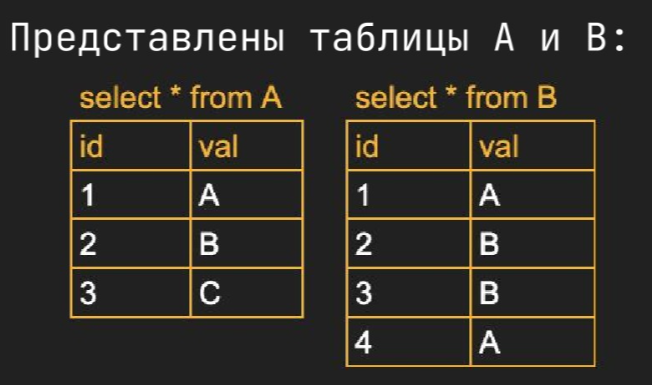

# Database normalisation

**Database normalization**:
- The process of **structuring a relational database** in accordance with a series of so-called **normal forms** in order to reduce data redundancy and improve data integrity; usually it is done by splitting a table into smaller tables and coding relationships between them via keys. 
- It was first proposed by British computer scientist Edgar F. Codd as part of his relational model.
- Normalisation is the process of refining a database design to ensure that each independent piece of information is in only one place except for foreign key
- Doesn't really apply in noSQL databases;

Denormalized dataset - all the data is combined in one dataset, without adhering to the database rules. To enter to a database, data has to have data integrity and adhere to some rules of good database design. Normalization of a database table - structuring it in such a way that it doesn't and cannot express *redundant information*. 

The main purpose of database normalization is to avoid complexities, eliminate duplicates, and organize data in a consistent way.

There are some normal forms (NF) which start with the most important (dangerous) at 1NF and continue to the less dangerous ones with increasing number. These are basically like safety assessment levels, starting from broader one to the more detailed ones. 

**1NF** - eliminates repeating groups:
- Row order should NOT be used to convey information in a table;
- Atomicity: a single cell can only contain a single value of the same data type (within the column);
- Every table has to have primary key (one or several);
- Every row should be unique and not be repeated;
- A repeating group of data items should NOT be stored on a single row; instead, should be stored in a separate table referencing the main table via key;

**2NF** - eliminates redundancy:
- The table has to be in 1NF;
- All non-key attribute in a table must depend on the entire primary key (one or several) within that table; if it only depends on one of the primary keys, then it doesn't belong in this table;
- Relationship between tables has to be formed with foreign keys;

**3NF** - eliminates transitive partial dependency:
- The table has to be in 2NF;
- every non-attribute in a table should depend on the key, the whole key, and nothing but the key; that is to say, there should not be dependencies between attributes that are not part of primary key;

An excellent example is given here: https://www.freecodecamp.org/news/database-normalization-1nf-2nf-3nf-table-examples/#:~:text=The%20First%20Normal%20Form%20%E2%80%93%201NF,-For%20a%20table&text=there%20must%20be%20a%20primary,each%20row%20in%20the%20table

## Denormalisation

Denormalization is a database optimization technique in which we add redundant data to one or more tables. This can help us avoid costly joins in a relational database. Note that denormalization does not mean ‘reversing normalization’ or ‘not to normalize’. It is an optimization technique that is applied after normalization.

Basically, the process of taking a normalized schema and making it non-normalized is called denormalization, and designers use it to tune the performance of systems to support time-critical operations.

In a traditional normalized database, we store data in separate logical tables and attempt to minimize redundant data. We may strive to have only one copy of each piece of data in a database. For example, in a normalized database, we might have a Courses table and a Teachers table. Each entry in Courses would store the teacherID for a Course but not the teacherName. When we need to retrieve a list of all Courses with the Teacher’s name, we would do a join between these two tables. In some ways, this is great; if a teacher changes his or her name, we only have to update the name in one place. The drawback is that if tables are large, we may spend an unnecessarily long time doing joins on tables. Denormalization, then, strikes a different compromise. Under denormalization, we decide that we’re okay with some redundancy and some extra effort to update the database in order to get the efficiency advantages of fewer joins. 

Pros of Denormalization:
- Improved query performance: retrieving data is faster since we do fewer joins;
- Reduced complexity: By combining related data into fewer tables, denormalization can simplify the database schema and make it easier to manage. 
- Simplification of queries: Queries to retrieve can be simpler(and therefore less likely to have bugs), since we need to look at fewer tables.
- Easier Maintenance and Updates: Denormalization can make it easier to update and maintain the database by reducing the number of tables.
- Improved Read Performance: Denormalization can improve read performance by making it easier to access data.
- Better Scalability: Denormalization can improve the scalability of a database system by reducing the number of tables and improving the overall performance.


Cons of Denormalization:
- Reduced data integrity: By adding redundant data, denormalization can reduce data integrity and increase the risk of inconsistencies.
- Increased Complexity: While denormalization can simplify the database schema in some cases, it can also increase complexity by introducing redundant data.
- Increased Storage Requirements: By adding redundant data, denormalization can increase storage requirements and increase the cost of maintaining the database.
- Increased Update and Maintenance Complexity: Denormalization can increase the complexity of updating and maintaining the database by introducing redundant data.
- Limited Flexibility: Denormalization can reduce the flexibility of a database system by introducing redundant data and making it harder to modify the schema.


# ANSI SQL standards

**ANSI SQL** - official SQL standard maintained by ANSI/ISO; "The official set of rules and guidelines for structuring SQL queries".

It defines a uniform, vendor-neutral syntax intended to work across all relational databases, to ensure cross-platform interoperability and avoid vendor lock-in. 

**Non-ANSI SQL** refers to proprietary SQL features or syntax extensions created by database vendors, as well as legacy SQL. 

Examples of non-ANSI SQL:
- `SHOW` statements
- `DO` - execute an expression without returning a result
- Functions from BigQuery: `ARRAY_LENGTH(arr)`, `ARRAY_AGG(value)`, `ARRAY_CONCAT(arr1, arr2)`
- BigQuery ML functions: `ML.PREDICT`, `ML.TRAIN`, `ML.EVALUATE`, `ML.FEATURE_INFO`

# Subsets of SQL commands

SQL is a hybrid language that contains 4 languages at once - DDL, DML, DCL, DQL

> Read more: https://www.scaler.com/topics/ddl-dml-dcl/

## DDL

> DDL, Data Definition Language, schema statements

DDL is a subset of SQL commands that define the structure or schema of the database; commands used to modify or alter the structure of the database. 

Commands:
| Command | Explanation |
| - | - |
| **CREATE** | Create a new database |
| **ALTER** | ALTER command alters the database structure by adding, deleting, and modifying columns of the already existing tables, like renaming and changing the data type and size of the columns. |
| **DROP** | The DROP command deletes the defined table with all the table data, associated indexes, constraints, triggers, and permission specifications. |
| **TRUNCATE** | **Deletes all the data / rows** and records from an existing table, including the allocated spaces for the records. Unlike the DROP command, it does not delete the table from the database. It works similarly to the DELETE statement without a WHERE clause; also TRUNCATE is faster than DELETE. |
| **RENAME** | ... |

**Database commands**:
```sql
CREATE DATABASE database1;

-- Rename a database: 
ALTER DATABASE first_database RENAME TO second_database;

-- Delete a database:
DROP DATABASE second_database;
```

**Table commands**:

These are SQL schema statements for creating tables with specified schemas.
```sql
-- General form
CREATE TABLE table1(
  column1 DATATYPE CONSTRAINTS, 
  column2 DATATYPE CONSTRAINTS
);
-- Create a new table
CREATE TABLE IF NOT EXISTS tablename;
-- Create an empty table
CREATE TABLE table1();

-- Rename a table
ALTER TABLE table1 
RENAME TO table2;

-- Delete records from a table, but leave the table
-- TRUNCATE - like DELETE, but doesn't have a possible IF clause
TRUNCATE table1;
TRUNCATE table1, table2;

-- Delete the table and all the rows inside it
DROP TABLE table1;
DROP TABLE table1, table2;
DROP TABLE IF EXISTS table1;

-- General form
ALTER TABLE table1 
ADD COLUMN column1 DATATYPE CONSTRAINTS DEFAULT 'default', 
ADD COLUMN column2 DATATYPE CONSTRAINTS REFERENCES table2(column1);
-- Add a column example
ALTER TABLE table1 
ADD COLUMN name VARCHAR(30) NOT NULL UNIQUE;

-- Rename a column
ALTER TABLE table1 
RENAME COLUMN column1 TO column2;

-- Change datatype of a column
ALTER TABLE characters ALTER COLUMN date_of_birth SET DATA TYPE VARCHAR(10); # Change datatype of a column
-- Restart the auto-incrementing values
ALTER SEQUENCE person_id_seq RESTART WITH 10; # or 1
-- Add foreign key
ALTER TABLE <table_name> ADD FOREIGN KEY(<column_name>) REFERENCES <referenced_table_name>(<referenced_column_name>);

-- Delete a column
ALTER TABLE table1 
DROP COLUMN column1;

-- Drop a constraint for a column
ALTER TABLE table1 DROP CONSTRAINT constraint_name; # Drop a named constraint
ALTER TABLE table1 ALTER COLUMN column1 DROP NOT NULL; # Drop not null constraint

-- Add a column by concatenating two other columns (NOTE: this is not the most optimal solution, but it's the one that works for me):
ALTER TABLE table1 ADD COLUMN full_name VARCHAR(30); 
UPDATE table1 SET full_name = first_name || ' ' || last_name;
```


## DML

> DML, Data Manipulation Language, data statements

DML is an element in SQL language that deals with managing and manipulating data in the database. DML commands are SQL commands that perform operations like storing data in database tables, modifying and deleting existing rows, retrieving data, or updating data.

Commands:
| Command | Explanation |
| - | - |
| **SELECT** | Fetches data or records from one or more tables in the SQL database. The retrieved data gets displayed in a result table known as the result set.
| **INSERT** | Inserts one or more new records into the table in the SQL database. |
| **UPDATE** | Updates or changes the existing data or records in a table in the SQL database. |
| **DELETE** | Deletes the existing records (that can be specified with a WHERE clause and logical operators to delete selected rows from the database). Is redo-able. |
| **MERGE** | Deals with insertion, updation, and deletion in the same SQL statement. |
| **CALL** | Calls or invokes a stored procedure. |
| **EXPLAIN PLAN** | Describes the access path to the data. It returns the execution plans for the statements like INSERT, UPDATE, and DELETE in the readable format for users to check the SQL Queries. |
| **LOCK TABLE** | Ensures the consistency, atomicity, and durability of database transactions like reading and writing operations. |

Table:
```sql
-- Delete records from a table, but leave the table
-- DELETE - has a possible IF clause
DELETE FROM table1;
DELETE FROM table1 WHERE column1 = value; 
```

```sql
-- Insert a row in the default order of columns
INSERT INTO table1 VALUES ('Value1', 52, DATE '1995-05-04');
-- Insert a row with data for specified columns only
INSERT INTO table1 (column1, column2, column3) VALUES ('Value1', 52, DATE '1995-05-04');
-- Insert two rows
INSERT INTO table1 (column1, column2, column3) VALUES (...), (...);

-- Alter all rows
UPDATE table1
SET column1 = 10

-- Update an entry based on IF-condition
UPDATE table1 
SET column1=5, column2=10 
WHERE row='Rowname' AND row2='Rowname2';

-- Delete all rows
DELETE FROM table1; 
-- Delete a row in which column has the specified value
DELETE FROM table1 WHERE column1='Value'; 

-- Update rows

-- Update values in a column - swap 'f' and 'm' values
UPDATE Salary SET sex = CASE WHEN sex = 'm' THEN 'f' ELSE 'm' END;

```

## DCL

Data Control Language, shortly termed DCL, is comprised of those commands in SQL that deal with controls, rights, and permission in the database system. DCL commands are SQL commands that perform operations like giving and withdrawing database access from the user.

| Command | Explanation | 
| - | - |
| **GRANT** | Gives access privileges or permissions like ALL, SELECT, and EXECUTE to the database objects like views, tables, etc, in SQL. |
| **REVOKE** | Withdraws access privileges or permissions given with the GRANT command. |

## TCL

> TCL, Transaction Control Language, transaction statements

TCL:
- COMMIT
- ROLLBACK
- SAVEPOINT


# Types of tables

Different types of tables:
- Permanent tables: created by the `CREATE TABLE` statement
- Derived (subquery-generated) tables: rows returned by a subquery and held in memory
- Temporary (volatile) tables: volatile data held in memory
- Virtual table (view): created using the `CREATE VIEW` statement


## Subquery

> a.k.a. nested query, inner query

- Subqueries are embedded within another SQL query (called the *containing statement*) and are used when the result of one query depends on that of the other; 
- Are powerful tools for performing complex data manipulations that require one or more intermediary steps
- **Scalar subqueries** are queries that only return a single value. More specifically, this means if you execute a scalar subquery, it would return one column value of one specific row. 
- **Non-scalar subqueries**, however, can return single or multiple rows and may contain multiple columns.


### Types of correlation

(depending on their relation to the containing query):
- Noncorrelated subqueries
- Correlated subqueries

**Noncorrelated subqueries**: 

<u>May be executed alone</u> and do not reference anything from the containing statement 

```sql
-- Find all cities that are not in India
SELECT 
  city_id, 
  city
FROM city
WHERE 
  country_id <> (
    SELECT
      country_id
    FROM country
    WHERE country = 'India'
  );
```

**Correlated subqueries**:

These subqueries reference one or more columns from the containing query statement

```sql
SELECT 
  с.first_name, 
  c.last_name 
FROM customer c
WHERE 20 = (
  SELECT count(*) 
  FROM rental r
  WHERE r.customer_id = c.customer_id
);


-- an operator that is used a lot for correlated subqueries is EXISTS
-- find all clients who rented at least one movie before 25 may 2005
SELECT 
  с.first_name, 
  c.last_name
FROM customer c
WHERE EXISTS (
  SELECT 1 
  FROM rental r
  WHERE 
    r.customer_id = c.customer_id
    AND date(r.rental date) < '2005-05-25'
);

-- Correlated subquery that is used for changing the column last_update in the table 'customer'
UPDATE customer с
SET с.last_update = (
  SELECT max(г.rental_date) 
  FROM rental r
  WHERE r.customer_id = c.customer_id
);
```


> Note: a subquery can return multicolumn and multirow table:
```sql
SELECT 
  actor_id, 
  film_id
FROM film_actor
WHERE (actor_id, film_id) IN (
  SELECT
    a.actor_id,
    f.film_id
  FROM actor a
  CROSS JOIN film f
  WHERE 
    a.last_name = 'MONROE'
    AND f.rating = 'PG'
);
```

### Types of location

**Types (depending on where / in which clause the subquery is located)**:
- SELECT subqueries
- FROM subqueries
- WHERE subqueries
- HAVING subqueries

**SELECT subqueries**

```sql
-- General Form
SELECT 
    column1, 
    column2, 
    columnN,
    (
        SELECT agg_function(column) 
        FROM table 
        WHERE condition
    )
FROM table
```

**FROM subqueries**

Subqueries in the FROM clause create a temporary table that can be used for the main query. This allows
the programmer to simplify the process by breaking the problem into smaller, more manageable parts.

This subquery's data is held in memory for the duration of the entire query and then discarded.

```sql
-- General form
-- This is the containing query
SELECT employee, total_sales
FROM (
  -- This is the subquery
  SELECT 
    first_name || ' ' || last_name AS employee, 
    SUM(sales) AS total_sales
  FROM sales
  GROUP BY employee
) AS sales_summary -- alias of the subquery
WHERE total_sales > 100000;
```

In this example, the subquery creates a temporary table aliased as `sales_summary`, which does the following:
- Concatenates each employee’s first and last name (separated by a space). This concatenation is aliased as employee.
- Calculates the total sales for each employee.
- Groups the total_sales by employee.

**WHERE subqueries**

Subqueries in the WHERE clause are used to filter rows based on conditions detailed in a subquery.

This method is useful when you don’t already have access to the condition on which you want to filter your query.

Scalar example: 
```sql
-- Suppose that we have a table called employees with employee_id, first_name, last_name, salary, and department_id columns. If we want to find all employees who earn more than the average salary, we can use a subquery:
SELECT first_name, last_name, salary
FROM employees
WHERE salary > (SELECT AVG(salary) FROM employees);

-- Find all clients who are handled by the branch that Michael Scott manages
SELECT client.client_name
FROM client
WHERE branch_id = (
    SELECT employee.branch_id
    FROM employee
    WHERE employee.first_name = 'Michael' AND employee.last_name = 'Scott'
);
```

Non-scalar example:
```sql
-- Suppose that we are using the same dataset as before with the first_name, last_name, and salary fields. 

-- Find names of all employees who have sold over 30,000 to a single client
SELECT employee.first_name, employee.last_name
FROM employee
WHERE employee.emp_id IN (
    SELECT works_with.emp_id
    FROM works_with
    WHERE works_with.total_sales > 30000
);
```

**HAVING subqueries**

The HAVING clause is used to filter the results of a GROUP BY query based on conditions involving
aggregate functions. The subquery is executed for each group and filters the groups based on the
specified condition.

```sql
SELECT CustomerID, AVG(TotalAmount) AS AverageTotalAmount
FROM Orders
GROUP BY CustomerID
HAVING AVG(TotalAmount) > (SELECT AVG(TotalAmount)
FROM Orders);
```

## CTE

CTE, common table expressions
- CTEs are, in a sense, are like *named subqueries*
- They make a query more readable and allow each CTE communicate / query other CTEs, as opposed to (nested) subqueries. 


CTEs are also temporary tables typically that are formulated at the beginning of a
query and only exist during the execution of the query. This means that CTEs cannot be used in other
queries beyond the one in which you are using the CTE.
While CTEs and subqueries are both used in similar circumstances (such as when you need to produce
an intermediary result), there are a couple of factors that tip off CTEs:
• They are typically created at the beginning of a query using the WITH operator
• They are followed by a query that queries the CTE
Alternatively, subqueries are a query within a query, nested within one of a query’s clauses.

General form:
```sql
WITH 
alias AS (
  -- <Put query here>
), 
alias2 AS (
  -- <put query here>
)
-- ... <Query that queries the alias>
SELECT *
FROM alias
INNER JOIN alias2 
ON alias.id = alias2.id
```

Some examples:
```sql
-- A more concrete example
WITH customer_totals AS (
  SELECT CustomerID, SUM(TotalAmount) AS total_sales
  FROM Orders
  GROUP BY CustomerID
)
SELECT c.CustomerID, c.total_sales, o.avg_order_amount
FROM customer_totals c
JOIN (
  SELECT CustomerID, AVG(TotalAmount) AS avg_order_amount
  FROM Orders GROUP BY CustomerID )
ON c.CustomerID = o.CustomerID;

-- an example
WITH actors_s AS (
  SELECT 
    actor_id, 
    first_name, 
    last_name
  FROM actor
  WHERE last name LIKE 'S%'
),
actors_s_pg AS (
  SELECT 
    s.actor_id, 
    s.first_name, 
    s.last_name,
    f.film_id, 
    f.title
  -- this CTE references another CTE actors_s
  FROM actors_s s
  INNER JOIN film_actor fa
  ON s.actor_id = fa.actor__id
  INNER JOIN film f
  ON f.film_id = fa.film_id
  WHERE f.rating = 'PG'
),
actors_s_pg_revenue AS (
  SELECT spg.first_name, spg.last_name, p.amount
  FROM actors_s_pg spg
  INNER JOIN inventory i
  ON i.film_id = spg.film_id
  INNER JOIN rental r
  ON i.inventory_id = r.inventory_id
  INNER JOIN payment p
  ON r.rental_id = p.rental_id
) -- end of the WITH statement
SELECT 
  spg_rev.first_name, 
  spg_rev.last_name,
  sum(spg_rev.amount) tot_revenue
FROM actors_s_pg_revenue spg_rev
GROUP BY spg_rev.first_name, spg_rev.last_name
ORDER BY 3 desc;
```

```sql
-- Example
WITH a1 AS (
	SELECT
		bs.branch_id,
		bs.branch_name,
		COUNT(bs.mgr_id)
	FROM employees_db.public.branch bs
	INNER JOIN employees_db.public.branch_supplier bs2 
	ON bs.branch_id = bs2.branch_id 
	
	GROUP BY 
		bs.branch_id, 
		bs.branch_name
)
SELECT * FROM a1
```

## Temporary tables

The tables appear like permanent tables, but any data inserted into this table will disappear at some point, e.g. at the end of a transaction or when the database connection session is closed.

```sql
-- MySQL
CREATE TEMPORARY TABLE temp1
(
  person_id SMALLINT(5),
  first_name VARCHAR(45),
  last_name VARCHAR(45)
);

INSERT INTO temp1
SELECT actor_id, first_name, last_name
FROM table1
WHERE last_name LIKE '%J';
```

## Views

> Views; kind of like virtual tables

A view is a mechanism for querying data; a query that is stored in the data dictionary.
- A view is created by assigning a name to a SELECT statement and then storing the query for future use;
- It looks and acts like a table, but there is no data associated with a view; when you issue a query against a view, your query is merged with the view definition to create a final query to be executed
- Example: you can save a table view upon running the inner join command, and then perform actions on that view table to not type in the join command over and over again. 

Uses and advantages:
- Data Security: 
  - You can keep the table private (users don't have SELECT permission to the table) but create one or more views that obscure the private / sensitive information;
- Data Aggregation:
  - Views can join and simplify multiple tables into a single virtual table;
  - Views can act as aggregated tables
- Hiding Complexity:
  - Views can hide the complexity of data
  - E.g. you can have a view with tons of subqueries, joins, etc. but they are hidden from the end user
- Convenience:
  - There is no additional data created or generated or stored when you create a view - the server simply saves the select statement for future use


After you create a view, it shows in the list of tables using the command `\d`. Nevertheless, this view is not a table; it simply is a result of a saved query. 

```sql
-- Create a view of a table
CREATE VIEW table1_view_males AS 
SELECT * FROM table1 WHERE gender = 'Male';

-- Show a table view
SELECT * FROM table1_view_males;

-- Update a view
CREATE OR REPLACE VIEW view1 AS ...;

-- Delete a view
DROP VIEW view1;
```

A more practical example
```sql
-- Let's say you have a join query
SELECT table1.first_name, table1.gender, table1.age, table2.item 
FROM table1 
INNER JOIN table2 ON table1.first_name = table2.first_name;

-- If you want to make an operation on it, instead of writing it out every time, you can save it as a view and then perform that action on the view of the table
CREATE VIEW table1_table2_innerjoin AS 
SELECT table1.first_name, table1.gender, table1.age, table2.item 
FROM table1 
INNER JOIN table2 ON table1.first_name = table2.first_name;

-- So now, you can perform operations on that view object you created, 
# for example, you can count rows
SELECT COUNT(*) FROM table1_table2_innerjoin;
```

Another example - you want to define a view that partially hides the email:
```sql
-- define a view
CREATE VIEW customer_vw (
  customer_id,
  first_name,
  last_name,
  email
) AS
SELECT 
  customer_id,
  first_name,
  last_name,
  -- partially obstruct the emails - only show first two letters, then '*****', ended by the last four letters
  concat(substr(email,1,2), '*****', substr(email, -4)) AS email
FROM customer
-- only show active customers
WHERE active = 1
;

-- query a view just like you would a table
SELECT 
  first_name,
  last_name, 
  email
FROM customer_vw;
```

Maybe slighly counterintuitive, but you can modify a table that is used in the view as long as some conditions are met:
- No aggregate functions are used
- The view does not employ GROUP BY or HAVING clauses;
- No subqueries exist in the SELECT or FROM clause, and any subqueries in the WHERE clause do no refer to tables in the from clause
- The view does not utilize UNION, UNION ALL, or DISTINCT
- The FROM clause includes at least one table or updatable view
- The FROM clause uses only innner joins if there is more than one table or view

For example, in the view below:
- You can modify last_name
- you CANNOT modify email since it is derived from an expression
- you CANNOT insert new rows as you have a derived column `email`
```sql
CREATE VIEW customer_vw (
  customer_id,
  first_name,
  last_name,
  email
) AS
SELECT 
  customer_id,
  first_name,
  last_name,
  concat(substr(email,1,2), '*****', substr(email, -4)) AS email
FROM customer
;
```

# Index

Index is a mechanism for quickly finding a specific item within a resource.

The role of indexes is to facilitate the retrieval of a subset of a table's rows and columns without the need to inspect every row in the table.

Show indexes: `SHOW INDEX FROM customer;`

```sql
-- Add an index called `idx_email` on the `customer.email` column
-- MySQL
ALTER TABLE customer
ADD INDEX idx_email (email);
-- Others
CREATE INDEX idx_email
ON customer (email);

-- Drop an index
-- MySQL
ALTER TABLE customer
DROP INDEX idx_email;
-- Others
DROP INDEX idx_email;
-- or
DROP INDEX idx_email ON customer;
```

Index can be multicolumn if you query data based on multiple columns.

E.g. if you search for customers by first and last names, you can build a multicolumn index:
```sql
ALTER TABLE customer
ADD INDEX idx_full_name (last_name, first_name);
```

<u>Types of indexes</u>:
- **B-tree indexes**: balanced-tree indexes;
  - Branch nodes are used for navigating the tree, while leaf nodes hold the actual values and location information;
  - Example of a B-tree index built on the customer.last_name column
  
  - As more and more rows are added to the table, the server will attempt to keep the tree balanced so that there aren't far more branch/leaf nodes on one side of the root node than the other; by keeping the tree balanced, the server is able to traverse quickly to the leaf nodes to find the desired values without having to navigate through many levels of branch nodes;
  - Great at handling columns that contain many different values, e.g. a customer's first or last names
- **Bitmap indexes**: 
  - Generate a bitmap for each value stored in the column
  - Bitmap indexes are a nice, compact indexing solution for columns with a small number of unique values
  - `CREATE BITMAP INDEX idx_active ON customer (active);`
  - Commonly used in warehousing environments, where large amounts of data are generally indexed on columns containing relatively few unique values;
- **Text indexes** / full-text indexes
  - If your database stores documents and the user wants to search for words or phrases in the document

Index disadvantages:
- Index is a table, so having lots of indexes can slow the database down
- Indexes require disk space
