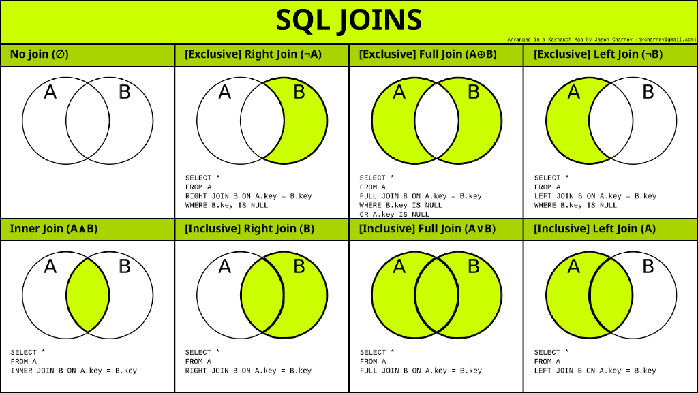
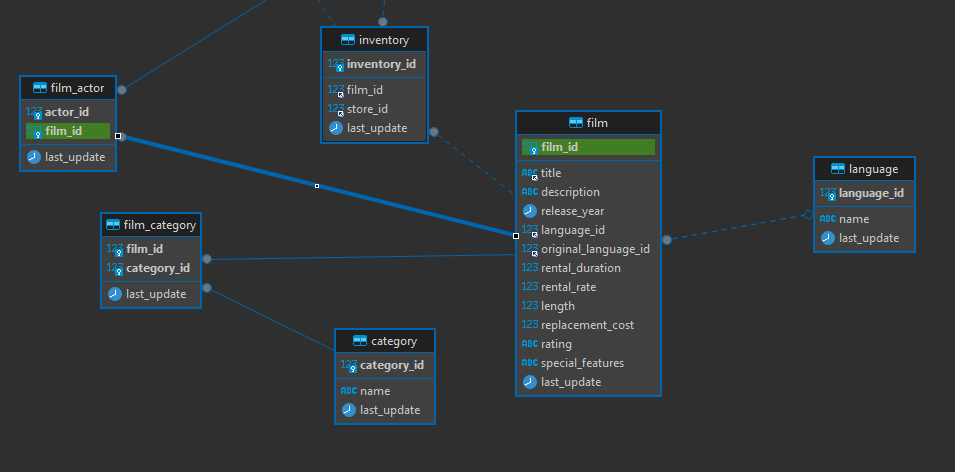
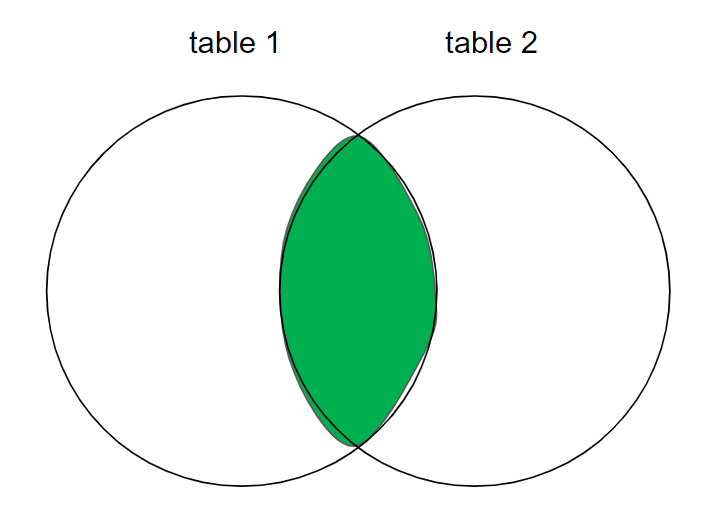
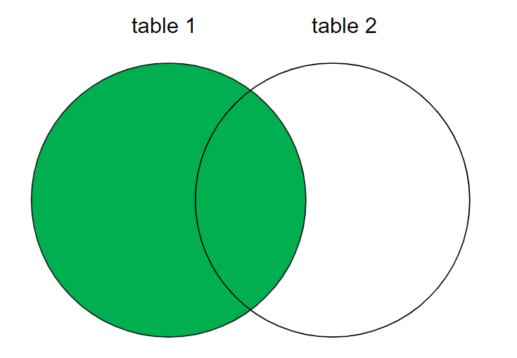
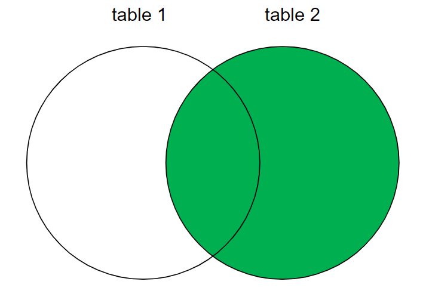
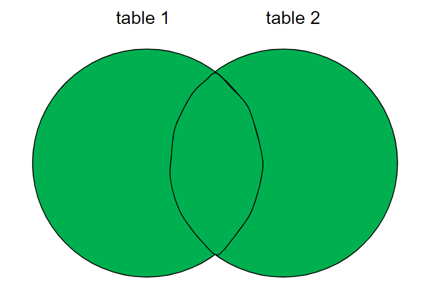

# SQL

# General

**Table** - organised set of data in the form of rows and columns.

A few types of schema in a relational database:
- Star schema: 
- Snowflake schema

Basic commands: 
| Command | PostgreSQL psql ; general | MySQL |
| - | - | - |
| List current dir | `\! cd` | |
| List files in the current dir | `\! dir` | |
| Import file | `\i file.sql` | |
| Print methods | `\?` | |
| List databases | `\l` | `SHOW DATABASES;` |
| Connect to a database | `\c database_name` | `use database_name;` |
| Show tables | `\d` | `SHOW TABLES;` |
| Show tables ONLY, without `id_seq` | `\dt` | |
| Describe table / Check columns and details of a table in a database | `\d second_table`, `\d+ second_table` ; `SELECT column_name, data_type, character_maximum_length, column_default, is_nullable FROM INFORMATION_SCHEMA.COLUMNS WHERE table_name = 'sample1';` | `DESCRIBE tablename`, `DESC table1` |
| Show the supported character sets in your server | | `SHOW CHARACTER SET;` |
| Connect to a database `database1` and format every output in XML | | | `sudo mysql -u root -p --xml database1` |
| Check constraints of different tables and databases | | | `SELECT * FROM information_schema.TABLE_CONSTRAINTS;` |

Specific to BigQuery:
```sql
-- Get names of columns in a table
SELECT column_name
FROM <project_name>.<dataset_name>.INFORMATION_SCHEMA.COLUMNS
WHERE table_name = '<table_name>' 
```

**Row / record**: a set of columns that together completely describe an entity or some action on an entity. 

## Comments

```sql
SELECT /* comment here */
FROM /* another comment here */
-- this is another way to write comments

/*
you can write multi-line comments
like this
*/
SELECT *
FROM table1
WHERE employee='Laura'

```

## Query formatting

```sql
SELECT a
     , d
     , c
FROM table
WHERE d = 'SOMETHING'
```


# Operators

Operators can be used in SELECT and WHERE statements. 

## Logical 

| Operator | Meaning |
| - | - |
| `AND` | Shows data if all the conditions separated by `AND` are TRUE. |
| `OR` | Shows data if any of the conditions separated by `OR` is TRUE. |
| `NOT` | Shows data if the condition after `NOT` is not true. |
| `BETWEEN ... AND ...` | Return values that are (inclusively) between the two values. `WHERE salary BETWEEN 500 AND 1000`. So `salary BETWEEN 500 AND 1000` is equivalent to `salary >= 500 AND salary <= 1000` |
| `IN` | TRUE if the operand is equal to one of a list of expressions |
| `NOT IN` | Opposite of `IN`. *Note: it is an alias for `<> ALL`* |
| `LIKE` | TRUE if the operand matches a pattern |
| `ALL` | *Difficult to understand* - make comparisons between a single value and every value in a set. *Note: `<> ALL` is equivalent to `NOT IN`* |
| `ANY` | Like ALL but it returns TRUE as soon as a single comparison is favorable. *Note: `= ANY` is equivalent to `IN`* |

Some examples:
```sql
SELECT 
  column1, 
  column2 
FROM table1 
WHERE 
  condition1 AND condition2 AND NOT condition3
;

-- ALL
-- EXAMPLE 1: Find all customers who have never gotten a free film rental
SELECT
  first_name,
  last_name
FROM customer
WHERE customer_id <> ALL ( -- it works just like `WHERE customer_id NOT IN (`, but the latter is much easier to understand
  SELECT customer_id
  FROM payment
  WHERE amount = 0
);

-- EXAMPLE 2:
-- 2. The containing query returns all customers whose total number of films rentals exceeds any of the North American customers
SELECT customer_id, count(*)
FROM rental r 
GROUP BY customer_id 
HAVING COUNT(*) > ALL (
	-- 1. Subquery returns (in one multi-rowed column) the total number of film rentals for all customers in North America 
	SELECT COUNT(*)
	FROM rental r
	INNER JOIN customer c
	ON r.customer_id = c.customer_id 
	INNER JOIN address a
	ON c.address_id = a.address_id 
	INNER JOIN city ct 
	ON a.city_id = ct.city_id 
	INNER JOIN country co 
	ON ct.country_id = co.country_id 
	WHERE co.country IN ('United States', 'Mexico', 'Canada')
	GROUP BY r.customer_id
);

-- ANY
-- EXAMPLE 1: Find all customers whose total film rental payments exceed the total payments for all customers in Bolivia, Paraguay, or Chile
SELECT customer_id, SUM(amount)
FROM payment
GROUP BY customer_id
HAVING SUM(amount) > ANY (
  SELECT SUM(p.amount)
  FROM payment p
  INNER JOIN customer c
  ON p.customer_id = c.customer_id
  INNER JOIN address a
  ON c.address_id = a.address_id
  INNER JOIN city ct 
  ON a.city_id = ct.city_id
  INNER JOIN country co
  ON ct.country_id = co.country_id
  WHERE co.country IN ('Bolivia', 'Paraguay', 'Chile')
  GROUP BY co.country
)

```

## Comparison

Can be used for comparing numbers or strings. 

| Operator | Meaning |
| --- | -- |
| `<`, `<=`, `>`, `>=` | |
| `=` | equals |
| `<>` | not equal. `WHERE name <> 'STEVEN'` |
| `LIKE`, `~`, `REGEXP` | used for regex |
| `IN` | if a value is contained within a list. |
| `BETWEEN` | value is contained between two other values. |

> Note: NULL value indicates an unavailable or unassigned value. The value NULL does not equal zero (0), nor does it equal a space (‘ ‘). Because the NULL value cannot be equal or unequal to any value, you cannot perform any comparison on this value by using operators such as ‘=’ or ‘<>’.
>
> Therefore, use `Column IS NULL` or NOT NULL

## Arithmetic

| Operator | Meaning |
| --- | --- |
| `-`, `+`, `*`, `/` | |
| `^` | power. Works in PostgreSQL. |
| `%` | modulo |

Examples:
```sql
SELECT 10 + 2;
SELECT (100 * 20) / 10;
SELECT column1 * 10;
```

### Divide by zero

To prevent an error when dividing by zero, you case use CASE WHEN statement
```sql
SELECT
  c.first_name,
  c.last_name,
  SUM(p.amount) AS tot_payment_amt,
  COUNT(p.amount) AS num_payments,
  SUM(p.amount) / CASE WHEN COUNT(p.amount) = 0 THEN 1 ELSE COUNT(p.amount) END AS avg_payment
FROM customer AS s
LEFT OUTER JOIN payment AS p
ON c.customer_id = p.customer_id
GROUP BY 
  c.first_name,
  c.last_name
```

`SAFE_DIVIDE`
- BigQuery

Additionally, when you know that your division operation might involve dividing by zero, you can use BigQuery's function `SAFE_DIVIDE` as it doesn't return an error upon encountering error, but a null value:
```sql
WITH temp1 AS (
  SELECT 1 a, 2 b
  union all
  select 1 a, 1 b  
  union all 
  select 1 a, 0 b  
  union all 
  select 0 a, 1 b  
  union all 
  select 0 a, 0 b
)
SELECT SAFE_DIVIDE (a, b)
from temp1
-- returns
-- | fila | f0_  |
-- | ---- | ---- |
-- | 1    | 0.5  |
-- | 2    | 1.0  |
-- | 3    | null |
-- | 4    | 0.0  |
-- | 5    | null |
```

Features of `SAFE_DIVIDE`:
- It never fails the query because of division by zero or division by null error:
  - If denominator = 0, returns NULL instead of an error
  - If denominator is NULL, returns NULL

## Set 


| Operator | Explanation |
| - | - |
| `UNION` | Combine all the rows from two or more sets. Sort the combined set and remove duplicates. |
| `UNION ALL` | Like UNION, but does not sort the combined set and does not remove duplicates. Thus, the number of rows in the final data set always equals to the sum of the number of rows in the sets being combined. |
| `INTERSECT` | Performs intersection. If the two queries in a compound query return non-overlapping data sets, the intersection will be an empty set. Removes duplicate rows in the overlapping region. |
| `INTERSECT ALL` | Same as INTERSECT but doesn't remove the duplicates in the overlapping region. |
| `EXCEPT` | Performs the EXCEPT set operation - returns the first result set minus any overlap with the second result set. Removes all occurrences of duplicate data from set A. |
| `EXCEPT ALL` | Same as EXCEPT but removes only one occurrence of duplicate data from set A for every occurrence in set B. | 

Examples:
```sql
-- Set A: {10, 10, 10, 11, 12}
-- Set B: {10, 10}

-- A except B: {11, 12}
-- A except all B: {10, 11, 12}
```

### UNION

You perform a set operation by placing a set operator between two `select` statements

Example:
```sql
SELECT ...
FROM table1
WHERE ...
UNION -- UNION ALL, INTERSECT, INTERSECT ALL, EXCEPT
SELECT ...
FROM table2
WHERE ...
```

UNION combines the results from several SELECT statements.

Rule:
- The two statements / tables / data sets that are joined by the `UNION` statement MUST have the same number of columns
- The columns being concatenated MUST have the same data type

```sql
-- Return a list of employee names and then branch names located below the first list
SELECT first_name -- can also specify the name of the common column, e.g. `AS name_of_the_union_column`
FROM employee 
UNION -- can also be UNION ALL
SELECT branch_name 
FROM branch

-- You can also include ORDER BY, but it has to come after the last query AND you have to sort it by the names of the first query
SELECT 
  a.first_name AS fname,
  a.last_name AS lname
FROM actor a
UNION ALL
SELECT 
  c.first_name,
  c.last_name
FROM customer c
ORDER BY lname, fname
;

-- Find a list of all clients and branch suppliers ids
SELECT client_name, branch_id -- to increase clarity, can specify the table: `client.branch_id`
FROM client 
UNION
SELECT supplier_name, branch_id -- same: `branch_supplier.branch_id`
FROM branch_supplier;

-- Get distinct values from two columns - emp_id and is_married
SELECT DISTINCT (a1.emp_marr_vals)
FROM (
	SELECT emp_id AS emp_marr_vals
	FROM newtable
	UNION 
	SELECT is_married
	FROM newtable
) AS a1
```

UNION can also be used to generate synthetic data. See `Types of tables/Subquery/Generate temporary data`

### EXCEPT

### INTERSECT

PostgreSQL example:

```sql
WITH temp1 AS (
  SELECT 0 index, 'A' letter
  UNION ALL
  SELECT 1 index, 'B' letter
  UNION ALL
  SELECT 2 index, 'C' letter
  UNION ALL
  SELECT 3 index, 'D' letter
  UNION ALL
  SELECT 3 index, 'D' letter
),
temp2 AS (
  SELECT 2 index, 'C' letter
  UNION ALL
  SELECT 3 index, 'D' letter
  UNION ALL
  SELECT 3 index, 'D' letter
  UNION ALL
  SELECT 3 index, 'something else here' letter
  UNION ALL
  SELECT 4 index, 'E' letter
)
SELECT *
FROM temp1
INTERSECT
SELECT *
FROM temp2

-- result
-- if you just run INTERSECT, it basically removes duplicates:
-- index|letter|
-- -----+------+
--     3|D     |
--     2|C     |

-- you can also run INTERSECT ALL, which doesn't remove duplicate intersecting rows:
-- index|letter|
-- -----+------+
--     3|D     |
--     3|D     |
--     2|C     |
```

BigQuery example

```sql
/* This is an example from BigQuery, where only INTERSECT DISTINCT exists. */

WITH temp1 AS (
  SELECT 0 index, 'A' letter
  UNION ALL
  SELECT 1 index, 'B' letter
  UNION ALL
  SELECT 2 index, 'C' letter
  UNION ALL
  SELECT 3 index, 'D' letter
  UNION ALL
  SELECT 3 index, 'D' letter
),
temp2 AS (
  SELECT 2 index, 'C' letter
  UNION ALL
  SELECT 3 index, 'D' letter
  UNION ALL
  SELECT 3 index, 'D' letter
  UNION ALL
  SELECT 3 index, 'something else here' letter
  UNION ALL
  SELECT 4 index, 'E' letter
)
SELECT *
FROM temp1
INTERSECT ALL
SELECT *
FROM temp2


-- Result:
-- [{
--   "index": "2",
--   "letter": "C"
-- }, {
--   "index": "3",
--   "letter": "D"
-- }]
```

### Generate temporary data

Subqueries (or preferably CTEs) can be used to **generate new data**:

**Generating a (relatively) small dataset**
```sql
-- query
SELECT 'Small Fry' name, 0 low_limit, 74.99 high_limit
UNION ALL
SELECT 'Average Joes' name, 75 low_limit, 149.99 high_limit
UNION ALL
SELECT 'Heavy Hitters' name, 150 low_limit, 99999.99 high_limit;
-- generates the following temporary data
-- name         |low_limit|high_limit|
-- -------------+---------+----------+
-- Small Fry    |        0|     74.99|
-- Average Joes |       75|    149.99|
-- Heavy Hitters|      150|  99999.99|

-- you can subsequently make operations with this synthetic generated data
WITH temp1 AS (
	SELECT 'Small Fry' name, 0 low_limit, 74.99 high_limit
	UNION ALL
	SELECT 'Average Joes' name, 75 low_limit, 149.99 high_limit
	UNION ALL
	SELECT 'Heavy Hitters' name, 150 low_limit, 99999.99 high_limit
)
SELECT COUNT(*)
FROM temp1
```

**Generate a larger dataset**
```sql
-- Generate a column with increasing numbers from 0 to 399 (in total 400 rows)
-- MySQL
SELECT 
	ones.num + tens.num + hundreds.num AS a
FROM
(
	SELECT 0 num UNION ALL
	SELECT 1 num UNION ALL
	SELECT 2 num UNION ALL
	SELECT 3 num UNION ALL
	SELECT 4 num UNION ALL
	SELECT 5 num UNION ALL
	SELECT 6 num UNION ALL
	SELECT 7 num UNION ALL
	SELECT 8 num UNION ALL
	SELECT 9 num 
) AS ones
CROSS JOIN
(
	SELECT 0 num UNION ALL
	SELECT 10 num UNION ALL
	SELECT 20 num UNION ALL
	SELECT 30 num UNION ALL
	SELECT 40 num UNION ALL
	SELECT 50 num UNION ALL
	SELECT 60 num UNION ALL
	SELECT 70 num UNION ALL
	SELECT 80 num UNION ALL
	SELECT 90 num 
) AS tens
CROSS JOIN
(
	SELECT 0 num UNION ALL
	SELECT 100 num UNION ALL
	SELECT 200 num UNION ALL
	SELECT 300 num 
) AS hundreds
ORDER BY a
;

-- Generate a row for every day in the year 2020
-- MySQL
-- This approach automatically includes the extra leap day (February 29)
SELECT 
	DATE_ADD(
		'2020-01-01', 
		INTERVAL (ones.num + tens.num + hundreds.num) DAY
	) AS dt
FROM
(
	SELECT 0 num UNION ALL
	SELECT 1 num UNION ALL
	SELECT 2 num UNION ALL
	SELECT 3 num UNION ALL
	SELECT 4 num UNION ALL
	SELECT 5 num UNION ALL
	SELECT 6 num UNION ALL
	SELECT 7 num UNION ALL
	SELECT 8 num UNION ALL
	SELECT 9 num 
) AS ones
CROSS JOIN
(
	SELECT 0 num UNION ALL
	SELECT 10 num UNION ALL
	SELECT 20 num UNION ALL
	SELECT 30 num UNION ALL
	SELECT 40 num UNION ALL
	SELECT 50 num UNION ALL
	SELECT 60 num UNION ALL
	SELECT 70 num UNION ALL
	SELECT 80 num UNION ALL
	SELECT 90 num 
) AS tens
CROSS JOIN
(
	SELECT 0 num UNION ALL
	SELECT 100 num UNION ALL
	SELECT 200 num UNION ALL
	SELECT 300 num 
) AS hundreds
WHERE DATE_ADD('2020-01-01', INTERVAL(ones.num + tens.num + hundreds.num) DAY) < '2021-01-01'
ORDER BY dt
;
```

Can also write like this: 
```sql
WITH transactions AS (
  SELECT 1 AS user_id, 100 AS amount UNION ALL
  SELECT 1, 150 UNION ALL
  SELECT 1, 200
)
SELECT *
FROM transactions
```


# Operations

## Null Handling

### COALESCE vs IFNULL

The main difference between the two is that `IFNULL` function takes two arguments and returns the first one if it's not `NULL` or the second if the first one is `NULL`.

`COALESCE` function can take two or more parameters and returns the first non-`NULL` parameter, or `NULL` if all parameters are null, for example:

```sql
-- Source - https://stackoverflow.com/a/18528590
-- Posted by Aleks G, modified by community. See post 'Timeline' for change history
-- Retrieved 2026-01-19, License - CC BY-SA 4.0

SELECT IFNULL('some value', 'some other value');
-> returns 'some value'

SELECT IFNULL(NULL,'some other value');
-> returns 'some other value'

SELECT COALESCE(NULL, 'some other value');
-> returns 'some other value' - equivalent of the IFNULL function

SELECT COALESCE(NULL, 'some value', 'some other value');
-> returns 'some value'

SELECT COALESCE(NULL, NULL, NULL, NULL, 'first non-null value');
-> returns 'first non-null value'
```

## Temp functions

Let's consider a simple example:

```sql
WITH temp1 AS (
  SELECT 'hello_20250501-and then the rest' textvalue union all 
  select 'asdfdd20250601asdfk'
),

temp2 AS (
  SELECT
    textvalue,
    CAST(SUBSTRING(textvalue, 7, 4) || '-' || SUBSTRING(textvalue, 11, 2) || '-' || SUBSTRING(textvalue, 13, 2) AS DATE) AS extracted_date
  FROM temp1
)

SELECT
  textvalue, 
  extracted_date,
  EXTRACT(YEAR FROM extracted_date) AS year,
  EXTRACT(MONTH FROM extracted_date) AS month,
  EXTRACT(DAY FROM extracted_date) AS day
FROM temp2
```

You could have written that super-long string operation as a temporary function. Please note that now there are two queries / transactions below:

```sql
CREATE TEMP FUNCTION extract_Custom_Date(x string) AS ((
  SELECT
    CAST(
      SUBSTRING(x, 7, 4) || '-' ||
      SUBSTRING(x, 11, 2) || '-' ||
      SUBSTRING(x, 13, 2)
    AS DATE)
));

WITH temp1 AS (
  SELECT 'hello_20250501-and then the rest' textvalue union all 
  select 'asdfdd20250601asdfk'
),

temp2 AS (
  SELECT
    textvalue,
    extract_Custom_Date(textvalue) AS extracted_date
  FROM temp1
)

SELECT
  textvalue, 
  extracted_date,
  EXTRACT(YEAR FROM extracted_date) AS year,
  EXTRACT(MONTH FROM extracted_date) AS month,
  EXTRACT(DAY FROM extracted_date) AS day
FROM temp2

```


# Conditional logic

## CASE WHEN

Creating a new column / field based on a condition for the other columns. 

> In SQL, conditional logic is executed by the `case` expression, which can be used in SELECT, INSERT, UPDATE, and DELETE statements.
> It is ANSI-SQL compliant, meaning it works everywhere - PostgreSQL, MySQL, BigQuery, etc., etc.

Features:
- In the CASE expression, the clauses are evaluated from top to bottom in order
- CASE expressions may return any type of expression, including subqueries; IOW, the CASE expression goes through conditions and returns a value when the first condition is met (so it's greedy)

**Types of CASE statements**:
1. Searched case expressions
   1. Can specify any condition - range, inequality, multipart conditions;
  ```sql
  CASE 
    WHEN category.name IN ('Children', 'Family', 'Sports', 'Animation') THEN 'All ages'
    WHEN category.name = 'Horror' THEN 'Adult'
    WHEN category.name IN ('Music', 'Games') THEN 'Teens'
    ELSE 'Other'
  END
  ```
1. Simple case expressions
   1. Less flexible than searched case expression
   2. Simpler 
   3. only supports one type of condition
  ```sql
  CASE category.name
    WHEN 'Children' THEN 'All ages'
    WHEN 'Family' THEN 'All ages'
    WHEN 'Sports' THEN 'All ages'
    WHEN 'Animation' THEN 'All ages'
    WHEN 'Horror' THEN 'Adult'
    WHEN 'Music' THEN 'Teens'
    WHEN 'Games' THEN 'Teens'
    ELSE 'Other'
  END
  ```

```sql
-- General view
CASE 
  WHEN condition1 THEN result1
  WHEN condition2 THEN result2
  WHEN conditionN THEN resultN
  ELSE else_result
END AS alias;
```

### in select

Here is an example where we create a new field that will detail if a student passed or failed, based on their scores:
```sql
SELECT 
  student_id, 
  student_name, 
  exam_score,
  CASE 
    WHEN exam_score >= 60 THEN 'Pass' 
    ELSE 'Fail' 
  END AS result
FROM students;
```

```sql
-- CASE WHEN can be used within a aggregate function
-- For example, take values where rating < 3 as 1 (otherwise, take as 0), and sum them - that counts how many ratings there are with a value of less than 3
SUM(case when rating < 3 then 1 else 0 end)

-- An example: multiply by -1 if another column says "Buy", else take the original value
SELECT stock_name, 
    CASE
        WHEN operation = 'Buy' THEN price * -1 
        ELSE price
        END AS capital_proc
    FROM Stocks
```

Another example of multiple filters:
```sql
SELECT 
	sex,
	count(*) AS count1,
	sum(is_married) AS count_married,
	sum(CASE WHEN e.birth_date > '1980-01-01' THEN 1 ELSE 0 END) AS count_older_1980,
	sum(CASE WHEN e.birth_date < '1970-01-01' THEN 1 ELSE 0 END) AS count_younger_1970
FROM employee e
INNER JOIN newtable nt
ON e.emp_id = nt.emp_id 
GROUP BY sex
```

Can use CASE WHEN for handling null values
```sql
CASE WHEN a.address IS NULL THEN 'unknown' ELSE a.address END address
```

### in update

> conditional updates

```sql
-- A script that runs every week that sets the `customer.active` column to 0 for any customers who haven't rented a film in the last 90 days
UPDATE customer
SET active = 
  CASE
    WHEN 90 <= (SELECT datediff(now(), max(rental_date))
                FROM rental r
                WHERE r.customer_id = customer.customer_id) 
    THEN 0
    ELSE 1
    END
WHERE active = 1;
```

## IF

`IF()` is not part of ANSI SQL, meaning that it only exists in certain engines like:
- MySQL
- MariaDB
- BigQuery

Note: compared to `CASE WHEN`, it has advantages and disadvantages:
- ✅ very convenient and readable for simple, binary condition
- ❌ Only supports two outputs (no multi-branch logic)
- ❌ Therefore, not very readable for complex logic

BigQuery:
```sql
IF(condition, value_if_true, value_if_false)

SELECT
    product,
    IF(price > 100, 'premium', 'budget') AS price_band
FROM products;
```

# Constraints

Constraints are a restriction placed on one or more columns of a table.

**Check all constraints for database `database1`, table `favorite_food`**
```sql
-- MySQL
SELECT * FROM information_schema.TABLE_CONSTRAINTS 
WHERE 
	CONSTRAINT_SCHEMA = 'database1'
	AND TABLE_NAME = 'favorite_food';
```

Constraints can be created at the time of creation of the associated table:
```sql
-- example for MySQL table
CREATE TABLE customer (
  customer_id SMALLINT UNSIGNED NOT NULL AUTO_INCREMENT,
  store_id TINYINT UNSIGNED NOT NULL,
  first_name VARCHAR(45) NOT NULL,
  active BOOLEAN NOT NULL DEFAULT TRUE,
  create_date DATETIME NOT NULL,
  last_update TIMESTAMP DEFAULT CURRENT_TIMESTAMP ON UPDATE CURRENT_TIMESTAMP,
  -- primary key constraint
  PRIMARY KEY (customer_id),
  -- indexes
  KEY idx_fk_store_id (store_id),
  KEY idx_fk_address_id (address_id),
  KEY idx_last_name (last_name),
  -- foreign key
  CONSTRAINT fk_customer_address FOREIGN KEY (address_id)
    REFERENCES address (address_id) ON DELETE RESTRICT ON UPDATE CASCADE
)ENGINE=InnoDB DEFAULT CHARSET=utf8;
```

## Keys

### Primary key

Primary key:
- Serves as a **unique identifier** for each record in a table;
- IOW, it is an entry into the `Primary key` column that **inequivocally (uniquely)** identify each one row in a table, i.e. an ID for each data point / row.
- Features:
  - `Null` values are not accepted. 
  - Are indexed automatically.
  - If you manually tried inserting a row with a primary key that already exists in the table, it would lead to an error, as no duplicate primary keys are allowed;
  - By definition, primary key has two constraints - NOT NULL and UNIQUE;

Primary key types:
- Natural key: derived from existing meaningful column data, e.g. product code, sku code;
- Surrogate key: artificially generated meaningless unique row identified (e.g. auto-incrementing integer)

An example of a column `person_id` that is a primary key:
```txt
<!-- MySQL -->
Field      |Type                |Null|Key|Default|Extra         |
-----------+--------------------+----+---+-------+--------------+
person_id  |smallint unsigned   |NO  |PRI|       |auto_increment|

<!-- PostgreSQL -->
   Column    |         Type          | Collation | Nullable |                  Default
-------------+-----------------------+-----------+----------+-------------------------------------------
 person_id   | integer               |           | not null | nextval('person_person_id_seq'::regclass)
```

**Create a column with primary key that you manually have to enter**:
```sql
-- NOTE: NOT A GOOD PRACTICE, but an example
-- PostgreSQL
CREATE TABLE sounds (sound_id INT PRIMARY KEY);
```

**Create a table with PRIMARY KEY constraint**
```sql
-- You can create a table with a column with PRIMARY KEY constraint. 
-- As it is also a  SERIAL, you don't need to specify it when inserting new rows - it will be created automatically as per the internal rules:

-- PostgreSQL
CREATE TABLE sounds (
  sound_id SERIAL PRIMARY KEY
);
-- alternatively, can use:
-- BIGSERIAL NOT NULL PRIMARY KEY; 

-- MySQL
-- can be SMALLINT or INT
CREATE TABLE person (
  person_id SMALLINT UNSIGNED AUTO_INCREMENT,
  PRIMARY KEY (person_id)
);
-- or if you want to name the constraint
CREATE TABLE person (
  person_id SMALLINT UNSIGNED AUTO_INCREMENT,
  CONSTRAINT pk_person PRIMARY KEY (person_id)
);
```

**Set a column as a primary key**
```sql
-- PostgreSQL
-- Add a column and set it as primary key
ALTER TABLE moon ADD COLUMN moon_id SERIAL PRIMARY KEY;
-- or in two steps
ALTER TABLE table_name ADD COLUMN column1 SERIAL;
ALTER TABLE table1 ADD PRIMARY KEY (column1);
```


If you want to alter the primary key, you can do it like this. Check first the details of a table:
```txt
mario_database=> \d characters
                                             Table "public.characters"
+----------------+-----------------------+-----------+----------+--------------------------------------------------+
|     Column     |         Type          | Collation | Nullable |                     Default                      |
+----------------+-----------------------+-----------+----------+--------------------------------------------------+
| character_id   | integer               |           | not null | nextval('characters_character_id_seq'::regclass) |
| name           | character varying(30) |           | not null |                                                  |
| homeland       | character varying(60) |           |          |                                                  |
| favorite_color | character varying(30) |           |          |                                                  |
+----------------+-----------------------+-----------+----------+--------------------------------------------------+
Indexes:
    "characters_pkey" PRIMARY KEY, btree (name)
```

Then drop contraint:
```sql
ALTER TABLE characters DROP CONSTRAINT characters_pkey;
```

Primary key can be a **composite primary key** if it consists of multiple columns.

**Upon creation of the table**
```sql
-- MySQL
CREATE TABLE table1(
  person_id SMALLINT UNSIGNED,
  food VARCHAR(20),
  CONSTRAINT pk_favorite_food PRIMARY KEY (person_id, food)
);
```

**Set few columns**
```sql
-- PostgreSQL
-- Uses more than one column as a unique pair. 
ALTER TABLE table_name ADD PRIMARY KEY(column1, column2); 
```

### Foreign key

A foreign key:
- Field in a table that **references the primary key of another table** to connect different tables through joins.
- Makes a connection between two tables via their joint column. 
- Enforce data integrity, making sure the data confirms to some rules when it is added to the DB. More specifically, it *restricts one or more columns to contain only values found in another table's primary key columns.*; thus it prevents *orphaned rows* - rows that no longer point to valid primary key (e.g. changing a customer's ID in the `customer` table without changing the same customer ID in the `rental` table);
- It is NOT necessary to have a foreign key constraint in place in order to join two tables
- A table might include a *self-referencing foreign key*, which means that it includes a column that points to the primary key within the same table; for example, a table about movies, where each movie has a `film_id`, can contain column `prequel_film_id` which points to the film's parent `film_id`

`ON` clauses in the foreign key constraint:
- ON DELETE SET NULL: if in the table 1 a row is deleted, then in the table 2 that references that first table via foreign key the corresponding value is set to NULL;
- ON DELETE CASCADE: if the row in the original table containing an id is deleted, then in a table referencing that table via a foreign key the entire row is deleted. 
- ON DELETE RESTRICT: 
  - will cause the server to raise an error if a row is attempted to be deleted in the parent table that is referenced in the child table;
  - protects against orphaned records when rows are deleted from the parent table;
- ON UPDATE CASCADE: 
  - will cause the server to propagate a change to the primary key value of a parent (referenced) table with a primary key to the child table;
  - also protects against orphaned records when a primary key value is updated in the parent table;
- ON UPDATE RESTRICT
- ON UPDATE SET NULL

**Create foreign key upon creation of the table**
```sql
-- PostgreSQL
CREATE TABLE user_profiles (
  profile_id INT PRIMARY KEY,
  user_id INT UNIQUE,
  profile_data VARCHAR(255),
  FOREIGN KEY (user_id) REFERENCES users(user_id) -- ON DELETE SET NULL --or-- ON DELETE CASCADE
);

-- MySQL
-- Foreign key person_id in table favorite_food that references another table's person.person_id
CREATE TABLE favorite_food (
  person_id SMALLINT UNSIGNED,
  CONSTRAINT fk_fav_food_person_id FOREIGN KEY (person_id) REFERENCES person (person_id) 
);

```

```sql

-- Create a new column with  the constraint of foreign key
ALTER TABLE more_info 
ADD COLUMN character_id INT 
REFERENCES characters(character_id);

-- You can set an existing column as a foreign key like this:
-- PostgreSQL
ALTER TABLE table_name 
ADD FOREIGN KEY(column_name) 
REFERENCES referenced_table(referenced_column)
ON DELETE SET NULL -- optional option
;
-- MySQL
ALTER TABLE customer
ADD CONSTRAINT fk_customer_address FOREIGN KEY (address_id) -- add a foreign key on column address_id
  REFERENCES address (address_id) ON DELETE RESTRICT ON UPDATE CASCADE; -- that will reference a parent table address, column address_id, and if from address.address_id a row is attempted to be removed, an error is raised

ALTER TABLE rental 
ADD CONSTRAINT fk_1 FOREIGN KEY (customer_id)
REFERENCES customer (customer_id) ON DELETE RESTRICT;

-- remove a constraint
ALTER TABLE customer
DROP CONSTRAINT -- ...o9i
```

## UNIQUE

Restricts the specified column to contain unique values within it. Values in this column must be unique for each data point. Makes sure that only unique values can be added in a column

> You should not build unique indexes / constraints on your primary key column(s), since the server already checks uniqueness for primary key values.

```sql
ALTER TABLE table1 ADD CONSTRAINT constraint_name_here UNIQUE (column1) -- Custom constraint name
-- or
ALTER TABLE table1 ADD UNIQUE (column1) -- Constraint name defined by psql

-- Create unique index on the `customer.email` column
-- MySQL
ALTER TABLE customer
ADD UNIQUE idx_email (email);

-- SQL server, Oracle database
CREATE UNIQUE INDEX idx_email
ON customer (email);
```

## CHECK

> Check works for PostgreSQL; 
> 
> Enum - for MySQL (I think)

Restricts the allowable values for a column. Thus, a column can only accept specific values

```sql
ALTER TABLE table1 
ADD CONSTRAINT constraint_name CHECK (column1='Male' OR column1='Female');

-- Other examples
-- check the minimum length of a login field
CONSTRAINT login_min_length CHECK (char_length(login) >= 3) 
-- check constraints that only three values are possible for this column
eye_color CHAR(2) CHECK (eye_color IN ('BR', 'BL', 'GR'))
```

MySQL:
```sql
eye_color ENUM('BR', 'BL', 'GR'),                    -- Eye color
```

## DEFAULT

Sets a default value for each row in a column. If no value is provided for this column, set a default value. 

```sql
DEFAULT NOW()
DEFAULT 'string here'
```

## others

| Constraint | Meaning |
| --- | --- |
| **NOT NULL** | Values in this column have to be present, i.e. cannot be `NULL` |
| **DEFAULT** | Sets a default value for each row in a column |
| **PRIMARY KEY** | Makes a specified column a `PRIMARY KEY` type. |
| **FOREIGN KEY** | Makes a specified column an external key. E.g. `constraint user_uuid_foreign_key foreign key (user_uuid) references users (uuid) on update cascade on delete cascade` - обязывает содержать значение в user_uuid только для существующей записи в таблице users и автоматически обновится если оно будет изменено в таблице users, а так же заставит запись удалиться при удалении записи о пользователе |
| **REFERENCES table(column)** | Make a foreign key referencing another table |

Examples:
```sql
-- Add a NOT NULL constraint to the foreign key column, so that there will be no Null rows
ALTER TABLE table_name ALTER COLUMN column_name SET NOT NULL;
```


DEFAULT - specify a default value for a column
```sql
CREATE TABLE table1 (column1 INT DEFAULT 'undecided')
```

CONFLICT (CONSTRAINT) MANAGEMENT
```sql
ON CONFLICT (column1) DO NOTHING;
INSERT INTO ... VALUES ... ON CONFLICT (column1) DO UPDATE SET column1 = EXCLUDED.column1; # If an entry exists, it will update with the value you give it
```

FOREIGN KEYS - can connect tables based on foreign keys
```sql
CREATE TABLE table1(column1 DATATYPE REFERENCES table2(column_of_table2);

ALTER TABLE table_name ADD COLUMN column_name DATATYPE REFERENCES referenced_table_name(referenced_column_name); # to set a foreign key that references a column from another table
ALTER TABLE table_name ADD FOREIGN KEY(column_name) REFERENCES referenced_table(referenced_column); # set an existing column as a foreign key
ALTER TABLE character_actions ADD FOREIGN KEY(character_id) REFERENCES characters(character_id);
```

```sql
-- AUTO_INCREMENT
-- Makes a column automatically populate with incrementing values (starting with 1) upon inserting new rows
```sql
-- MySQL
CREATE TABLE person (
  person_id SMALLINT UNSIGNED,
  PRIMARY KEY (person_id)
);
SET foreign_key_checks=0;
ALTER TABLE person MODIFY person_id SMALLINT UNSIGNED AUTO_INCREMENT;
SET foreign_key_checks=1;
```


# Trigger

Defines a certain action when a certain operation is performed on a database. 

```sql
-- Run this in the MySQL terminal
DELIMITER $$
CREATE
    TRIGGER my_trigger BEFORE INSERT
    ON employee
    FOR EACH ROW BEGIN
        INSERT INTO trigger_test VALUES('added new employee'); -- `VALUES(NEW.attribute_name)` if you want to add attribute of the newly-inserted row  
    END$$
DELIMITER ;
-- Now, every time a row is added to the table `employee`, a row is added into the table `trigger_test` saying `added new employee`
```

# IF conditions

```sql
# From table 'Employee', calculate bonus for each employee_id. 
# Bonus = 100% salary (if ID is odd and employee name doesn't start with 'M'), else bonus = 0. 
## Solution 1
SELECT employee_id, CASE WHEN employee_id % 2 = 1 AND name NOT LIKE 'M%' THEN salary ELSE 0 END AS bonus FROM Employees;
## Solution 2
SELECT employee_id, if(employee_id % 2 = 1 AND name NOT LIKE 'M%', salary, 0) AS bonus FROM Employees;
```


# Joins

JOIN is a command for linking rows from two or more tables based on a column common for all of them, using the subclause `ON`.
- Common joins: `INNER`, `LEFT`
- Less common: `FULL OUTER`
- Joins you should use very rarely: `RIGHT`, `CROSS`

| Type | Explanation |
| - | - |
| Inner Join | Returns records with matching values in both tables. |
| Left (outer) join | Returns all records from the left table and the matched records (or NULL for non-matched records) from the right table. |
| Right (outer) join | The opposite of left outer join. |
| Full (outer) joint | Returns all records, with non-matching records having NULL. |

When you join and you reference tables outside the `from` clause, you either use the entire table names or you alias for each table (with or without `AS` keyword).

There are two main categories of joins:
- **INNER JOIN**: will only retain the data from the two tables that is related to each other (that is present in both tables, like an overlap of the Venn diagram);
- **OUTER JOIN**: will additionally retain the data that is not related from one table to the other; iow, combines values from the two tables, even those with NULL values.

General form:
```sql
SELECT * FROM table1 -- or SELECT table1.id, table2.id2
JOIN table2 ON table1.id = table2.id;
```

In your ON statement, you can also join based on ranges:
```sql

WITH 
Prices AS (
	SELECT 1 product_id, '2019-02-17'::date start_date, '2019-02-28'::date end_date, 5 price
	UNION ALL
	SELECT 1 product_id, '2019-03-01'::date start_date, '2019-03-22'::date end_date, 20 price
	UNION ALL
	SELECT 2 product_id, '2019-02-01'::date start_date, '2019-02-20'::date end_date, 15 price
	UNION ALL
	SELECT 2 product_id, '2019-02-21'::date start_date, '2019-03-31'::date end_date, 30 price
),
UnitsSold AS (
	SELECT 1 product_id, '2019-02-25'::date purchase_date, 100 units
	UNION ALL
	SELECT 1 product_id, '2019-03-01'::date purchase_date, 15 units
	UNION ALL
	SELECT 2 product_id, '2019-02-10'::date purchase_date, 200 units
	UNION ALL
	SELECT 2 product_id, '2019-03-22'::date purchase_date, 30 units
)
SELECT *
FROM Prices AS p
INNER JOIN UnitsSold AS us
	ON p.start_date < us.purchase_date 
	AND us.purchase_date < p.end_date
```

You can also combine JOIN and WHERE operations:
```sql
SELECT column_list
FROM table1
JOIN table2 ON table1.column_name = table2.column_name
WHERE condition;
```


---



Now let's consider two tables and how they can be joined on the `student_id` column:

Table `student`:
| student_id |     name     | age|
|:----|:----|:----|
|          1 | John Stramer |  50|
|          2 | John Wick    |  35|
|          3 | Jack Bauer   |  45|

Table `course`:
| course_id | student_id|
|:----|:----|
|         1 |          1|
|         1 |          2|
|         2 |          1|
|         3 |         10|


## ON...AND vs ON...WHERE

Let's say we have two tables:

```sql
SELECT * FROM A
```

| id | val |
| - | - |
| 1 | A |
| 2 | B |
| 3 | C |

```sql
SELECT * FROM B
```

| id | val |
| - | - |
| 1 | A | 
| 2 | B |
| 3 | B |
| 4 | A |

You can join them with two different ways:

**We do additional filter in the ON statement with AND - filter is happening BEFORE the join, in the individual table**

```sql
SELECT *
FROM A
LEFT JOIN B
ON
  A.id = B.id
  AND B.val = 'A'
```

We get:

| A.id | A.val | B.id | B.val |
| - | - | - | - |
| 1 | A | 1 | A | 
| 2 | B | NULL | NULL |
| 3 | C | NULL | NULL |

**We do additional filter in the WHERE statement - filter is happening AFTER the join, in the resulting joined table**

```sql
SELECT *
FROM A
LEFT JOIN B
ON
  A.id = B.id
WHERE B.val = 'A'
```

We get:

| A.id | A.val | B.id | B.val |
| - | - | - | - |
| 1 | A | 1 | A |

---

You can also use joins for an advanced case like this:



```sql
SELECT 
  p.PROD_CAT,
  COALESCE(SUM(s.PRICE * s.CNT), 0) AS TOTAL_AMT
FROM public.product1 AS p
LEFT JOIN public.sale1 AS s 
ON 
  p.PROD_NM = s.PROD_NM
  AND s.SALE_DT BETWEEN p.EFF_DT AND p.EXP_DT
GROUP BY p.PROD_CAT
```

## ON vs USING

There are two clauses for joining - ON and USING:

**ON**

the ON clause is the most general: `ON t1.a = t2.a`, `ON t1.a = t2.b AND t1.b = t2.b`

```sql
SELECT 
  post.post_id,
  title,
  review
FROM post
INNER JOIN post_comment 
  ON post.post_id = post_comment.post_id
ORDER BY post.post_id, post_comment_id
```

**USING**

if a column used for join has the same name, USING can be used where you don't specify the table it is coming from;

the USING clause: shorthand form: `USING a`, `USING (a, b)` - where if you are joining on multiple columns you just write them in a tuple where each element is separated by a coma

USING -any columns mentioned in the USING list will appear in the joined list only once with an unqualified name

```sql
SELECT
  post_id,
  title,
  review
FROM post
INNER JOIN post_comment 
  USING(post_id) -- can also write as: USING (post_id)
ORDER BY post_id, post_comment_id
```

## Inner join

> `INNER JOIN` can also be written as `JOIN`

Intersection of two tables, meaning all rows that exist for both. 



Command:
```sql
SELECT * 
FROM student 
INNER JOIN course 
ON student.student_id = course.student_id;
```
Output:
| student_id |     name     | age | course_id | student_id|
|:----|:----|:----|:----|:----|
|          1 | John Stramer |  50 |         1 |          1|
|          2 | John Wick    |  35 |         1 |          2|
|          1 | John Stramer |  50 |         2 |          1|

> `\x` - toggle expanded display. 

Another example of joining two tables:
```txt
table1
| id | val |
| -  | -   |
| 1  | A |
| null | B |
| 1 | C | 
| 2 | D |

table2
| id | val |
| - | - |
| 1 | A |
| null | B |
| 1 | C |

inner join of these tables:
| id | table1.val | table2.val |
| - | - | - |
| 1 | A | A |
| 1 | A | C |
| 1 | C | A |
| 1 | C | C |
```

## Left (outer) join

Will keep the unrelated data from the left (the first) table. Left join gets all rows from the left table, but from the right table - only rows that are linked to those of the table on the left. Missing data from the right table will have NULL values. 



> can be written as LEFT JOIN, LEFT OUTER JOIN
>
> the keyword "LEFT" indicates that the table on the left side of the join is responsible for determining the number of rows in the result set, whereas the table on the right side is used to provide column values whenever a match is found

Command:
```sql
SELECT * 
FROM student 
LEFT JOIN course 
ON student.student_id = course.student_id;
```
Output:
| student_id |     name     | age | course_id | student_id|
|:----       |:----         |:----|:----      |:----      |
|          1 | John Stramer |  50 |         1 |          1|
|          2 | John Wick    |  35 |         1 |          2|
|          1 | John Stramer |  50 |         2 |          1|
|          3 | Jack Bauer   |  45 |      NULL |      NULL |


More examples:
```sql
select * from a LEFT OUTER JOIN b on a.a = b.b;
-- Only show entries that don't have a car
SELECT * FROM person LEFT JOIN car ON car.id = person.car_id WHERE car.* IS NULL;
```

> Note: we can change the join type from LEFT JOIN to RIGHT JOIN and vise versa as long as we also change the order of the tables
>
> For example, these two statements return the same result:
>
> SELECT o.OrderId, o.OrderDate, c.CustomerId, c.FirstName, c.LastName, c.Country
> FROM Customers c
> LEFT JOIN Orders o ON c.CustomerId = o.CustomerId;
>
> and
>
> SELECT o.OrderId, o.OrderDate, c.CustomerId, c.FirstName, c.LastName, c.Country
> FROM Orders o
> RIGHT JOIN Customers c ON o.CustomerId = c.CustomerId

## Right (outer) join

All rows from the second / right table + the rows that match the rows from the second table .



Command:
```sql
SELECT * FROM student RIGHT JOIN course ON student.stu
dent_id = course.student_id;
```
Output:
| student_id |     name     | age | course_id | student_id|
|:----|:----|:----|:----|:----|
|          1 | John Stramer |  50 |         1 |          1|
|          2 | John Wick    |  35 |         1 |          2|
|          1 | John Stramer |  50 |         2 |          1|
|       NULL |       NULL   | NULL|         3 |         10|


## Full (outer) join

> `FULL OUTER JOIN` can also be written as `FULL JOIN`

Combine all values from the two tables, including those with NULL values. 



Command:
```sql
SELECT * FROM student FULL JOIN course ON student.student_id = course.student_id;
```
Output:
| student_id |     name     | age | course_id | student_id|
|:----|:----|:----|:----|:----|
|          1 | John Stramer |  50 |         1 |          1|
|          2 | John Wick    |  35 |         1 |          2|
|          1 | John Stramer |  50 |         2 |          1|
|       NULL | NULL         | NULL|         3 |         10|
|          3 | Jack Bauer   |  45 |      NULL | NULL      |


More examples:
```sql
select * from a FULL OUTER JOIN b on a.a = b.b;

SELECT * FROM table1 FULL JOIN table2 ON table1.id = table2.char_id; 
```
Or, if the column has the same name:
```sql
SELECT * FROM table1 JOIN table2 USING (id_name)
```

```sql
-- We have two tables with primary and foreign key "employee_id", and we want to show ids that are not used for inner join (because they are not in both tables)
SELECT absent_in_one AS employee_id 
FROM (
    SELECT
    CASE 
    WHEN e_emp_id IS NULL THEN s_emp_id
    WHEN s_emp_id IS NULL THEN e_emp_id
    ELSE NULL
    END AS absent_in_one
    FROM (
        SELECT e.employee_id AS e_emp_id, e.name AS e_name, s.employee_id AS s_emp_id, s.salary AS s_salary
        FROM Employees e
        FULL JOIN Salaries s
        ON e.employee_id = s.employee_id
    )
)
WHERE absent_in_one IS NOT NULL
```

Or if we want to joint three tables:
```sql
SELECT columns FROM junction_table
FULL JOIN table_1 ON junction_table.foreign_key_column = table_1.primary_key_column
FULL JOIN table_2 ON junction_table.foreign_key_column = table_2.primary_key_column;
```

## Multi-table joins

Example:
```sql
-- example 1
SELECT c.CustomerName, o.OrderDate, p.ProductName
FROM Customers c
INNER JOIN Orders o ON c.CustomerID = o.CustomerID
INNER JOIN Products p ON o.ProductID = p.ProductID;

-- example 2
SELECT c.CustomerName, o.OrderDate, p.ProductName
FROM Customers c
INNER JOIN Orders o ON c.CustomerID = o.CustomerID
LEFT JOIN Products p ON o.ProductID = p.ProductID;
```

The join order does not matter! All the variations below will return the same result, but thw rows might be in different order:
```sql
SELECT 
  c.first_name,
  c.last_name,
  ct.city

-- variation 1
FROM customer c
INNER JOIN address a
  ON c.address_id = a.address_id
INNER JOIN city ct
  ON a.city_id = ct.city_id

-- variation 2
FROM city ct
INNER JOIN address a
  ON a.city_id = ct.city_id
INNER JOIN customer c
  ON c.address_id = a.address_id

-- variation 3
FROM address a
INNER JOIN city ct
  ON a.city_id = ct.city_id
INNER JOIN customer c
  ON c.address_id = a.address_id
```

## Self join

Joining a table with itself. Can utilise inner, left, right, or full outer joins. 

Why?
- Some tables might include a self-referencing foreign key, which means that it includes a column that points to the primary key within the same table

For example, let's consider the following table. 
| id | name  | salary | managerId |
| -- | ----- | ------ | --------- |
| 1  | Joe   | 70000  | 3         |
| 2  | Henry | 80000  | 4         |
| 3  | Sam   | 60000  | null      |
| 4  | Max   | 90000  | null      |

We can join each employee with their manager:
| employee_name | employee_salary | manager_name | manager_salary |
| ------------- | --------------- | ------------ | -------------- |
| Joe           | 70000           | Sam          | 60000          |
| Henry         | 80000           | Max          | 90000          |

This can be done by using the following command:
```sql
SELECT 
  e1.name AS employee_name, 
  e1.salary AS employee_salary, 
  e2.name AS manager_name, 
  e2.salary AS manager_salary
FROM Employee e1
INNER JOIN Employee e2 
-- using self-referencing foreign key managerId
ON e1.managerId = e2.id
```

Another example - return all addresses that are in the same city:
```sql
SELECT 
	a1.address AS address1,
	a2.address AS address2,
	a1.city_id 
FROM address AS a1
INNER JOIN address AS a2
	ON a1.city_id = a2.city_id
-- here you use `<` to prevent duplication. If you use `<>` instead, you will get duplication like addressA, addressB, same city and addressB, addressA, same city
WHERE a1.address < a2.address;
```

## Cross join
 
Cartesian product (a.k.a. cross join) is when you join two tables without specifying how to join them, which generates every permutation of the two tables. 

> This join type is used rarely

You can write `CROSS JOIN` in two ways:
```sql
-- method 1
SELECT *
FROM table1
CROSS JOIN table2

-- method 2
SELECT *
FROM table1, table2
```

For example, in this case you join two tables without specifying a condition:
- `SELECT COUNT(*) FROM customer` - $599$ rows
- `SELECT COUNT(*) FROM payment` - $16044$ rows
- `SELECT COUNT(*) FROM customer CROSS JOIN payment` - $599 * 16044 = 9610356$ rows

A more visual example:
```sql
WITH table1 AS (
	SELECT 'John' AS name, 'Wayne' AS surname
	UNION ALL
	SELECT 'Bruce' AS name, 'Willis' AS surname
	UNION ALL
	SELECT 'Jack' AS name, 'The Ripper' AS surname
),
table2 AS (
	SELECT 'Carpenter' AS profession
	UNION ALL
	SELECT 'Movie Star' AS profession
	UNION ALL
	SELECT 'Data Scientist' AS profession
)
SELECT * FROM table1
CROSS JOIN table2

-- Output:
-- name |surname   |profession    |
-- -----+----------+--------------+
-- John |Wayne     |Carpenter     |
-- John |Wayne     |Movie Star    |
-- John |Wayne     |Data Scientist|
-- Bruce|Willis    |Carpenter     |
-- Bruce|Willis    |Movie Star    |
-- Bruce|Willis    |Data Scientist|
-- Jack |The Ripper|Carpenter     |
-- Jack |The Ripper|Movie Star    |
-- Jack |The Ripper|Data Scientist|
```

```sql
SELECT * FROM customer INNER JOIN payment;
-- can also be written as:
SELECT * FROM customer CROSS JOIN payment;
-- or
SELECT * FROM customer, payment;

-- an example: a CROSS JOIN below behaves just like a normal INNER JOIN. So the two statements below are equivalent:
SELECT * FROM customer c CROSS JOIN payment p WHERE c.customer_id = p.customer_id
SELECT * FROM customer c INNER JOIN payment p ON c.customer_id = p.customer_id
```

```sql
-- Identify all cases where an actor named Monroe appeared in a PG film
-- (All of the queries below result in the same output)
-- var 1
SELECT 
  actor_id, 
  film_id
FROM film_actor
WHERE (actor_id, film_id) IN (
  SELECT
    a.actor_id,
    f.film_id
  FROM actor a
  CROSS JOIN film f
  WHERE 
    a.last_name = 'MONROE'
    AND f.rating = 'PG'
);

-- var2
SELECT 
	fa.actor_id,
	fa.film_id
FROM film_actor fa 
INNER JOIN actor a 
ON fa.actor_id = a.actor_id 
INNER JOIN film f
ON fa.film_id = f.film_id 
WHERE 
	a.last_name = 'MONROE'
	AND f.rating = 'PG';

-- var3
SELECT 
  fa.actor_id, 
  fa.film_id
FROM film_actor fa
WHERE 
  fa.actor_id IN (SELECT actor_id FROM actor WHERE last_name = 'MONROE')
  AND fa.film_id IN (SELECT film_id FROM film WHERE rating='PG');
```

> When CROSS JOIN is used with a WHERE clause, it behaves like INNER JOIN, filtering the results based on specific conditions

## Natural join

> This join type sucks and should be avoided

Join where the columns on which to join are determined automatically using the identical names of the columns in the tables to be joined.

```sql
SELECT 
  c.first_name, c.last_name, date(r.rental_date)
FROM customer c
NATURAL JOIN rental r
```

## Regex join

```sql
WITH temp1 AS (
  SELECT 1 id, 'hello we are opening our stores' textvalue union all
  select 20 id, 'this product is vegetarian' union all 
  select 30 id, 'this product is not suitable for vegetarians at all' union all 
  select 4 id, 'this product contains cannabis in itself.' union all
  select 40 id, 'the product has cannabis oil in its ingredients list.'
),
keywords AS (
  SELECT 'vegetarian' keyword union all 
  select 'cannabis oil' 
)

select *
from temp1 AS tp
INNER JOIN keywords AS kw 
  ON REGEXP_CONTAINS(
    LOWER(tp.textvalue),
    LOWER(
      CONCAT('\\b', kw.keyword, '\\b')
    )
  )

-- note that it doesn't match "vegetarians" in sentence id 30 because
-- it is matching keywords surrounded by the word boundary \b

-- [{
--   "id": "20",
--   "textvalue": "this product is vegetarian",
--   "keyword": "vegetarian"
-- }, {
--   "id": "40",
--   "textvalue": "the product has cannabis oil in its ingredients list.",
--   "keyword": "cannabis oil"
-- }]
```

You can also create custom logic for joining, for example:
- Regex join based on inclusion keywords;
- However, if a exclusion keyword is also matched for the same item for the same match_group, then exclude that matched match_group for that item

```sql
WITH temp1 AS (
  SELECT 1  id, 'hello we are opening our stores' textvalue union all
  select 20 id, 'this product is vegetarian' union all 
  select 3  id, 'this product is not suitable for vegetarians at all' union all 
  select 4  id, 'this product contains cannabis in itself.' union all
  select 40 id, 'the product has cannabis oil in its ingredients list.' union all 
  select 5  id, 'this product is not vegetarian as it contains meat'
),
keywords AS (
  SELECT 'DIET' match_group, 'vegetarian' keyword, 'include' match_type union all 
  select 'DIET' match_group, 'cannabis oil',       'include' union all 
  select 'DIET' match_group, 'meat',               'exclude'
)

SELECT
  temp1.id,
  temp1.textvalue,
  k.match_group,
  ARRAY_AGG(DISTINCT k.keyword ORDER BY k.keyword) AS keywords_matches
FROM temp1
INNER JOIN keywords AS k
  ON REGEXP_CONTAINS(
    LOWER(temp1.textvalue),
    LOWER(CONCAT('\\b', k.keyword, '\\b'))
  )
WHERE
  k.match_type = 'include'
  AND NOT EXISTS (
    SELECT 1
    FROM keywords AS k_exc
    WHERE
      k_exc.match_type = 'exclude'
      AND k_exc.match_group = k.match_group
      AND REGEXP_CONTAINS(
        LOWER(temp1.textvalue),
        LOWER(CONCAT('\\b', k_exc.keyword, '\\b'))
      )
  )
GROUP BY 1, 2, 3
-- in this example below, inclusion keyword matched id 5 on vegetarian, 
-- however, it also matched on exclusion keyword "meat" for the same match_group, therefore, 
-- we excluded that row from being in the match_group

-- [{
--   "id": "20",
--   "textvalue": "this product is vegetarian",
--   "match_group": "DIET",
--   "keywords_matches": ["vegetarian"]
-- }, {
--   "id": "40",
--   "textvalue": "the product has cannabis oil in its ingredients list.",
--   "match_group": "DIET",
--   "keywords_matches": ["cannabis oil"]
-- }]
```

# MATCH INTO

General syntax:

```sql
MERGE INTO TargetTable AS T
USING SourceTable AS S
    ON (T.ID = S.ID) -- Condition to match rows

WHEN MATCHED THEN
    UPDATE SET T.Name = S.Name -- Action if rows match

WHEN NOT MATCHED [ BY TARGET ] THEN
    INSERT (ID, Name) VALUES (S.ID, S.Name) -- Action if no match in target

[ WHEN NOT MATCHED BY SOURCE THEN
    DELETE -- Action if no match in source (optional, use with caution)
]; -- Semicolon is required in SQL Server
```

Here is an example. For some reason, you can't do `MERGE` with two CTEs, so I had to create some tables:

```sql
CREATE TABLE `info_table` (
  id INT64,
  name STRING,
  type STRING,
  char_name STRING,
  class STRING
);

INSERT INTO `info_table` (id, name, type, char_name, class)
VALUES 
  (1, 'abc',  'normal', 'jerry', 'mage'),
  (2, 'abcd', 'normal', 'tom',   'warrior'),
  (3, 'dak',  'match',  'kerry', 'druid');

CREATE TABLE `info_table_override` (
  id INT64,
  name STRING,
  class STRING
);

INSERT INTO `info_table_override` (id, name, class)
VALUES 
  (1, 'abc', 'UPDATED MAGE'),
  (2, 'abcd', 'UPDATED WARRIOR');

MERGE `info_table` AS it
USING `info_table_override` AS ito
ON it.id = ito.id
AND it.name = ito.name
WHEN MATCHED THEN
  UPDATE SET
    it.class = ito.class,
    it.type = 'override';

-- as a result, you get an updated table in `info_table` like this
-- id name  type     char_name class
-- -----------------------------------------------
-- 2	 abcd	 override tom       UPDATED WARRIOR
-- 1	 abc   override jerry     UPDATED MAGE
-- 3	 dak   match    kerry     druid
```


# Pivot

## Wide -> long (unpivot)

There are different solutions for this.

### UNPIVOT

- Works in BigQuery

```sql
WITH temp1 AS (
  SELECT 1 ID, 25 age, 50000 compensation, 3 years_experience
  union all
  select 2 ID, 33 age, 61000 compensation, 5 years_experience 
)

SELECT
    ID,
    VariableType,
    VariableValue
FROM
    temp1
UNPIVOT
    (VariableValue FOR VariableType IN (age, compensation, years_experience)) AS UnpivotedData;

-- result
-- | ID | VariableType     | VariableValue |
-- | -- | ---------------- | ------------- |
-- | 1  | age              | 25            |
-- | 1  | compensation     | 50000         |
-- | 1  | years_experience | 3             |
-- | 2  | age              | 33            |
-- | 2  | compensation     | 61000         |
-- | 2  | years_experience | 5             |
```

### UNION ALL

- A more compatible solution

**Example 1**

```txt
From table: 
| name | sport | color | bonus |
| - | - | - | - |
| name1 | basketball | green | 10 |
| name2 | voleyball | red | 5 |

To table:
| name | category | value |
| - | - | - |
| name1 | sport | basketball | 
| name1 | color | green |
| name1 | bonus | 10 |
| name2 | sport | voleyball |
| name2 | color | red |
| name2 | bonus | 5 |
```

```sql
SELECT 
  name, 
  'sport' AS category, 
  sport AS value
FROM wideClient
UNION ALL 
SELECT 
  name, 
  'color' AS category, 
  color AS value
FROM wideClient
UNION ALL
SELECT 
  name, 
  'bonus' AS category, 
  bonus AS value 
FROM wideClient
```


## Long -> wide (pivot)

### Manual

Here you have to specify names of columns used for pivot.

**Example 1**

```txt
Input: 
Department table:
+------+---------+-------+
| id   | revenue | month |
+------+---------+-------+
| 1    | 8000    | Jan   |
| 2    | 9000    | Jan   |
| 3    | 10000   | Feb   |
| 1    | 7000    | Feb   |
| 1    | 6000    | Mar   |
+------+---------+-------+
Output: 
+------+-------------+-------------+-------------+-----+-------------+
| id   | Jan_Revenue | Feb_Revenue | Mar_Revenue | ... | Dec_Revenue |
+------+-------------+-------------+-------------+-----+-------------+
| 1    | 8000        | 7000        | 6000        | ... | null        |
| 2    | 9000        | null        | null        | ... | null        |
| 3    | null        | 10000       | null        | ... | null        |
+------+-------------+-------------+-------------+-----+-------------+
```

Query:
```sql
SELECT
    id,
    MAX(CASE WHEN month='Jan' THEN revenue ELSE null END) AS Jan_Revenue,
    MAX(CASE WHEN month='Feb' THEN revenue ELSE null END) AS Feb_Revenue,
    MAX(CASE WHEN month='Mar' THEN revenue ELSE null END) AS Mar_Revenue,
    MAX(CASE WHEN month='Apr' THEN revenue ELSE null END) AS Apr_Revenue,
    MAX(CASE WHEN month='May' THEN revenue ELSE null END) AS May_Revenue,
    MAX(CASE WHEN month='Jun' THEN revenue ELSE null END) AS Jun_Revenue,
    MAX(CASE WHEN month='Jul' THEN revenue ELSE null END) AS Jul_Revenue,
    MAX(CASE WHEN month='Aug' THEN revenue ELSE null END) AS Aug_Revenue,
    MAX(CASE WHEN month='Sep' THEN revenue ELSE null END) AS Sep_Revenue,
    MAX(CASE WHEN month='Oct' THEN revenue ELSE null END) AS Oct_Revenue,
    MAX(CASE WHEN month='Nov' THEN revenue ELSE null END) AS Nov_Revenue,
    MAX(CASE WHEN month='Dec' THEN revenue ELSE null END) AS Dec_Revenue
FROM Department
GROUP BY id
ORDER BY id ASC
```

-------------------------------------------------------------------------------------------

Another example:
```sql
-- table `film`
-- title           |rating|
-- ----------------+------+
-- ACADEMY DINOSAUR|PG    |
-- ACE GOLDFINGER  |G     |
-- ADAPTATION HOLES|NC-17 |
-- AFFAIR PREJUDICE|G     |
-- AFRICAN EGG     |G     |
-- AGENT TRUMAN    |PG    |
-- AIRPLANE SIERRA |PG-13 |
-- AIRPORT POLLOCK |R     |
-- ALABAMA DEVIL   |PG-13 |
-- ALADDIN CALENDAR|NC-17 |

-- You can create a table like this:
SELECT
  rating,
  COUNT(*)
FROM film
GROUP BY rating;
-- rating|count(*)|
-- ------+--------+
-- PG    |     194|
-- G     |     178|
-- NC-17 |     210|
-- PG-13 |     223|
-- R     |     195|

-- If you wanted the same result but having a table with a single row and five columns (one for each rating):
SELECT 
	SUM(CASE WHEN film.rating = 'G' THEN 1 ELSE 0 END) AS 'G',
	SUM(CASE WHEN film.rating = 'PG' THEN 1 ELSE 0 END) AS 'PG',
	SUM(CASE WHEN film.rating = 'PG-13' THEN 1 ELSE 0 END) AS 'PG_13',
	SUM(CASE WHEN film.rating = 'R' THEN 1 ELSE 0 END) AS 'R',
	SUM(CASE WHEN film.rating = 'NC-17' THEN 1 ELSE 0 END) AS 'NC_17'
FROM film;
-- G  |PG |PG_13|R  |NC_17|
-- ---+---+-----+---+-----+
-- 178|194|  223|195|  210|
```

In MySQL, you can use the pivot clauses.

**Example 2**

```sql
-- | store | week | xcount |
-- | - | - | - |
-- | 101 | 1 | 138 |
-- | 101 | 2 | 282 |
-- | 102 | 1 | 96 |
-- | 102 | 2 | 18 |

-- BigQuery / MySQL solution
WITH temp1 AS (
  SELECT 101 AS store, 1 AS week, 138 AS xcount
  UNION ALL
  SELECT 101 AS store, 2 AS week, 282 AS xcount
  UNION ALL 
  SELECT 102 AS store, 1 AS week, 96 AS xcount
)
SELECT * 
FROM temp1
PIVOT (MAX(xcount) for week IN (1, 2, 3))

-- | store | _1 | _2 | _3 |
-- | - | - | - | - |
-- | 101 | 138 | 282 | NULL |
-- | 102 | 96 | 18 | NULL |
```

Another Example of pivot (can be used in BigQuery):

```sql
SELECT
  id,
  STRING_AGG(DISTINCT(IF(feature = "Iron", textvalue, NULL))) AS text_values_for_iron,
  STRING_AGG(DISTINCT(IF(feature = "Wood", textvalue, NULL))) AS text_values_for_wood,
  ... -- can repeat for many many classes
FROM table1
GROUP BY 1
```

### Automatic

```sql
WITH temp1 AS (
  SELECT 1 id, 2020 year, 100 price, 'gbp' unit union all 
  SELECT 1 id, 2020 year, 1000 price, 'gbp' unit union all
  select 1 id, 2021 year, 105 price, 'gbp' unit union all 
  select 1 id, 2022 year, 115 price, 'gbp' unit union all 
  SELECT 2 id, 2020 year, 200 price, 'gbp' unit union all 
  select 2 id, 2021 year, 205 price, 'gbp' unit union all 
  select 2 id, 2022 year, 215 price, 'gbp' unit union all 
  SELECT 3 id, 2020 year, 300 price, 'gbp' unit union all 
  select 3 id, 2021 year, 305 price, 'gbp' unit union all 
  select 3 id, 2022 year, 315 price, 'gbp' unit 
)

SELECT * 
FROM temp1
Pivot(MAX(price) AS price
FOR YEAR IN (2020, 2021, 2022, 2023))

-- [{
--   "id": "1",
--   "unit": "gbp",
--   "price_2020": "1000",
--   "price_2021": "105",
--   "price_2022": "115",
--   "price_2023": null
-- }, {
--   "id": "2",
--   "unit": "gbp",
--   "price_2020": "200",
--   "price_2021": "205",
--   "price_2022": "215",
--   "price_2023": null
-- }, {
--   "id": "3",
--   "unit": "gbp",
--   "price_2020": "300",
--   "price_2021": "305",
--   "price_2022": "315",
--   "price_2023": null
-- }]
```

# Export query to CSV

```sql
-- General form
\copy (SELECT ...) TO '/Users/Desktop/file.csv' DELIMITER ',' CSV HEADER;

-- Example
\copy (SELECT * FROM table1 WHERE first_name='Evgenii') TO '/Users/evgen/Desktop/query2.csv' DELIMITER ',' CSV HEADER;
```

# Procedures

In SQL, stored procedure is a set of statement(s) that perform some defined actions. We make stored procedures so that we can reuse statements that are used frequently. Below are the procedures for PostgreSQL.

Not sure if I can get a procedure to return information in a SELECT statement.

Check all procedures for postgreSQL
```sql
\df
```

Create a new procedure for PostgreSQL
```sql
CREATE PROCEDURE proc_1 ()
LANGUAGE SQL
AS $$
SELECT * FROM table1;
$$;
```

Run a procedure
```sql
CALL proc_1();
```

E.g. a procedure for inserting a new entry
```sql
# Create procedure
CREATE PROCEDURE proc_insertrecord 
(var1 VARCHAR(30), var2 VARCHAR(30), var3 INT) 
LANGUAGE SQL
AS $$ 
INSERT INTO table1 (first_name, gender, age) 
VALUES (var1, var2, var3); 
$$;

# Run procedure
CALL proc_insertRecord ('Isabel2', 'weird', 10);
```

Delete a procedure
```sql
DROP PROCEDURE proc_1;
```

# Transaction

A transaction is $N \ge 1$ queries to DB that either compelete successfully all together or are not completed at all (property of *atomicity*).

A SQL transaction is a sequence of database operations that behave as a single unit of work. It ensures that multiple operations are executed in an atomic and consistent manner, which is crucial for maintaining database integrity. SQL transactions adhere to a set of principles known as ACID.

Primary statements used for managing SQL transactions:
- BEGIN TRANSACTION / START TRANSACTION
- COMMIT
- ROLLBACK


Example of a transaction: consider a bank database with two tables: Customers (customer_id, name, account_balance) and Transactions (transaction_id, transaction_amount, customer_id). To transfer a specific amount from one customer to another securely, you would use a SQL transaction as follows:
```sql
BEGIN TRANSACTION;
-- MySQL `START TRANSACTION;`

-- Reduce the balance of the sender
UPDATE Customers
SET account_balance = account_balance - 100
WHERE customer_id = 1;

-- Increase the balance of the receiver
UPDATE Customers
SET account_balance = account_balance + 100
WHERE customer_id = 2;

-- Insert a new entry into the Transactions table
INSERT INTO Transactions (transaction_amount, customer_id)
VALUES (-100, 1),
       (100, 2);

-- Check if the sender's balance is sufficient
IF (SELECT account_balance FROM Customers WHERE customer_id = 1) >= 0
    -- if true, make the changes permanent;
    COMMIT;
ELSE
    -- otherwise, ROLLBACK - undo all the changes done to the data since the beginning of this transaction
    ROLLBACK;

-- the end of the transaction is signalled by the COMMIT command
```

Another example - transfer $50 from account 123 to account 789:
```sql
-- Account:
-- account_id | avail_balance | last_activity_date  |
-- --------------------------------------------------
-- 123        | 500           | 2019-07-10 20:53:27 |
-- 789        | 75            | 2019-06-22 15:18:35 |

-- Transaction:
-- txn_id | txn_date   | account_id | txn_type_cd | amount |
-- ---------------------------------------------------------
-- 1001   | 2019-05-15 | 123        | C           | 500    |
-- 1002   | 2019-06-01 | 789        | C           | 75     |

START TRANSACTION;

UPDATE Account 
SET 
	avail_balance = avail_balance - 50, 
	last_activity_date = CURRENT_TIMESTAMP
WHERE 
	account_id = 123
;

INSERT INTO Transaction(txn_date, account_id, txn_type_cd, amount)
VALUES (CURDATE(), 123, 'D', 50)

UPDATE Account
SET
	avail_balance = avail_balance + 50,
	last_activity_date = CURRENT_TIMESTAMP 
WHERE 
	account_id = 789
;

INSERT INTO Transaction(txn_date, account_id, txn_type_cd, amount)
VALUES (CURDATE(), 789, 'C', 50)

COMMIT;
```

SQL transactions are crucial in various real-world scenarios that require multiple database operations to occur atomically and consistently. **Real-life examples**:
- **E-commerce**: When processing an order that includes billing, shipping, and updating the inventory, it is essential to execute these actions as a single transaction to ensure data consistency and avoid potential double bookings, incorrect inventory updates, or incomplete order processing.
- **Banking and financial systems**: Managing accounts, deposits, withdrawals, and transfers require transactions for ensuring data integrity and consistency while updating account balances and maintaining audit trails of all transactions.
- **Reservation systems**: For booking tickets or accommodations, the availability of the seats or rooms must be checked, confirmed, and updated in the system. Transactions are necessary for this process to prevent overbooking or incorrect reservations.
- **User registration and authentication**: While creating user accounts, it is vital to ensure that the account information is saved securely to the correct tables and without duplicates. Transactions can ensure atomicity and isolation of account data operations.

**Potential issues with SQL transactions**:
- **Isolation problems**:
  - Dirty reads - where a transaction may see uncommitted changes made by some other transaction. 
  - Non-repeatable reads: Before transaction A is over, another transaction B also accesses the same data. Then, due to the modification caused by transaction B, the data read twice from transaction A may be different. The key to non-repeatable reading is to modify: In the same conditions, the data you have read, read it again, and find that the value is different.
  - Phantom reads: When the user reads records, another transaction inserts or deletes rows to the records being read. When the user reads the same rows again, a new “phantom” row will be found. The key point of the phantom reading is to add or delete: Under the same conditions, the number of records read out for the first time and the second time is different.
- **Deadlocks**: when two different transactions are waiting for resources that the other transaction currently holds. E.g. transaction A might have just updated the `account` table and is waiting for a write lock on the `transaction` table, while transaction B has inserted a row into the `transaction` table and is waiting for a write lock on the `account` table.
- **Lost updates**
- **Long-running transactions**


Transactions may also have savepoints, so that if you do a rollback, you return to that savepoint (and not undo the entire transaction):
```sql
START TRANSACTION;

UPDATE product
SET date_retired = CURRENT_TIMESTAMP()
WHERE product_cd = 'XYZ';

SAVEPOINT before_close_accounts;

UPDATE account
SET 
  status = 'CLOSED', 
  close_date = CURRENT_TIMESTAMP(),
  last_activity_date = CURRENT_TIMESTAMP()
WHERE product_cd = 'XYZ';

ROLLBACK TO SAVEPOINT before_close_accounts;
COMMIT;
```

## Locking

Locks are the mechanism the database server uses to control simultaneous use of data resources. 

Two locking strategies:
- Database writers request and receive from the server a write lock to modify data, *and database readers must request and receive from the server a read lock to query data*; One write lock is given out at a time for each table (or portion) and read requests are blocked until the write 
- **Versioning approach:** database writers request and receive from the server a write lock to modify data, *but readers do not need any type of lock to query data*. Instead, the server ensures that a reader sees a consistent view of the data from the time their query begins until their query has finished. 

## auto-commit vs manual commit

> note: this is written for DBeaver

When you are working with a database in DBeaver, you can have two modes:
- Auto-commit: any changes to the database, such as UPDATE, DELETE, etc. are by default committed. Once a query has finished, there is no way of undoing it
- Manual commit: you can rollback any changes you have made to the database. If you want to make the changes permanent, you have to manually commit them by pressing the corresponding button

Manual for DBeaver: https://github.com/dbeaver/dbeaver/wiki/Auto-and-Manual-Commit-Modes


## Isolation levels

> Read more: https://blog.iddqd.uk/interview-section-databases/

Transaction isolation levels are how SQL databases solve data reading problems in concurrent transactions. 

The four isolation levels in increasing order of isolation attained for a given transaction, are READ UNCOMMITTED , READ COMMITTED , REPEATABLE READ , and SERIALIZABLE.
- **Read uncommitted**: one transaction can read the data of another uncommitted transaction.  
  - Weakest isolation, but also the fastest;
  - Allows dirty reads, non-repeatable reads, phantoms
  - Is acceptable when 1) you are reading data that you know will never be modified in any way or 2) for non-critical summary reports
- **Read committed**: a transaction cannot read data until another transaction is committed. 
  - Default for PostgreSQL
  - Prevents dirty reads
  - Allows non-repeatable reads, phantom reads
- **Repeatable read**: when starting to read data (transaction is opened), modification operations are no longer allowed. Solved non-repeatable read.
  - Default for MySQL
  - Prevents dirty reads, non-repeatable reads
  - Allows phantoms
- **Serializable**: erializable is the highest transaction isolation level. Under this level, transactions are serialized and executed sequentially, which can avoid dirty read, non-repeatable read, and phantom read. However, this transaction isolation level is inefficient and consumes database performance, so it is rarely used.
  - Strongest isolation, but also the slowest
  - Prevents dirty reads, non-repeatable reads, and phantom reads

# Metadata

Metadata - data about data.

Data dictionary / system catalog - data about tables:
- table name
- table storage information (tablespace, initial size, etc.)
- storage engine
- column names
- column data types
- default column values
- not null column constraints
- primary key columns
- primary key name
- name of primary key index
- foreign key name and columns

in MySQL, `information_schema` is used to publish metadata. All objects within the `information_schema` database are views that, unlike `describe`, can be queried. 

Views within the `information_schema` database:
| View name | Provides information about ... |
| - | - |
| `schemata` | Databases |
| `tables` | Tables and views |
| `columns` | Columns of tables and views |
| `statistics` | Indexes |
| `user_privileges` | Who has privileges on which schema objects |
| `schema_privileges`, `table_privileges`, `column_privileges` | Who has privileges on which databases, tables, or columns of which tables |
| `character_sets` | What character sets are available |
| `collations` | What collations are available for which character sets |
| `collation_character_set_applicability` | Which character sets are available for which collation |
| `table_constraints` | The unique, foreign key, and primary key constraints |
| `key_column_usage` | The constraints associated with each key column |
| `routines` | Stored routines (procedures and functions) |
| `views` | Views |
| `triggers` | Table triggers |
| `plugins` | Server plug-ins |
| `engines` | Available storage engines |
| `partitions` | Table partitions |
| `events` | Scheduled events |
| `processlist` | Running processes |
| `referential_constraints` | Foreign keys |
| `parameters` | Stored procedure and function parameters |
| `profiling` | User profiling information |

Examples:

```sql
-- show info about tables and views
SELECT table_name, table_type
FROM information_schema.tables
WHERE
	-- 'sakila' schema / database
	table_schema = 'sakila'
	-- exclude the views, showing only tables
	AND table_type = 'BASE TABLE'
ORDER BY table_name;

-- show info only about views
SELECT table_name, is_updatable
FROM information_schema.views
WHERE table_schema = 'sakila'
ORDER BY table_name;

-- column information for both tables and views
SELECT 
	column_name,
	data_type,
	character_maximum_length AS char_max_len,
	numeric_precision AS num_prcsn,
	numeric_scale AS num_scale
FROM information_schema.columns
WHERE 
	table_schema = 'sakila'
	AND table_name = 'film'
-- 'ordinal_position' - to retrieve the columns in the order in which they were added to the table
ORDER BY ordinal_position;

-- get info about indexes for database 'sakila', table 'rental'
SELECT 
	index_name,
	non_unique,
	seq_in_index, 
	column_name
FROM information_schema.statistics
WHERE 	
	table_schema = 'sakila'
	AND table_name = 'rental'
ORDER BY index_name, seq_in_index;

-- show constraints
SELECT 
	constraint_name,
	table_name,
	constraint_type
FROM information_schema.table_constraints
WHERE table_schema = 'sakila'
ORDER BY constraint_type, constraint_name;
```


# Relationships

Relationships in SQL are a way to establish connections between multiple tables. There are five different types of relationships between tables:
- One-to-one
- One-to-many
- Many-to-many
- Many-to-one
- Self-referencing

Read more: https://www.geeksforgeeks.org/relationships-in-sql-one-to-one-one-to-many-many-to-many/

## One-to-one

- Definition: Each record in Table A is associated with one and only one record in Table B, and vice versa.
- Setup: Include a foreign key in one of the tables that references the primary key of the other table.

```sql
-- For example: Tables users and user_profiles, where each user has a single corresponding profile.
CREATE TABLE users (
    user_id INT PRIMARY KEY,
    username VARCHAR(50));
CREATE TABLE user_profiles (
    profile_id INT PRIMARY KEY,
    user_id INT UNIQUE,
    profile_data VARCHAR(255),
    FOREIGN KEY (user_id) REFERENCES users(user_id));
```

## One-to-many

- Definition: Each record in Table A can be associated with multiple records in Table B, but each record in Table B is associated with only one record in Table A.
- Setup: Include a foreign key in the "many" side table (Table B) that references the primary key of the "one" side table (Table A).

```sql
-- For example: Tables departments and employees, where each department can have multiple employees, but each employee belongs to one department.
CREATE TABLE departments (
    department_id INT PRIMARY KEY,
    department_name VARCHAR(50));
CREATE TABLE employees (
    employee_id INT PRIMARY KEY,
    employee_name VARCHAR(50),
    department_id INT,
    FOREIGN KEY (department_id) REFERENCES departments(department_id));
```

```txt
Example: each character from the Mario franchise is associated with multiple filenames that represent sounds, but each sound is only connected to one character.

In this example, the foreign key from table B (`sounds`) references the primary key from table A (`characters`): 

mario_database=> SELECT * FROM characters FULL JOIN sounds ON characters.character_id = sounds.character_id;
mario_database=>                                                    
+--------------+--------+------------------+----------------+----------+--------------+--------------+
| character_id |  name  |     homeland     | favorite_color | sound_id |   filename   | character_id |
+--------------+--------+------------------+----------------+----------+--------------+--------------+
|            1 | Mario  | Mushroom Kingdom | Red            |        1 | its-a-me.wav |            1 |
|            1 | Mario  | Mushroom Kingdom | Red            |        2 | yippee.wav   |            1 |
|            2 | Luigi  | Mushroom Kingdom | Green          |        3 | ha-ha.wav    |            2 |
|            2 | Luigi  | Mushroom Kingdom | Green          |        4 | oh-yeah.wav  |            2 |
|            3 | Peach  | Mushroom Kingdom | Pink           |        5 | yay.wav      |            3 |
|            3 | Peach  | Mushroom Kingdom | Pink           |        6 | woo-hoo.wav  |            3 |
|            3 | Peach  | Mushroom Kingdom | Pink           |        7 | mm-hmm.wav   |            3 |
|            1 | Mario  | Mushroom Kingdom | Red            |        8 | yahoo.wav    |            1 |
```

## Many-to-many

- Definition: Each record in Table A can be associated with multiple records in Table B, and vice versa.
- Setup: Create an intermediate (junction, linking) table that contains foreign keys referencing both related tables.

```sql
-- For example: Tables students and courses, where each student can enroll in multiple courses, and each course can have multiple students.
CREATE TABLE students (
    student_id INT PRIMARY KEY,
    student_name VARCHAR(50));
CREATE TABLE courses (
    course_id INT PRIMARY KEY,
    course_name VARCHAR(50));
CREATE TABLE student_courses (
    student_id INT,
    course_id INT,
    PRIMARY KEY (student_id, course_id),
    FOREIGN KEY (student_id) REFERENCES students(student_id),
    FOREIGN KEY (course_id) REFERENCES courses(course_id));
```

## Many-to-one

> Note: A Many-to-One relation is the same as one-to-many, but from a different viewpoint.

- Definition: Multiple records in table A can be associated with one record in table B.
- Setup: Crate a Foreign key in “Many Table” that references to Primary Key in “One Table”.

```sql
-- Example: Table Courses and Teachers, many courses can be taught by single teacher.
CREATE TABLE Teachers (
    teacher_id INT PRIMARY KEY,
    first_name VARCHAR(255),
    last_name VARCHAR(255)
);
CREATE TABLE Courses (
    course_id INT PRIMARY KEY,
    course_name VARCHAR(255),
    teacher_id INT,
    FOREIGN KEY (teacher_id) REFERENCES Teachers(teacher_id)
);
```

## Self-referencing

- Definition: A table has a foreign key that references its primary key.
- Setup: Include a foreign key column in the same table that references its primary key.

```sql
-- For example : A table `employees` with a column `manager_id` referencing the same table’s `employee_id`.
CREATE TABLE employees (
    employee_id INT PRIMARY KEY,
    employee_name VARCHAR(50),
    manager_id INT,
    FOREIGN KEY (manager_id) REFERENCES employees(employee_id));
```

# PostgreSQL

Login: `psql --username=<username-here> --dbname=<dbname-here>`

# Create function

In PostgreSQL, first you can create a function. First, let's say you have the following table `public.test`:

```txt
id|num|data        |
--+---+------------+
 1|100|abc'def     |
 2|200|second_entry|
 3|100|abc'def     |
 4|200|second_entry|
 5|100|abc'def     |
 6|200|second_entry|
```

Create this filter function:

```sql
CREATE OR REPLACE FUNCTION SelectId4(N INT) RETURNS TABLE (num INT, data1 VARCHAR) AS $$
BEGIN
	RETURN QUERY (
		SELECT
			t1.num,
			t1.data AS data1
		FROM public.test AS t1
		WHERE id = N
	);
END;
$$ LANGUAGE plpgsql;
```

Then you can call it like this: 

```sql
SELECT * FROM SelectId4(3)
```

To see all the available functions that I created:

```sql
SELECT routine_name, routine_schema, routine_definition
FROM information_schema.routines
WHERE routine_type = 'FUNCTION'
AND routine_schema NOT IN ('pg_catalog', 'information_schema');
```

